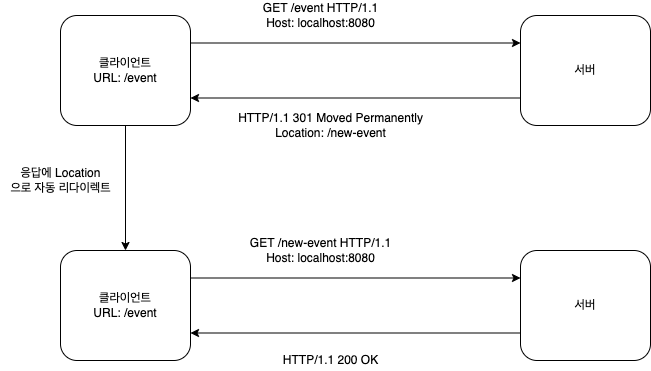
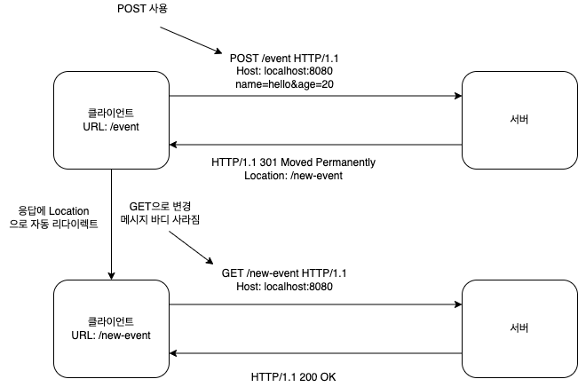
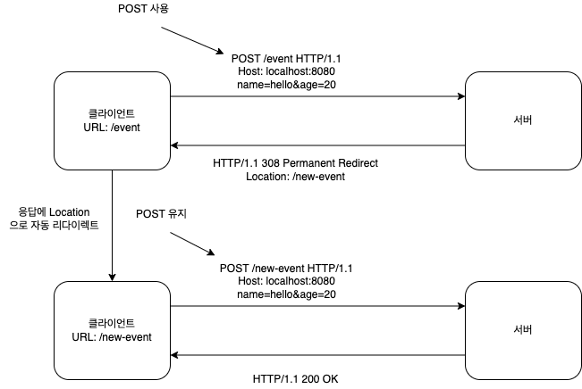
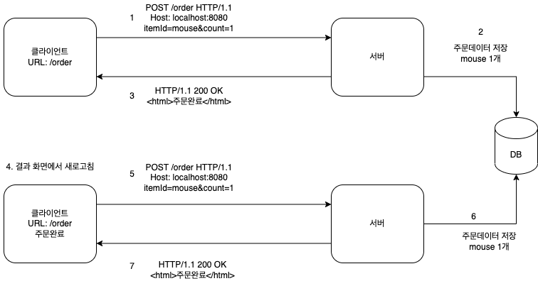
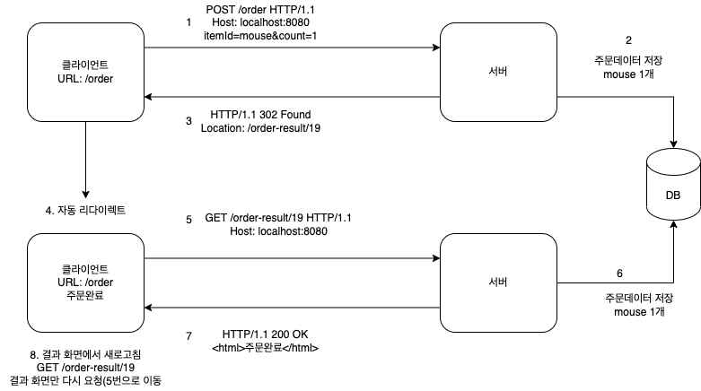

## 상태 코드

클라이언트가 보낸 요청의 처리 상태를 응답에서 알려주는 기능

- 1xx (Informational): 요청 수신되어 처리중
- 2xx (Successful): 요청 정상 처리
- 3xx (Redirection): 요청 완료하려면 추가 행동 필요
- 4xx (Client Error): 클라이언트 오류, 잘못된 문법등으로 서버가 요청을 수행할 수 없음
- 5xx (Server Error): 서버 오류, 서버가 정상 요청 처리하지 못함

- 클라이언트가 인식할 수 없는 상태코드를 서버가 반환할 시 -> 클라이언트는 상위 상태코드로 해석해서 처리
- 미래에 새로운 상태 코드 추가되어도 클라이언트 변경하지 않아도 됨

## 2xx (Successful)

- 200 OK
- 201 Created
- 202 Accepted
- 204 No Content

#### 202 Accepted

> 요청 접수되었으나 처리가 완료되지 않았음

- 배치 처리 같은 곳에서 사용
  예) 요청 접수 후 1시간 뒤에 배치 프로세스가 요청 처리함

#### 204 No Content

> 서버가 요청을 성공적으로 수행했지만, 응답 페이로드 본문에 보낼 데이터가 없을 때

- 예) 웹 문서 편집기에서 save 버튼
- save 버튼의 결과로 아무 내용이 없어도 된다.
- save 버튼을 눌러도 같은 화면 유지해야 함
- 결과 내용 없어도 204 메시지 만으로 성공을 인식할 수 있음

## 3xx (Redirection)

> 요청 완료하기 위해 유저 에이전트(웹 브라우저)의 추가 조치가 필요하다는 의미

#### 리다이렉션 이해

> 웹 브라우저는 3xx 응답의 결과에 Location 헤더가 있으면, location 위치로 자동 이동

##### 리다이렉션 종류

- 영구 리다이렉션 - 특정 리소스의 URI가 영구적으로 이동
  - 예) /members -> /users
  - 예) /event -> /new-event
- 일시 리다이렉션 - 일시적인 변경
  - 주문 완료 후 주문 내역 화면으로 이동
  - PRG: Post/Redirect/Get
- 특수 리다이렉션
  - 결과 대신 캐시 사용

##### 영구 리다이렉션(301, 308)

- 리소스의 URI가 영구적으로 이동
- 원래 URL 사용 X, 검색 엔진 등에서도 변경 인지

**301 Moved Permanently**

- 리다이렉트시 요청 메서드가 GET으로 변하고, 본문이 제거될 수 있음

페이지가 사라진 URL에 POST 요청 보내게 되면 301 응답으로 인해 자동 해당 Location으로 자동 리다이렉션 되는데 POST 요청과 메시지 바디가 사라지고 단순 페이지만 응답 받게됨
그럼 다시 이벤트 가입 POST 작성해야 한다.

**308 Permanent Redirect**

- 301과 기능은 같음
- 리다이렉트시 요청 메서드와 본문 유지

301 과 다르게 단순 페이지로 리다이렉션 하는게 아니라
이벤트 가입하려했던 POST 메시지 바디까지 보존한체로 요청

##### 일시적인 리다이렉션(302, 307, 303)

- 리소스의 URI가 일시적으로 변경
- 따라서 검색 엔진 등에서 URL 변경하면 안됨

**302 Found**

- 리다이렉션 요청 메서드가 GET으로 변하고, 본문 제거될 수 있음

**307 Temporary Redirect**

- 302와 기능은 같음
- 리다이렉트시 요청 메서드와 본문 유지(요청 메서드를 변경하면 안됨)

**303 See Other**

- 302와 기능 같음
- 리당렉트시 요청 메서드가 GET으로 변경

###### PRG: Post/Redirect/Get

**일시적인 리다이렉션 - 예시**

- POST로 주문후에 웹 브라우저를 새로고침하면 -> 다시 POST로 또 요청하게 됨 -> 중복 주문 될 수 있음

- POST 주문후에 새로 고침으로 인한 중복 주문 방지
- POST로 주문후에 주문 결과 화면을 GET 메서드로 리다이렉트
- 새로고침해도 결과 화면을 GET으로 조회
- 중복 주문 대신에 결과 화면만 GET으로 다시 요청

- URL 이 이미 POST -> GET 으로 리다이렉트 됨
- 새로고침 해도 GET으로 결과 화면만 조회

- 302 Found -> GET으로 변할 수 있음
- 307 Temporary Redirect -> 메서드가 변하면 안됨
- 303 See Other -> 메서드가 GET으로 변경

> 307, 303 권장하지만 현실적으로 많은 애플리케이션 라이브러리 들이 302 기본값으로 사용
> 자동 리다이렉션시에 GET으로 변해도 되면 그냥 302 사용해도 큰 문제 없다.

#### 기타 리다이렉션(300, 304)

- 300: 안씀
- 304 Not Modified
  - 캐시 목적으로 사용
  - 클라이언트에게 리소스 수정되지 않았음을 알려줌 => 따라서 클라이언트는 로컬PC에 저장된 캐시 재사용함(캐시로 리다이렉트 한다.)
  - 304 응답은 응답에 메시지 바디 포함하면 안됨(로컬 캐시 사용해야 하므로)
  - 조건부 GET, HEAD 요청시 사용

## 4xx (Client Error)

클라이언트 오류

- 클라이언트의 요청에 잘못된 문법등으로 서버가 요청 수행할 수 없을 때
- 오류의 원인이 클라이언트에 있음
- 클라이언트가 이미 잘못된 요청 데이터 보내고 있기 때문에, 똑같은 재시도 해도 실패함

#### 400 Bad Request

클라이언트가 잘못된 요청 해서 서버가 요청 처리할 수 없음

- 요청 구문, 메시지 등 오류
- 클라이언트는 요청 내용 다시 검토하고, 다시 보내야함

예) 요청 파라미터가 잘못되거나, API 스펙이 맞지 않을 때

#### 401 Unauthorized

> 로그인이 되지 않았다

클라이언트가 해당 리소스에 대한 인증 필요함

- 인증 되지 않음
- 401 오류 발생시 응답에 WWW-Authenticate 헤더와 함께 인증 방법 설명
- 인증(Authentication): 본인이 누구인지 확인(로그인)
- 인가(Authorization): 권한부여 (Admin 권한처럼 특정 리소스에 접근할 수 있는 권한, 인증이 있어야 인가가 있음)

#### 403 Forbidden

서버가 요청을 이해했지만 승인 거부

- 주로 인증 자격 증명은 있지만, 접근 권한이 불충분한 경우

예) 어드민 등급이 아닌 사용자가 로그인은 했지만, 어드민 등급의 리소스에 접근하는 경우

#### 404 Not Found

요청 리소스를 찾을 수 없음

- 요청 리소스가 서버에 없음
- 클라이언트가 권한이 부족한 리소스에 접근할 때 해당 리소스를 숨기고 싶을 때

## 5xx (Server Error)

- 서버 문제로 오류 발생
- 서버에 문제가 있기 때문에 재시도 하면 성공할 수도 있음(DB가 복구 된다던지 등등)

#### 500 Internal Server Error

서버 문제로 오류 발생, 애매하면 500 오류

- 서버 내부 문제로 오류

#### 503 Service Unavailable

서비스 이용 불가

- 서버가 일시적인 과부하 또는 예정된 작업으로 잠시 요청 처리할 수 없음
- Retry-After 헤더 필드로 얼마뒤에 복구되는지 보낼 수도 있음
