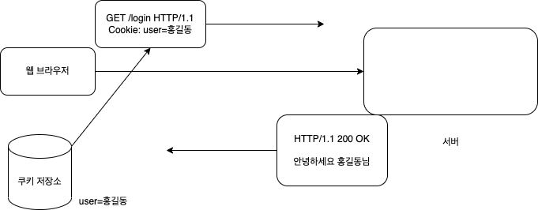

## HTTP 헤더

- header-field = field-name":" OWS field-value OWS (OWS: 띄어쓰기 허용)
- field-name은 대소문자 구분 없음

```
Host: www.google.com

Content-TYpe: text/html;charset=UTF-8
Content-Length: 3423
```

## HTTP 헤더 용도

- HTTP 전송에 필요한 모든 부가정보
- ex) 메세지 바디의 내용, 메시지 바디의 크기, 압축, 인증, 요청 클라이언트, 서버 정보, 캐시 관리 정보 등
- 표준 헤더가 너무 많다
- 필요시 임의의 헤더 추가 가능 -> helloworld: hihi

## HTTP 헤더 분류 - RFC2616(과거)

- 헤더 분류
  - General 헤더: 메시지 전체에 적용되는 정보, 예) Connection: close
  - Request 헤더: 요청 정보, 예) User-Agent: Mozilla/5.0 (Macintosh; ..)
  - Response 헤더: 응답 정보, 예) server: Apache
  - Entity 헤더: 엔티티 바디 정보, 예) Content-Type: text/html, Content-Length: 3423

## HTTP BODY message body - RFC2616(과거)

- 메시지 본문(message body)은 엔티티 본문(entity body)을 전달하는데 사용
- 엔티티 본문은 요청이나 응답에서 전달할 실제 데이터
- 엔티티 헤더는 엔티티 본문의 데이터를 해석할 수 있는 정보 제공
  - 데이터 유형(html, json), 데이터 길이, 압축 정보 등등

## HTTP BODY message body - RFC7230(최신)

엔티티라는 단어 대신 표현이라는 단어 사용

- 메시지 본문(message body) 통해 표현 데이터 전달
- 메시지 본문 = 페이로드(payload)
- 표현은 요청, 응답에서 전달할 실제 데이터
- 표현 헤더는 표현 데이터를 해석할 수 있는 정보 제공
  - 데이터 유형(json, html), 데이터 길이, 압축 정보 등등

## 표현

- Content-Type: 표현 데이터의 형식
- Content-Encoding: 표현 데이터의 압축 방식
- Content-Language: 표현 데이터의 자연 언어
- Content-Length: 표현 데이터의 길이, Transfer-Encoding(전송 코딩) 사용하면 Content-Length 사용하면 안됨
- 표현 헤더는 전송, 응답 둘다 사용

## Content-Type 표현 데이터의 형식 설명

- 미디어 타입, 문자 인코딩

ex)

- text/html; charset=utf-8
- application/json
- image/png

## Content-Encoding 표현 데이터 인코딩

- 표현 데이터를 압축하기 위해 사용
- 데이터를 전달하는 곳에서 압축 후 인코딩 헤더 추가
- 데이터를 읽는 쪽에서 인코딩 헤더의 정보로 압축 해제

ex)

- gzip
- deflate
- identity

## Content-Language 표현데이터의 자연언어

Content-Language: en, ko, en-US 등

## 협상(콘텐츠 네고시에이션)

협상 헤더는 요청시에만 사용
클라이언트가 선호하는 표현 요청

- Accept: 클라이언트가 선호하는 미디어 타입 전달
- Accept-Charset: 클라이언트가 선호하는 문자 인코딩
- Accept-Encoding: 클라이언트가 선호하는 압축 인코딩
- Accept-Language: 클라이언트가 선호하는 자연 언어


Accept-Language 복잡한 예시


클라이언트가 요청한 한국어를 서버가 지원하지 않으므로
기본 언어인 독일어 반환
=> 우선순위 필요

## 협상과 우선순위 1 (Quality Values(q))

GET /event
Accept-Language: ko-KR,ko;q=0.9,en-US;q=0.8;en;q=0.7

- Qualty Values(q) 값 사용
- 0 ~ 1, 클수록 높은 우선순위
- 생략하면 1
- Accept-Language: ko-KR,ko;q=0.9,en-US;q=0.8;en;q=0.7
  1. ko-KR;q=1 (생략은 우선순위 1)
  2. ko;q=0.9
  3. en-US;q=0.8
  4. en;q=0.7

## 협상과 우선순위 2

- 구체적인 것을 우선한다.
- Accept: text/\*, text/plain text/plain;format=flowed, \*/\*
  1. text/plain;format=flowed
  2. text/plain
  3. text/\*
  4. \*/\*

## 협상과 우선순위 3

- 구체적인 것을 기준으로 미디어 타입 맞춤
- Accept: text/\*;q=0.3, text/html;q=0.7, text/html;level=1, text/html;level=2;q=0.4, \*/\*;q=0.5

| Media Type        | Quality |
| ----------------- | ------- |
| text/html;level=1 | 1       |
| text/html         | 0.7     |
| text/plain        | 0.3     |
| image/jpeg        | 0.5     |
| text/html;level=2 | 0.4     |
| text/html;level=3 | 0.7     |

## 전송 방식 설명

- 단순 전송
- 압축 전송
- 분할 전송
- 범위 전송

## 단순 전송

**Content-Length**

컨텐츠에 대한 길이를 알 수 있을때 사용하는 것

## 압축 전송

**Content-Encoding**

페이로드를 압축 했을 시 Content-Encoding 명시해줘야 한다

## 분할 전송

**Transfer-Encoding**


5바이트 hello, 5바이트 World 이런식으로 쪼개서 전송하는 방식
Content-Length 명시하면 안됨

## 범위 전송

**Range, Content-Range**


예: 이미지를 전송 받고 있는 경우 절반 정도 데이터 받은 상황에 끊긴 절반 이후 부터 보내달라는 요청 시에 사용

## 일반 정보

- From: 유저 에이전트의 이메일 정보
- Referer: 이전 웹 페이지 주소
- User-Agent: 유저 에이전트 애플리케이션 정보
- Server: 요청 처리하는 Origin 서버의 소프트웨어 정보
- Date: 메시지가 생성된 날짜

## From 유저 에이전트의 이메일 정보

- 일반적으로 잘 사용되지 않음
- 검색 엔진 같은 곳에서, 주로 사용
- 요청에서 사용

## Referer 이전 웹 페이지 주소

- 현재 요청된 페이지의 이전 웹 페이지 주소
- A -> B로 이동하는 경우 B를 요청할 때 Referer: A 포함해서 요청
- Referer 사용해서 유입 경로 데이터 분석할 때 많이 사용
- 요청에서 사용
- 참고: referer는 단어 referrer의 오타

## User-Agent 유저 에이전트 애플리케이션 정보

- user-agent: Mozilla/5.0 (Macintosh; Intel Mac OS X 10_15_7) AppleWebKit/537.36 (KHTML, like Gecko) Chrome/86.0.4240.183 Safari/537.36
- 클라이언트의 애플리케이션 정보(웹 브라우저 정보, 등등)
- 통계 정보
- 어떤 종류의 브라우저에서 장애가 발생하는지 파악 할 수 있음
- 요청에서 사용

## Server 요청 처리하는 ORIGIN 서버의 소프트웨어 정보

> ORGINT 서버: 내 요청은 중간에 proxy 서버나 캐쉬 서버등 많은 경로 거치는데 마지막에 내 HTTP 요청을 응답하는 서버를 지칭한다.

- Server: Apache/2.2.22 (Debian)
- server: nginx
- 응답에서 사용

## Date - 메시지가 발생한 날짜와 시간

- Date: Tue, 15 Nov 1994 08:12:31 GMT
- 응답에서 사용

## 특별한 정보

- Host: 요청한 호스트 정보(도메인)
- Location: 페이지 리다이렉션
- Allow: 허용 가능한 HTTP 메서드
- Retry-After: 유저 에이전트가 다음 요청을 하기까지 기다려야 하는 시간

## Host 요청한 호스트 정보(도메인)

- 요청에서 사용
- 필수 값
- 하나의 서버가 여러 도메인을 처리해야 할 때
- 하나의 IP주소에 여러 도메인이 적용되어 있을 때


> 가상 호스트: 여러 도메인을 한번에 처리할 수 있는 서버
> 실제 애플리케이션이 여러개 구동될 수 있음


클라이언트가 어느 도메인의 /hello 페이지를 요청하는지 알 수 없음
Host 정보를 지정하여 어느 도메인으로 요청할지 명시

## Location 페이지 리다이렉션

- 웹 브라우저는 3xx 응답의 결과에 Location 헤더가 있으면, Location 위치로 자동 이동(리다이렉트)
- 응답코드 3xx에서 설명
- 201 (Created): Location 값은 요청에 의해 생성된 리소스 URI
- 3xx (Redirection): Location 값은 요청을 자동으로 리디렉션하기 위한 대상 리소스를 가리킴

## Allow 허용 가능한 HTTP 메서드

클라이언트에게 허용 가능한 HTTP 메소드 알려줌

- 405 (Method Not Allowed) 에서 응답에 포함해야함

## Retry-After - 유저 에이전트가 다음 요청 하기까지 기다려야 하는 시간

- 503(Service Unavailable): 서비스가 언제까지 불능인지 알려줄 수 있음
- Retry-After: Fri, 31 Dec 1999 23:59:59 GMT (날짜 표기)
- Retry-After: 120(초단위 표기)

## 인증

- Authorization: 클라이언트 인증 정보를 서버에 전달
- WWW-Authenticate: 리소스 접근시 필요한 인증 방법 정의

## Authorization

클라이언트 인증 정보를 서버에 전달

## WWW-Authenticate - 리소스 접근 시 필요한 인증 방법 정의

- 리소스 접근시 필요한 인증 방법 정의
- 401 Unauthorized 응답과 함께 사용
- WWW-Authenticate: Newauth realm="apps", type=1,
  title="Login to\"apps\"", Basic realm="simple"

## 쿠키

쿠키 헤더 2가지

- Set-Cookie: 서버에서 클라이언트로 쿠키 전달(응답)
- Cookie: 클라이언트가 서버에서 받은 쿠키 저장하고, HTTP 요청 시 서버로 전달

HTTP 는 무상태 프로토콜 이므로 사용자가 로그인 했어도 서버는 어떤 사람이 로그인한 건지 알 수가 없다.

**쿠키 미사용**
대안 -> 모든 요청에 사용자 정보 포함


GET /welcome?user=홍길동 HTTP/1.1
GET /board?user=홍길동 HTTP/1.1
GET /order?user=홍길동 HTTP/1.1
GET /xxx?user=홍길동 HTTP/1.1

=> 모든 페이지에 사용자 정보를 포함해서 요청해야 하므로 보안도 취약하고 리소스 낭비도 크다

**로그인 요청 상황**


**로그인 이후**



클라이언트는 로그인 이후 요청할 때 쿠키 저장소에 조회한 후 HTTP에 Cookie 값을 명시하여 요청한다.

## 쿠키

set-cookie: sessionId=abcde1234; expires=Sat, 26-Dec-2020 00:00:00 GMT; path=/; domain=.google.com; Secure

- 사용처
  - 사용자 로그인 세션 관리
  - 광고 정보 트래킹
- 쿠키 정보는 항상 서버에 전송됨

  - 네트워크 트래픽 추가 유발
  - 최소한의 정보만 사용(세션 id, 인증 토큰)
  - 서버에 전송하지 않고, 웹 브라우저 내부에 데이터를 저장하고 싶으면 웹 스토리지(localStorage, sessionStorage)에 저장

- 보안에 민감한 데이터는 저장하면 안됨(주민번호, 신용카드 번호 등등)

## 쿠키 - 생명주기(Expires, max-age)

Set-Cookie: expires=Sat, 26-Dec-2020 04:39:21 GMT

- 만료일이 되면 쿠키 삭제
- Set-Cookie: max-age=3600 (3600초)
  - 0이나 음수를 지정하면 쿠키 삭제

쿠키의 2가지 종류

- 세션 쿠키: 만료 날짜를 생략하면 브라우저 종료시 까지만 유지
- 영속 쿠키: 만료 날짜를 입력하면 해당 날짜까지 유지

## 쿠키 - 도메인

domain=example.org

- 명시: 명시한 문서 기준 도메인 + 서브 도메인 포함해서 쿠키 전송

  - domain=example.org 를 지정해서 쿠키 생성
  - example.org 는 물론, dev.example.org 도 쿠키 접근

- 도메인 생략시: 현재 문서 기준 도메인만 적용
  - example.org 에서만 쿠키 접근
  - dev.example.org 는 쿠키 미접근

## 쿠키 - 경로(Path)

path=/home

- 이 경로를 포함한 하위 경로 페이지만 쿠키 접근
- 일반적으로 path=/루트로 지정

예 path=/home 지정

- /home 가능
- /home/level1 가능
- /home/level1/level2 가능
- /hello 불가능

## 쿠키 - 보안(Secure, HttpOnly, SameSite)

Secure

- 쿠키는 http, https 구분하지 않고 전송
- Secure 적용하면 https인 경우에만 전송

HttpOnly

- XSS 공격 방지
- 자바스크립트에서 접근 불가(document.cookie)
- HTTP 전송에만 사용

SameSite

- XSRF 공격 방지
- 요청 도메인과 쿠키에 설정된 도메인이 같은 경우만 쿠키 전송
