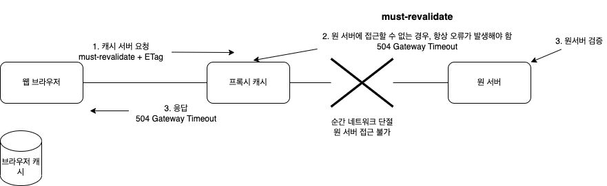

## 캐시가 없을 때

## 첫 번째 요청

두 번쨰 요청도 똑같이 1.1M 데이터 응답 받음

- 데이터가 변경되지 않아도 계속 네트워크 통해 데이터 다운로드 받아야 함
- 인터넷 네트워크는 매우 느리고 비싸다
- 브라우저 로딩 속도 느림
- 느린 사용자 경험

## 캐시 적용

## 첫 번째 요청

응답에 cache-control: max-age=60 으로 캐쉬 시간을 명시한다.

## 두 번째 요청

캐시 유효 시간 검증 후 60초 이내라면 캐쉬에서 응답 받는다.

- 캐시 덕분에 캐시 가능 시간동안 네트워크 사용하지 않아도 됨
- 비싼 네트워크 사용량 줄일 수 있음
- 브라우저 로딩 속도 매우 빠름
- 빠른 사용자 경험

## 세 번째 요청 - 캐시 시간 초과

- 서버를 통해 데이터 다시 조회하고, 캐시 갱신
- 이때 다시 네트워크 다운로드 발생

## 캐시 시간 초과

- 캐시 유효 시간이 초과해서 서버에 다시 요청하면 다음 두 가지 상황이 있을 수 있다.
  1. 서버에서 기존 데이터를 변경 한 상황
  2. 서버에서 기존 데이터를 변경되지 않은 상황

## 캐시 시간 초과

- 캐시 만료 후에도 서버에서 데이터를 변경하지 않은 상황
- 데이터를 전송하는 대신에 저장해 두었던 캐시를 재사용 할 수 있음(캐시 시간 만료되었어도)
- 클라이언트의 데이터와 서버의 데이터가 같다는 사실을 확인할 수 있는 방법 필요

## 첫 번째 요청

Last-Modified 헤더를 추가하여 데이터 최종 수정일 명시

## 두 번째 요청 - 캐시 시간 초과

요청 받은 서버는 요청의 if-modified-since 와 데이터 최종 수정일 날짜를 비교하여 변경되지 않았다면 304 Not Modified로 응답

클라이언트는 시간 만료되었던 데이터를 다시 캐시에 갱신하여 저장하고 재사용한다.

## 검증 헤더와 조건부 요청

1. 캐시 유효 시간 초과했어도, 서버의 데이터가 갱신되지 않았으면
2. 304 Not Modified + 헤더 메타 정보만 응답한다.
3. 클라이언트는 응답 받은 헤더 정보로 캐시의 메타 정보를 갱신
4. 클라이언트는 캐시에 저장되어 있는 데이터 재활용
5. 결과적으로 네트워크 다운로드가 발생하지만 용량이 적은 헤더 정보만 다운로드 받게된다.

## 검증 헤더와 조건부 요청

**검증 헤더**

- 캐시 데이터와 서버 데이터가 같은지 검증하는 데이터
- Last-Modified, ETag

**조건부 요청 헤더**

- 검증 헤더로 조건에 따른 분기
- if-Modified-Since: Last-Modified 사용
- if-None-Match: ETag 사용
- 조건 만족하면 200 OK
- 조건 만족하지 않으면 304 Not Modified

**예시**

- if-Modified-Since: 이후에 데이터가 수정되었으면?
  - 데이터 미변경 예시
    - 캐시: 2020년 11월 10일 10:00:00 vs 서버: 2020년 11월 10일 10:00:00
    - 304 Not Modified, 헤더 데이터만 전송(Body 미포함)
    - 전송 용량: 헤더 용량
  - 데이터 변경 예시
    - 캐시: 2020년 11월 10일 10:00:00 vs 서버: 2020년 11월 10일 11:00:00
    - 200 OK, 모든 데이터 전송(Body 포함)
    - 전송 용량 1.1M (헤더 + 바디)

## Last-Modified, if-Modified-Since 단점

- 1초 미만 단위로 캐시 조정 불가능
- 날짜 기반의 로직 사용
- 데이터 수정해서 날짜가 다르지만, 결과가 똑같은 경우
- 서버에서 별도의 캐시 로직을 관리하고 싶은 경우
  ex) 스페이스나 주석처럼 크게 영향 없는 변경에서 캐시 유지하고 싶은 경우

## ETag, If-None-Match

- ETag(Entity Tag)
- 캐시용 데이터에 임의의 고유햔 버전 이름 달아둠
  ex) ETag: "v1.0", ETag: "a2awefaae"
- 데이터가 변경되면 이 이름을 바꾸어서 변경함(Hash 다시 생성)
- 단순하게 ETag만 보내서 같으면 유지, 다르면 다시 받는 방법이다.

## 첫 번째 요청

브라우저 캐시에서 ETag 값 저장

## 두 번째 요청

ETag 값이 같다 => 실패
304 Not Modified HTTP Body 없는 응답 반환 => 시간 만료된 저장되있던 캐시 데이터 재활용

## ETag, If-None-Match 정리

- 단순하게 ETag만 서버에 보내서 같으면 유지, 다르면 다시 받음
- 캐시 제어 로직을 서버에서 완전히 관리
- 클라이언트는 단순히 이 값을 서버에 제공(클라이언트는 캐시 메커니즘을 모른다.)
- 예)
  - 서버는 배타 오픈 기간인 3일 동안 파일이 변경되어도 ETag를 동일하게 유지
  - 애플리케이션 배포 주기에 맞추어 ETag 모두 갱신

## 캐시 제어 헤더

- Cache-Control: 캐시 제어
- Pragma: 캐시 제어(하위 호환)
- Expires: 캐시 유효 기간(하위 호환)

## Cache-Control

- Cache-Control: max-age => 캐시 유효 시간 초단위로 명시
- Cache-Control: no-cache => 데이터는 캐시해도 되지만, 항상 클라이언트에서 조건부 요청 후 데이터를 origin 서버에 검증하고 사용
- Cache-Control: no-store => 데이터에 민감한 정보가 있으므로 저장하면 안됨(메모리에서 사용하고 최대한 빨리 삭제)

## Pragma

- Pragma: no-cache
- HTTP 1.0 하위 호환

## Expires 캐시 만료일 지정(하위 호환)

- expires: Mon, 01 Jan 1990 00:00:00 GMT
- 캐시 만료일을 정확한 날짜로 지정
- HTTP 1.0 부터 사용
- 지금은 더 유연한 Cache-Control: max-age 권장
- Cache-Control: max-age와 함께 사용하면 Expires는 무시한다.

## Cache-Control 캐시 지시어 - 기타

- Cache-Control: public => 응답이 public 캐시에 저장되어도 됨
- Cache-Control: private => 응답이 해당 사용자만을 위한 것, private 캐시에 저장해야 함(기본 값)
- Cache-Control: s-maxage => 프록시 캐시에만 적용되는 max-age
- Age:60 (HTTP 헤더) => 오리진 서버에서 응답 후 프록시 캐시 내에 머문 시간(초)

## Cache-Control 확실한 캐시 무효화 응답

캐시를 사용하지 않는다고 명시해도 브라우저는 GET 요청을 받은 응답을 대강 알아서 캐시하는 경우가 있음

- Cache-Control: no-cache, no-store, must-revalidate => 이 옵션 다 넣어야 절대 캐시되지 않음
- Pragma: no-cache => HTTP 1.0 하위 호환 => 과거 브라우저(HTTP 1.0)에서도 요청 올 수 있으므로 명시해야 한다

## Cache-Control: must-revalidate

- 캐시 만료 후 최초 조회시 원 서버에 검증해야 함
- 원 서버 접근 실패 시 반드시 오류 발생해야함: 504(Gateway Timeout)
- must-revalidate은 캐시 유효 시간이라면 캐시를 사용함

원 서버와 통신 끊긴 상황

## must-revalidate

