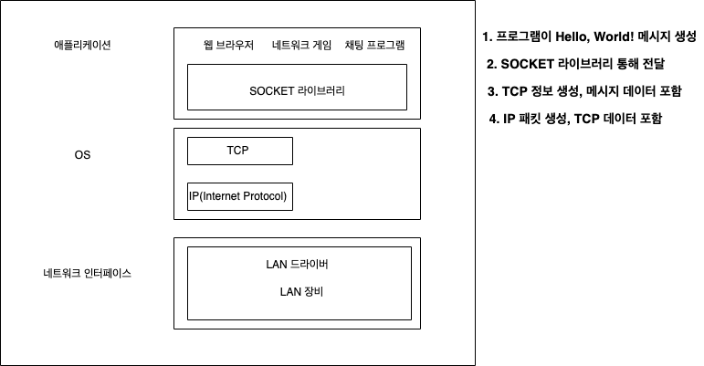
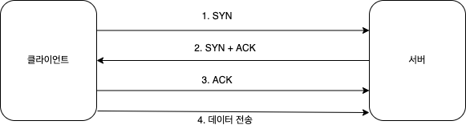
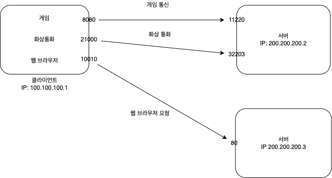
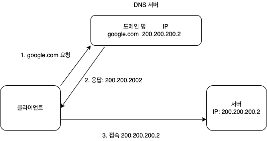

## IP 주소 부여

- 컴퓨터 끼리 통신하기 위해서 IP 주소 부여

## IP 인터넷 프로토콜 역할

- 지정한 IP 주소에 데이터 전달
- 패킷 이라는 통신 단위로 데이터 전달

## IP 패킷 정보

- 패킷은 출발지 IP, 목적지 IP, 기타 ..., 전송 데이터 로 이뤄짐

> 데이터를 받은 서버 또한 응답하기 위해 자신의 IP(출발지), 응답할 IP,(목적지), 기타, 데이터 잘 받았다는 의미를 담은 패킷 보냄

데이터가 가는 경로와 응답하는 경로는 다를 수 있다.

## IP 프로토콜의 한계

- 비 연결성: 패킷 받을 대상 없거나 서비스 불능 상태여도 패킷 전송
- 비 신뢰성: 중간에 패킷이 사라지는 경우, 패킷이 순서대로 도착하지 않는 것
- 프로그램 구분: 같은 IP 사용하는 클라이언트에서 통신하는 애플리케이션이 둘 이상이라면

패킷 용량이 대략 1500byte 넘으면 나눠서 보낸다.

IP 프로토콜의 한계를 해결하기 위해 => TCP/UDP 프로토콜

## TCP/UDP 프로토콜 계층

소켓 라이브러리 이용해 OS 계층에 메시지 데이터 전달
아래 계층으로 내려가면서 각 계층의 프로토콜로 캡슐화 진행

TCP 세그먼트: 출발지 port, 목적지 port, 전송 제어, 순서, 검증 정보 등

## TCP 특징

전송 제어 프로토콜(Transmission Control Protocol)

- 연결지향 - TCP 3 way handshake(가상 연결)
  나를 위한 전용 랜선으로 물리적으로 연결되었다는 의미가 아님
- 데이터 전달 보증
- 순서 보장
- 신뢰할 수 있는 프로토콜

### 연결지향

SYN: 접속 요청
ACK: 요청 수락
ACK 와 데이터 같이 전송도 가능

### 순서 보장

서버가 패킷 순서를 잘못 받은 경우 잘못 받은 부분부터 다시 보내라고 클라이언트에게 요청

## UDP 특징

**사용자 데이터그램 프로토콜(User Datagram Protocol**
**내가 통신 프로토콜을 최적화로 커스텀하고 싶은경우 UDP 사용**

- 하양 도화지에 비유(기능이 거의 없다.)
- 연결지향 X
- 데이터 전달 보증 X
- 순서 보장 X
- 데이터 전달 및 순서가 보장되지 않지만, 단순하고 빠름
- IP와 거의 같다. + Port + 체크섬 정도만 추가
- 애플리케이션에서 추가 작업 필요

## PORT

서버 안에서 애플리케이션을 구분하는 용도

- 0 ~ 65535 할당 가능
- 0 ~ 1023: 잘 알려진 포트, 사용하지 않는 것이 중요
- FTP: 20, 21
- TELNET: 23
- HTTP: 80
- HTTPS: 443

## DNS

