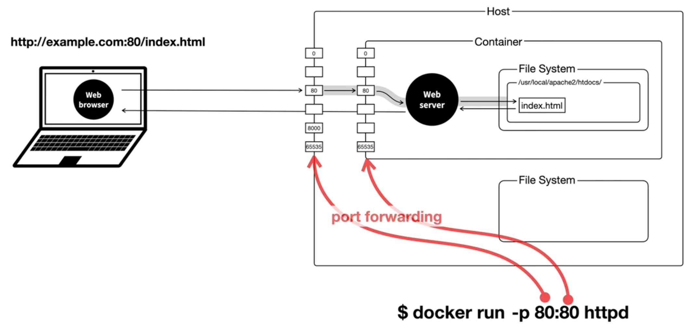

# docker 사용법

App Store ----> Docker Hub  
&nbsp;&nbsp;&nbsp;&nbsp;&nbsp;&nbsp; ↓ &nbsp;&nbsp;&nbsp;&nbsp;&nbsp;&nbsp;&nbsp;&nbsp;&nbsp;&nbsp;&nbsp;&nbsp;&nbsp;&nbsp;&nbsp;&nbsp;&nbsp;&nbsp;&nbsp;&nbsp;&nbsp;&nbsp;&nbsp;&nbsp;↓  
Program ----> &nbsp;&nbsp;image  
&nbsp;&nbsp;&nbsp;&nbsp;&nbsp;&nbsp; ↓ &nbsp;&nbsp;&nbsp;&nbsp;&nbsp;&nbsp;&nbsp;&nbsp;&nbsp;&nbsp;&nbsp;&nbsp;&nbsp;&nbsp;&nbsp;&nbsp;&nbsp;&nbsp;&nbsp;&nbsp;&nbsp;&nbsp;&nbsp;&nbsp;↓  
Process ----> container

## 이미지를 실행시켜 컨테이너 만들기

docker run 이미지 이름 ⇒ 이미지 실행

docker run —name ws2 httpd ⇒ ws2라는 이름의 httpd 이미지 실행

docker logs -f name ⇒ 로그 계속 출력 시키는 것

docker stop name ⇒ 이미지 중단

docker start name ⇒ **중단 된** 이미지 실행

docker rm ws2 ⇒ stop된 이미지 삭제

docker rm —force name ⇒ stop 안하고 삭제 방법

docker ps ⇒ 컨테이너 내에서 실행되는 프로세스 볼 수 있음

<aside>
💡 컨테이너 내에 실행되는 프로세스들은 내 컴퓨터의 자원을 사용한다.

</aside>

docker run —name ws3 -p 8081:80 httpd
