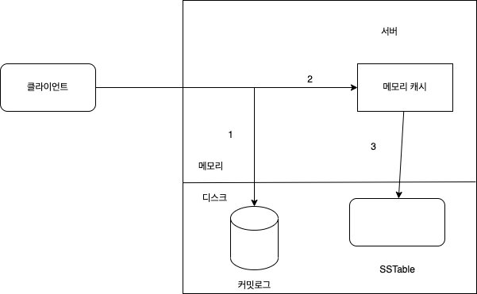
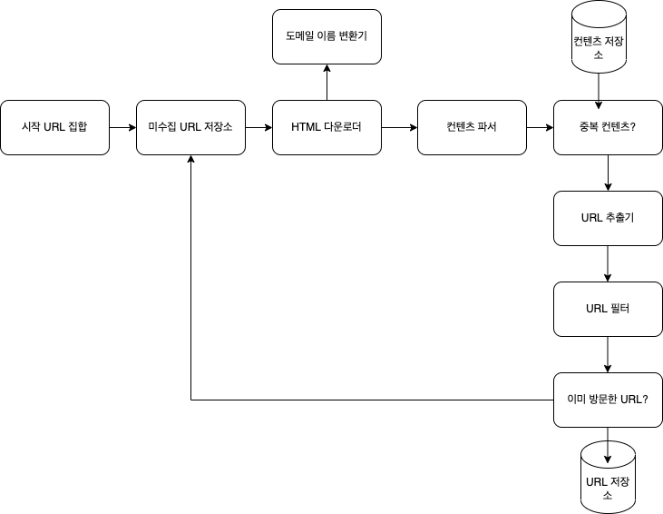
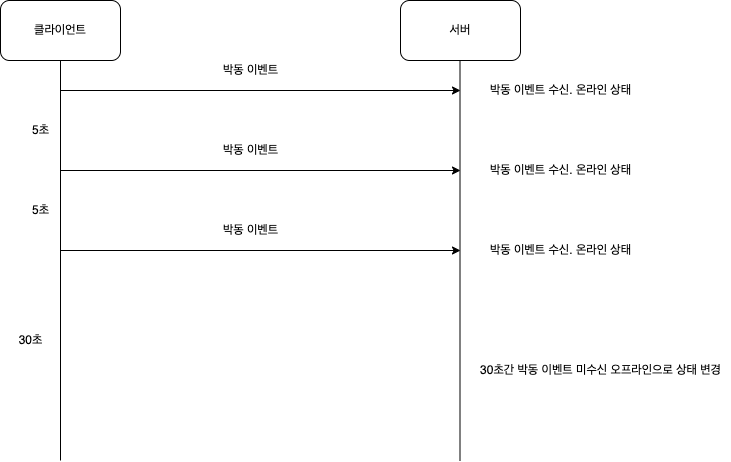

> 기업 -> 시스템 설계 면접 광범휘하게 시행 => 이런 면접으로 의사소통 및 문제해결 능력이 소프트웨어 엔지니어가 업무상 필요로 하는 능력과 유사 모호한 문제를 어떻게 분석하고 단계적으로 해결하는지로 지원자를 **평가**

# 1장. 사용자 수에 따른 규모 확장성

---

## 단일 서버

- 사용자 -> 도메인 이름 이용하여 웹사이트 접속
- 사용자 접속 위해 도메인 이름 서비스(Domain Name service, DNS)에 질의하여 IP 주소로 변환 과정 필요
- IP 주소로 HTTP 요청 전달
- 요청 받은 웹 서버 HTML 페이지나 JSON 형태의 응답 반환

## 데이터베이스

> 사용자가 늘면서 여러 서버를 두게 된다.
> 한 서버는 웹/모바일 트래픽 처리 용도, 다른 하나는 데이터베이스 용

**비-관계형 데이터베이스가 적합한 경우**

- 아주 낮은 응답 지연시간이 요구
- 다루는 데이터가 비정형이라 관계형 데이터가 아닌 경우
- 데이터(JSON, YAML, XML 등)를 직렬화하거나 역직렬화 할 수 있기만 하면 되는 경우
- 아주 많은 양의 데이터를 저장할 필요가 있는 경우
  > 데이터 직렬화: 메모리를 디스크에 저장하거나 네트워크 통신에 사용 위한 형식으로 변환하는 것  
  > 데이터 역직렬화: 반대로 디스크에 저장한 데이터 읽거나, 네트워크 통신으로 받은 데이터를 메모리에 쓸 수 있도록 변환하는 것

## 수직적 규모 확장 vs 수평적 규모 확장

**수직적 규모 확장(scale up)**

- 서버에 고사양 자원을 추가하는 유입되는 트래픽의 양이 적을 때 적합

**단점**

- 한 대의 서버에 CPU나 메모리를 무한대로 증설할 방법 없음
  장애에 대한 자동복구 방안, 다중화 방안 제시하지 않음 -> 서버 장애 발생 시 웹/앱은 완전히 중단

**수평적 규모 확장(scale out)**

- 많은 서버를 추가하여 성능 개선하는 행위, 대규모 애플리케이션 지원하는 데에 적절

**로드밸런서**

- 부하 분산 집합에 속한 웹 서버들에게 트래픽 부하를 고르게 분산하는 역할
  사용자는 로드밸런서의 공개 IP 주소로 접속 => 웹 서버는 클라이언트의 접속 직접 처리하지 않음

**데이터베이스 다중화**

> 다중화란
> 장애가 발생해도 예비 운용장비로 시스템의 기능을 계속할 수 있도록 하는 것을 말한다.

- 많은 데이터베이스 관리 시스템이 다중화를 지원
- 데이터베이스 서버 사이 주 서버, 부 서버 관계 설정 -> 데이터 원본은 주 서버에, 사본은 부 서버에 저장
- 쓰기 연산은 마스터 에서만 지원. 부 데이터베이스는 주 데이터베이스로부터 그 사본을 전달받고, 읽기 연산만을 지원.
- 데이터베이스를 변경하는 명령어들 ex) insert, delete, update 등은 마스터 DB로만 전달되어야 한다.
- 대부분 애플리케이션은 읽기 연산 비중 > 쓰기 연산 비중 => 부 DB가 주 DB 수 보다 많음

**다중화의 장점**

- 쓰기 연산은 주 DB로만, 읽기 연산은 부 DB로만 -> 분산 -> 병렬로 처리될 수 있는 질의 수 증가 -> 성능 증가
- 데이터를 지역적으로 떨어진 여러 장소에 다중화 시킴 -> DB 서버 중 일부가 파괴되어도 데이터가 보존될 수 있음
- 한 DB에 장애가 발생하더라도 다른 DB에 있는 데이터를 가져와 계속 서비스 진행 가능으로 가용성을 가짐

## 캐시

값 비싼 연산, 자주 참조되는 데이터를 메모리 안에 두고, 뒤이은 요청이 보다 빠르게 처리될 수 있도록 하는 저장소

> 애플리케이션의 성능은 DB를 얼마나 자주 호출하느냐에 크게 좌우

### 캐시계층

- 데이터가 잠시 보관되는 곳 DB 보다 빠름
- DB 부하를 줄일 수 있고 성능 또한 개선된다.
  **웹서버** <- 데이터가 캐시에 있으면 캐시에서 데이터 읽음 **캐시** <- 데이터가 캐시에 없으면 **DB**에서 데이터 읽어 캐시에 씀
  => 읽기 주도형 캐시 전략이라 부른다.

캐시할 데이터 종류, 크기, 액세스 패턴에 맞춰 다양한 캐시 전략이 있다.

캐시 서버를 이용하는 방법: 프로그래밍 언어로 API 제공

### 캐시 사용 시 유의할 점

- 캐시는 어떤 상황에 바람직한지 -> 데이터 갱신은 자주 일어나지 않지만 참조는 빈번하게 일어나는 상황 시
- 어떤 데이터를 캐시에 두어야 하는지 -> 캐시는 데이터를 휘발성 메모리에 둠, 영속적으로 보관활 데이터를 캐시에 두는 것은 바람직하지 않다.
  캐시 서버 재시작되면 캐시 내의 모든 데이터 사라진다. 중요 데이터는 지속적 저장소에 두어야 한다.
- 캐시에 보관된 데이터는 어떻게 만료할 것인지 -> 만료된 데이터는 캐시에서 삭제되어야 함. 만료 정책이 없으면 데이터는 캐시에 계속 남게 되므로 적절한 만료 정책을 두어야 한다.
- 일관성은 어떻게 유지할지 -> 데이터 저장소의 원본 == 캐시 내의 사본 -> 일관성, 저장소 원본 갱신하는 연산과 캐시 갱신하는 연산이 단일 트랜잭션으로 처리되지 않는 경우 일관성은 깨질 수 있음
  (Scaling Memcache at Facebook 참조)
- 장애 대처는 어떻게 할지 -> 캐시 서버 한 대만 두는 경우 해당 서버는 단일 장애 지점이 될 가능성이 있다. SPOF를 피하기 위해 여러 지역에 걸쳐 캐시 서버 분산시켜야 한다.
  > 단일 장애 지점이란(Single Point of Failuer, SPOF)
  > 특정 지점에서의 장애가 전체 시스템의 동작을 중단시켜버릴 수 있는 경우
- 캐시 메모리의 크기 -> 캐시 메모리가 너무 작으면 액세스 패턴에 따라 데이터가 자주 캐시에서 밀려나버려 캐시 성능을 떨어뜨릴 수 있다. -> 캐시 메모리를 과 할당 한다. -> 캐시에 보관될 데이터가 갑자기 늘었을때 생길 문제도 방지할 수 있음
- 데이터 방출 정책
  - 널리 쓰이는 것은 LRU(Least Recently Used) -> 마지막으로 사용된 시점이 가장 오래된 데이터를 내보내는 정책
  - LFU(Least Frequently Used - 사용된 빈도가 가장 낮은 데이터 내보내는 정책)
  - FIFO(First In First Out - 가장 먼저 들어온 데이터를 가장 먼저 내보내는 정책)
    > 데이터 방출 정책: 캐시가 꽉 차버린 상황에 추가로 캐시에 데이터를 넣어야 하는 경우 기존 데이터를 내보내야 한다. 이때 어떤 기준으로 방출할 데이터를 정할 정책

## 콘텐츠 전송 네트워크(CDN)

> CDN: 정적 콘텐츠를 전송하는데 쓰이는, 지리적으로 분산된 서버의 네트워크 이미지, 비디오, CSS, Javascript 파일 등을 캐시할 수 있음  
> 정적 웹: 서버에서 콘텐츠를 가공해서 제공하는게 아닌 프로그래머가 작성한 콘텐츠를 그대로 제공하는 웹
> CDN 작동 방식

1. 사용자가 이미지 URL을 이용해 image.png에 접근 -> URL의 도메인은 CDN 서비스 사업자가 제공한 것
2. CDN 서버의 캐시에 해당 이미지가 없는 경우, 서버는 원본 서버에 요청하여 파일 가져옴, 원본 서버는 웹 서버일 수 있고, 아마존 S3 같은 온라인 저장소일 수 있음
3. 원본 서버가 파일 CDN 서버에 반환, 응답의 HTTP 헤더에는 해당 파일이 얼마나 오래 캐시될 수 있는지를 설명하는 TTL 값 들어있음
4. CDN 서버는 파일을 캐시하고 사용자 A에게 반환, 이미지는 TTL에 명시된 시간이 끝날 때까지 캐시
5. 다른 사용자가 같은 이미지에 대한 요청을 CDN 서버에 전송한다.
6. 만료되지 않은 이미지에 대한 요청은 캐시를 통해 처리.

### CDN 사용 시 고려해야 할 사항

- 비용: CDN은 보통 제3 사업자에 의해 운영됨, CDN으로 들어가고 나가는 데이터 전송 양에 따라 요금 지출, 자주 사용되지 않는 콘텐츠를 캐싱하는 것은 CDN 에서 빼는것을 고려
- 적절한 만료 시한 설정: 콘텐츠의 만료 시점이 너무 길면 콘텐츠 신선도는 떨어지고, 짧으면 원본 서버에 빈번히 접속하게 되므로 시의성이 중요힌 콘텐츠는 만료 시점을 잘 정해야 함
- CDN 장애에 대한 대처 방안: CDN 자체가 죽었을 경우 웹사이트/애플리케이션이 어떻게 동작해야 하는지 고려해야 함 일시적으로 CDN이 응답하지 않을 경우, 문제 감지하고 원본 서버로부터 콘텐츠 가져오도록 클라이언트 구성하는 것이 필요할 수 있음
- 콘텐츠 무효화 방법: 만료되지 않은 콘텐츠를 CDN에서 제거하는 방법
  - CDN 사업자가 제공하는 API 이용하여 콘텐츠 무효화
  - 콘텐츠의 다른 버전 서비스하도록 오브젝트 버저닝 이용
    > 콘텐츠의 새로운 버전 지정하는 방법
    > URL 마지막에 버전 번호 인자로 준다. ex) image.png?v=2

CDN 을 통해 정적 콘텐츠(JS, CSS, 이미지 등)는 웹 서버로 서비스 하지 않고 CDN 통해 제공 -> 더 나은 성능
캐시가 데이터베이스 부하를 줄여줌

## 무상태 웹 계층

> 무상태 웹 계층이란
> 상태 정보(사용자 세션 데이터 같은 것)를 웹 계층에서 제거하고 DB에 저장하여 필요할 때 가져오도록 하는 것

### 상태 정보 의존적인 아키텍처

- 사용자 마다 사용자의 상태정보를 갖고 있는 서버에만 http 요청을 보낼 수 있다.

### 무상태 아키텍처

- 모든 사용자가 같은 서버를 가리지 않고 http 요청하고 웹서버는 공유 저장소로 상태 정보를 접근하는 방식

### 데이터 센터

다중 데이터센터 아키텍처의 기술적 난제

- 트래픽 우회: 사용자에게서 가장 가까운 데이터 센터로 트래픽을 보내는 효과적인 방법 찾는 것
- 데이터 동기화: 데이터 센터마다 별도 DB를 보유하고 있는 경우 장애가 발생되어 트래픽 우회가 되어도 해당 데이터 센터에 데이터가 동기화 되 있는지 => 데이터 다중화
- 테스트와 배포: 자동화된 배포 도구가 모든 데이터 센터에 동일한 서비스를 설치하는지

### 메시지 큐

> 메시지 큐: 메시지 무손실(소비자가 메시지를 꺼낼 때까지 안전히 보관된다는 특성)을 보장하는, 비동기 통신 지원하는 컴포넌트 메시지의 버퍼 역할을 한다.

### 로그, 메트릭, 자동화

- 로그: 에러 로그 모니터링 서버 단위로 모니터링 가능하지만 로그를 단일 서비스로 모아주는 도구를 활용하면 편리하다
- 메트릭: 사업 현황에 관한 유용한 정보
  - 호스트 단위 메트릭: CPU, 메모리, 디스크 I/O 관한 메트릭
  - 종합 메트릭: 데이터베이스 계층의 성능, 캐시 계층의 성능 같은 것
  - 핵심 비즈니스 메트릭: 일별 능동 사용자, 수익, 재방문 같은 것
- 자동화: 개발, 빌드, 테스트, 배포 등을 자동화 해 생산성 향상 시키는 것

### 데이터베이스의 규모 확장

> DB의 수평적 확장은 샤딩이라고도 부른다.

> 샤딩: 대규모 데이터베이스를 샤드(shard)라고 부르는 작은 단위로 분할하는 기술

모든 샤드는 같은 스키마를 쓰지만 샤드에 보관되는 데이터 사이에는 중복이 없음
샤딩 전략을 구현할 때 고려해야 할 사항

- 샤딩 키(파티션 키): 데이터가 어떻게 분산될지 정하는 하나 이상의 칼럼
  데이터를 고르게 분할 할 수 있도록 샤딩 키를 정해야 한다.
  - 데이터의 재 샤딩: 데이터가 너무 많아져 하나의 샤드로 감당하기 어려울 때
  - 샤드 소진 현상이 발생할 때: 샤드 간 데이터 분포가 균등하지 못하여 어떤 샤드에 할당된 공간 소모가 다른 샤드보다 빨리 진행될 때 -> 샤드 키 계산하는 함수 변경하고 데이터 재배치 하여야 한다. 안정 해시 기법 활용
  - 유명인사 문제(핫스팟 키): 특정 샤드에 질의가 집중 되 서버 과부하 걸린 문제
  - 조인과 비정규화: DB 샤딩 -> 여러 샤드에 걸친 데이터 조인하기 힘들어짐 => 데이터베이스를 비정규화 하여 하나의 테이블에서 질의가 수행될 수 있도록 하는 것

### 시스템 규모 확장을 위한 기법

- 웹 계층은 무상태 계층으로
- 모든 계층에 다중화 도입
- 가능한 많은 데이터를 캐시하는 것
- 여러 데이터 센터 지원
- 정적 콘텐츠는 CDN 통해 서비스
- 데이터 계층은 샤딩을 통해 그 규모 확장할 것
- 각 계층은 독립적 서비스로 분할
- 시스템을 지속적으로 모니터링하고, 자동화 도구들을 활용

# 2장. 개략적인 규모 추정

> 보편적으로 통용되는 성능 수치상에서 사고 실험으로 추정치를 계산하는 행위 -> 어떤 설계가 요구사항에 부합할 것인지 보기 위한 것

규모 확장성을 표현하는 데 필요한 기본기 중요(2의 제곱수, 응답지연 값, 가용성에 관계된 수치들)

## 2의 제곱수

---

**응답지연 값**

- 메모리는 빠르고 디스크는 느리다.
- 디스크 탐색은 가능한 피하기
- 단순 압축 알고리즘은 빠르다.

## 가용성에 관계된 수치들

---

> 고가용성: 시스템이 오랜 시간 동안 지속적으로 중단 없이 운영될 수 있는 능력, 퍼센트로 표현한다.
> 100%는 시스템이 단 한번도 중단된 적 없음을 의미
> SLA(Service Level Agreement): 서비스 사업자가 보편적으로 사용하는 용어, 서비스 사업자와 고객 사이에 맺어진 합의를 의미

### QPS와 저장소 요구량 추정

**가정**

- 월간 능동 사용자는 3억명
- 50%의 사용자가 트위터를 매일 사용
- 평균적으로 각 사용자는 매일 2건의 트윗을 올린다.
- 미디어를 포함하는 트윗은 10% 정도
- 데이터는 5년간 보관
  **추정**
  QPS 추정치
- 일간 능동 사용자 = 3억\*50% = 1.5억명
- QPS=1.5억 \* 2트윗/24시간/3600초 = 약 3500
- 최대 QPS = 2 \* QPS = 약 7000

**미디어 저장 위한 저장소 요구량**

- 평균 트윗 크기
  - tweet_id에 64바이트
  - 텍스트에 140바이트
  - 미디어에 1MB
- 미디어 저장소 요구량: 1.5억 \* 2 \* 10% \* 1MB = 30TB/일
- 5년간 미디어 보관 위한 저장소 요구량: 30TB \* 365 \* 5 = 55PB

# 3장 시스템 설계 면접 공략법

## 효과적 면접을 위한 4단계 접근법

### 1. 문제 이해 및 설계 범위 확정

> 요구사항을 정확히 이해하는 데 필요한 질문하는 것이 중요

- 구체적으로 어떤 기능들을 만들어야 하는지
- 제품 사용자 수는 얼마나 되는지
- 회사의 규모는 얼마나 빨리 커지리라 예상하는지, 차후에 회사 규모는 얼머나 될거라 생각하는지
- 회사가 주로 사용하는 기술 스택은 무엇인지, 설계를 단순화하기 위해 활용할 수 있는 기존 서비스로는 어떤 것들이 있는지

### 2. 개략적인 설계안 제시 및 동의 구하기

- 설계안에 대한 최초 청사진을 제시하고 의견 구하기
- 화이트보드나 종이에 핵심 컴포넌트를 포함하는 다이어 그램 그리기(ex 클라이언트(모바일/웹), API, 웹 서버, 데이터 저장소, 캐시, CDN, 메시지 큐 등)
- 최초 설계안이 시스템 규모에 관계된 제약사항 만족하는지 개략적으로 계산

### 3. 상세설계

> 설계 대상 컴포넌트 사이의 우선순위 정하기

각 컴포넌트를 어떻게 설계할지 설명

### 4. 마무리

- 면접관에게 내가 만든 설계를 다시 한번 요약해주는 것도 도움이 된다.
- 오류가 발생하면 무슨 일이 생기는지(서버 오류, 네트워크 장애 등)
- 운영 이슈 -> 메트릭은 어떻게 수집하고 모니터링 할 것인지? 로그는? 시스템은 어떻게 배포할 것인지
- 미래에 닥칠 규모 확장 요구에는 어떻게 대처할 것인지

**면접에서 해야 할 것**

- 질문을 통해 확인하기, 스스로 내린 가정이 옳다고 생각하지 말아야 한다.
- 문제의 요구사항 이해하기
- 정답, 최선의 답안은 없다. 요구사항을 정확하게 이해했는지 다시 확인하기
- 면접관이 내 사고 흐름을 이해할 수 있도록 면접관과 소통하기
- 가능하다면 여러 해법을 함께 제시하기
- 개략적 설계에 면접관이 동의 했을 시, 각 컴포넌트의 세부사항을 설명하기(가장 중요한 컴포넌트 부터)
- 면접관의 아이디어를 이끌어 내기
- 포기하기 말기

**면접에서 하지 말아야 할 것**

- 전형적 면접 문제들에도 대비하지 않은 상태에선 면접장에 가지 말 것
- 요구사항이나 가정들을 분명히 하지 않은 상태에서 설계를 제세하지 말 것
- 초반부터 특정 컴포넌트의 세부사항을 깊이 설명하지 말 것(개략적 설계 후 세부사항으로 넘어갈 것)
- 진행 중에 막혔다면, 힌트를 청할 것
- 설계안을 내놓았다고 면접이 끝낫다고 생각하지 말고 의견을 일찍 자주 물어볼 것

# 4장. 처리율 제한 장치의 설계

> 처리율 제한 장치: 클라이언트 또는 서비스가 보내는 트래픽의 처리율을 제어하기 위한 장치

ex

- 사용자는 초당 2회 이상 새 글을 올릴 수 없다.
- 같은 IP 주소로는 하루에 10개 이상의 계정 생성할 수 없다.
- 같은 디바이스로는 주당 5회 이상 리워드를 요청할 수 없다.

**API에 처리율 제한 장치를 두면 좋은 점**

- DoS(Denial of Service) 공격에 의한 자원 고갈 방지 할 수 있다.
  (처리율 제한 장치는 추가 요청 처리를 중단함으로써 DoS 공격 방지)
- 비용 절감 -> 추가 요청 처리에 제한을 두면 서버를 많이 두지 않아도 되고, 우선순위가 높은 API에 더 많은 자원 할당 가능하다. 또는 제 3자 API에 사용료를 지불하고 있는 회사에게는 더욱 중요
- 서버 과부하를 막을 수 있다. -> 봇에서 오는 트래픽이나 사용자의 잘못된 이용 패턴으로 유발된 트래픽을 걸러낼 수 있다.

## 1. 문제 이해 및 설계 범위 확정

**요구사항**

- 설정된 처리율을 초과하는 요청은 정확하게 제한
- 낮은 응답시간: 처리율 제한 장치가 HTTP 응답시간에 악 영향을 주어선 안된다.
- 가능한 한 적은 메모리 사용
- 분산형 처리율 제한: 하나의 처리율 제한 장치를 여러 서버나 프로세스에서 공유할 수 있어야 함
- 예외처리: 요청이 제한되었을 때는 그 사실을 사용자에게 알려야 한다.
- 높은 결함 감내성: 제한 장치에 장애가 생기더라도 전체 시스템에 영향을 주어선 안된다.

## 2. 개략적 설계안 제시 및 동의 구하기

**처리율 제한 장치는 어디에 둘 것인지**

> 직관적으론 장치는 클라이언트 측이나 서버 측에 둘 수 있다.

- 제한 장치를 클라이언트 측에 둔다면: 클라이언트는 처리율 제한을 안정적으로 걸 수 있는 장소로 적합하지 않다. 클라이언트 요청은 위변조가 쉽기 때문

- 제한 장치를 API 서버에 두는 방법
- 처리율 제한 미들웨어를 만들어서 해당 미들웨어로 API 서버로 가는 요청을 통제하는 것
  > 클라우드 마이크로서비스 의 경우 처리율 제한 장치는 보통 API 게이트웨이 라 불리는 컴포넌트에 구현됨
  > API 게이트웨이가 처리율 제한을 지원하는 미들웨어 이다.

**처리율 제한 장치를 어디에 두는 것의 지침**

- 프로그래밍 언어, 캐시 서비스 등 현재 사용하고 있는 기술 스택 점검, 현재 프로그래밍 언어가 서버 측 구현을 지원하기 충분할 정도로 효율이 높은지 확인
- 사업 필요에 맞는 처리율 제한 알고리즘 찾기
- 설계가 마이크로서비스 기반이고 사용자 인증이나 IP 허용목록 관리 등의 처리하기 위해 API 게이트웨이를 이미 설계에 포함시켰다면 -> 처리율 제한 기능 또한 게이트웨이에 포함시켜야 할 수 있다.
- 처리율 제한 서비스 만드는데 시간 소요됨 구현 인력 부족하다면 -> 상용 API 게이트웨이 쓰는것이 바람직

### 처리율 제한 알고리즘

#### 1. 토큰 버킷 알고리즘

**토큰 버킷 알고리즘의 동작 원리**

- 토큰 버킷은 지정된 용량 갖는 컨테이너로 버켓에는 사전 설정된 양의 토큰이 주기적으로 채워짐, 토큰이 꽉 찬 버킷에는 더 이상의 토큰은 추가되지 않음.
  토큰 공급기는 버킷에 매초 2개의 토큰 추가 버킷이 가득차면 추가 공급된 토큰은 버려짐
- 요청이 처리될 때마다 하나의 토큰 사용, 요청 도착 시 버킷에 충분한 토큰 있는지 검사
  - 충분한 토큰 있는 경우, 버킷에서 토큰 하나를 꺼내 요청을 시스템에 전달
  - 충분한 토큰 없는 경우, 해당 요청은 버려진다.

토큰 버킷 알고리즘의 인자

- 버킷 크기: 버킷에 담을 수 있는 토킨의 최대 개수
- 토큰 공급률: 초당 몇 개의 토큰이 버킷에 공급되는가

> 통상적으로 API 엔드포인트 마다 별도의 버킷을 둔다.
> ex) 사용자마다 한 번만 포스팅 할 수 있고 친구는 150명 까지 추가, 좋아요 버튼은 5번 까지 누를 수 있다면 사용자마다 3개의 버킷을 두어야 한다.

IP 주소별로 처리율 제한을 적용한다면 IP 주소마다 버킷 하나씩 할당해야 한다.
시스템의 처리율을 초당 10000개 요청으로 제한하고 싶다면, 모든 요청이 하나의 버킷을 공유하도록 해야 한다.
장점

- 구현 쉽다
- 메모리 사용 측면에서 효율적
- 짧은 시간에 집중되는 트래픽 처리 가능, 버킷에 토큰이 있기만 하면 요청은 시스템에 전달 됨

단점

- 버킷 크기, 토큰 공급률이라는 두 개의 인자를 적절하게 튜닝하는 것이 까다롭다

#### 2. 누출 버킷 알고리즘

> 토큰 버킷과 비슷하지만 요청 처리율이 고정되 있음
> 큐(FIFO)로 구현

**누출 버킷 동작원리**

- 요청 도착하면 큐가 가득 차 있는지 보고 빈자리가 있을 시 큐에 요청 추가
- 큐가 가득 차 있는 경우 새 요청은 버린다.
- 지정된 시간마다 큐에서 요청 꺼내 처리

누출 버킷 알고리즘의 인자

- 버킷 크기: 큐 사이즈와 같은 값
- 처리율: 지정된 시간당 몇 개의 항목 처리할지 지정하는 값(보통 초 단위)

장점

- 큐 크기 제한되 있어 메모리 사용량 측면에서 효율적
- 고정된 처리율 갖고 있기 때문에 안정적 출력 필요한 경우 적합

단점

- 단 시간에 많은 트래픽 몰리는 경우 큐에는 오래된 요청들이 쌓이고 요청들을 제때 처리 못하면 최신 요청들은 버려지게 된다.
- 두 개 인자 튜닝하기 까다롭다

#### 3. 고정 윈도 카운터 알고리즘

**고정 윈도 카운터 동작원리**

- 타임라인을 고정된 간격의 윈도로 나누고, 각 윈도마다 카운터를 붙인다.
- 요청 접수될 때마다 카운터 값 1씩 증가
- 카운터 값이 사전에 설정된 임계치에 도달하면 새로운 요청은 새 윈도가 열릴 때까지 버려짐

장점

- 메모리 효율 좋다
- 이해하기 쉽다
- 윈도가 닫히는 시점에 카운터 초기화하는 방식은 특정 트래픽 패턴을 처리하기에 적합

단점

- 윈도 경계 부근에서 일시적으로 많은 트래픽 몰리는 경우, 기대했던 처리 한도보다 많은 양의 요청을 처리하게 됨

#### 4. 이동 윈도 로깅 알고리즘

**이동 윈도 동작원리**

- 요청의 타임스탬프 추적, 타임스탬프 데이터는 보통 레디스의 정렬 집합 같은 캐시에 보관
- 새 요청이 오면 만료된 타임스탬프 제거, 만료된 타임스탬프는 그 값이 현재 윈도의 시작 지점보다 오래된 타임스탬프를 말함
- 새 요청의 타임스탬프를 로그에 추가
- 로그 크기가 허용치보다 같거나 작으면 요청을 시스템에 전달, 그렇지 않은 경우 처리 거부

장점

- 허용되는 요청의 개수는 시스템의 처리율 한도를 넘지 않음

단점

- 다량의 메모리 사용, 거부된 요청의 타임스탬프를 보관하기 때문

#### 4. 이동 윈도 카운터 알고리즘

> 이동 윈도 카운터 = 고정 윈도 카운터 + 이동 윈도 로깅

**이동 윈도 카운터 동작원리**
처리율 제한 장치 한도가 분당 7개 요청으로 설정되 있고
이전 1분 동안 5개의 요청, 현재 1분 동안 3개의 요청이 있을 시
1분의 30% 시점에 도착한 새 요청의 경우  
현재 1분간의 요청 수 + 직전 1분간의 요청 수 \* 이동 윈도와 직전 1분이 겹치는 비율
=> 3 + 5 \* 70% = 6.5개
처리율 제한 한도가 분당 7개 요청이므로 현재 1분의 30% 시점에 도착한 요청은 시스템에 전달 된다.
장점

- 이전 시간대의 평균 처리율에 따라 현재 윈도의 상태 계산하므로 짧은 시간에 몰리는 트래픽에 잘 대응
- 메모리 효율 좋다

단점

- 직전 시간대에 도착한 요청이 균등하게 분포되어 있다고 가정한 상태에서 추정치 계산

#### 개략적인 아키텍처

- 어느정도의 요청이 접수 되었는지 추적할 카운터를 추적 대상별로 둔다.
  추적 대상
  - 사용자 별 추적
  - IP 주소별 추적
  - API 엔드포인트
  - 서비스 단위
- 카운터의 값이 한도를 넘어 도착한 요청은 거부 한다.
- 카운터를 어디에 둘지: DB는 디스크 접근 탓에 느림 -> 메모리상에서 동작하는 캐시가 바람직
  > 레디스(Redis) 는 처리율 제한 장치를 구현할 때 자주 사용되는 메모리 기반 저장장치로, INCR, EXPIRE의 두 가지 명령어 지원
  - INCR: 메모리에 저장된 카운터 값 1 증가
  - EXPIRE: 카운터에 타임아웃 값 설정. 설정 시간 지나면 카운터 자동 삭제

**동작원리**

- 클라이언트가 처리율 제한 미들웨어에 요청 보냄
- 처리율 제한 미들웨어는 레디스의 지정 버킷에서 카운터 가져와 한도에 도달했는지 아닌지 검사
  - 한도에 도달 -> 요청 거부
  - 한도 도달 X -> 요청은 API 서버로 전달된다. 미들웨어는 카운터 값 증가시킨 후 다시 레디스에 저장

## 3. 상세 설계

#### 처리율 제한 규칙

시스템이 처리할 수 있는 마케팅 메시지의 최대치를 하루 5개로 제한

```
domain: messaging
descriptors:
  - key: message_type
    Value: marketing
    rate_limit:
      unit: day
      requests_per_unit: 5
```

클라이언트 -> 분당 5회 이상 로그인 할 수 없도록 제한

```
domain: auth
descriptors:
  - key: auth_type
    Value: login
    rate_limit:
      unit: minute
      requests_per_unit: 5
```

=> 이런 규칙들은 보통 설정 파일(configuration file) 형태로 디스크에 저장

#### 처리율 한도 초과 트래픽의 처리

요청이 한도 제한에 걸리면 API 는 HTTP 429 응답을 클라이언트에게 보냄

> 경우에 따라 한도 제한에 걸린 메시지를 나중에 처리하기 위해 큐에 보관할 수도 있음

**처리율 제한 장치가 사용하는 HTTP 헤더**

- X-Ratelimit-Remaining: 윈도 내에 남은 처리 가능 요청의 수
- X-Ratelimit-Limit: 매 윈도마다 클라이언트가 전송할 수 있는 요청 수
- X-Ratelimit-Retry-After: 한도 제안헤 걸리지 않으려면 몇 초 뒤에 요청 다시 보내야 하는지 알림
  > 너무 많은 요청을 보내면 429 too many requests 오류를 X-Ratelimit-Retry-After 헤더와 함께 반환하도록 한다.

**상세 설계**

- 처리율 제한 규칙 -> 디스크에 보관, 작업 프로세스는 수시로 규칙을 디스크에서 읽어 캐시에 저장
- 클라이언트의 요청은 서버에 보내려면 먼저 처리율 제한 미들웨어에 도달한다.
- 처리율 제한 미들웨어는 제한 규칙, 카운터, 마지막 요쳥의 타임스탬프를 레디스 캐시에서 가져옴 가져온 값들 근거로 다음 결정 내림
  - 해당 요청이 처리율 제한에 걸리지 않은 경우에는 API 서버로 보냄
  - 해당 요청이 처리율 제한에 걸렸다면 429 too many requests 에러를 클라이언트에 보낸다.
  - 요청은 그대로 버리거나 메시지 큐에 보관할 수 있다.

**분산 환경에서의 처리율 제한 장치의 구현**

> 여러 대의 서버와 병렬 스레드를 지원하도록 시스템 확장하는 것은 다음 두 가지 어려운 문제가 있다.

###### 경쟁 조건


counter 값이 5가 되어야 하는 상황에 4로 된 상황

**해결책**

- 락: 시스템의 성능 상당히 떨어뜨림
- 루아 스크립트
- 레디스 자료구조 정렬 집합

**동기화 이슈**

> 클라이언트 마다 처리율 아무 처리율 제한 장치에게 요청을 보내는 상황에 동기화를 하지 않는다면 처리율 제한을 올바르게 수행할 수 없음

해결책

- 고정 세션: 같은 클라이언트의 요청은 항상 같은 처리율 제한 장치로 보내는 것 -> 규모면에서 확장 가능하지 않고 유연하지 않음
- 레디스 같은 중앙 집중형 데이터 저장소 사용: 처리율 제한 장치 모두가 같은 중앙 집중된 데이터 저장소를 사용 하는 것

**성능 최적화**

- 여러 데이터 센터를 지원하는 상황에서 처리율 제한 장치
- 처리율 제한 장치 간에 데이터를 동기화할 때 최종 일관성 모델 사용하는 것

**모니터링**
모니터링을 통해 확인하려는 것

- 채택된 처리율 제한 알고리즘이 효과적인지
- 정의한 처리율 제한 규칙이 효과적 인지

## 4. 마무리

- 경성 또는 연성 처리율 제한
  - 경성 처리율 제한: 요청 개수는 임계치를 절대 넘어설 수 없음
  - 연성 처리율 제한: 요청 개수는 잠시 동안은 임계치 넘어설 수 있음
- 다양한 OSI 계층에서의 처리율 제한
- 처리율 제한을 회피하는 방법. 클라이언트를 어떻게 설계하는 것이 최선인지
  - 클라이언트 측 캐시를 사용하여 API 호출 횟수 줄이기
  - 처리율 제한의 임계치 이해하고, 짧은 시간 동안 많은 메시지 보내지 않게 하는 것
  - 예외나 에러를 처리하는 코드 도입하여 클라이언트가 예외 사황으로부터 우아하게 복구될 수 있도록 한다.
  - 재시도 로직을 구현할 때는 충분한 백오프 시간을 둔다.

# 5장 안정 해시 설계

> 안정 해시: 수평적 규모 확장성을 달성하기 위해 요청 또는 데이터를 서버에 균등하게 나누는 데에 사용되는 기술

## 해시 키 재배치 문제

N 개의 캐시 서버에서 부하를 균등하게 나누는 보편적 방법
=> serverIndex = hash(key) % N (N은 서버 개수)
|키|해시|해시 % 4 (서버 인덱스)|
|-----|--------|--------|
|key0|18358617| 1|
|key1|26143584| 0|
key2|18131146|2|

ex) hasy(key0) % 4 = 1 인 상황에 클라이언트는 캐시에 보관된 데이터를 가져오려면 서버 1에 접속해야 함

이 방법은 서버 풀의 크기가 고정되어 있을 때, 데이터 분포가 균등할 때는 잘 동작함

서버가 추가되거나 기존 서버가 삭제되면 문제 발생
1번 서버 장애 -> 동작 중단 -> 서버 풀 크기 3 -> 서버 인덱스 값이 달라짐 (hasy(key) % 3 으로 설정하기 때문)
=> 부하가 균등하게 분포되지 않게 된다.

> 안정 해시는 이 문제를 효과적으로 해결하는 기술

## 안정 해시

> 해시 테이블 크기가 조정될 때 평균적으로 오직 k/n 개의 키만 재배치하는 해시 기술
> k: 키의 개수, n: 슬롯의 개수
> (슬롯의 수가 바뀌면 전통적 해시 테이블은 대부분 키 재배치)

해시 함수 f로는 SHA-1 사용, 함수의 출력 값 범위는 x0, x1, x2, x3, ... xn
SHA-1의 해시 공간 범위는 0부터 2^160 - 1 이다. -> 해시 공간의 양쪽을 구부려 접으면 해시 링이 만들어 진다.
=> 해시 함수 f 사용하면 서버나 IP나 이름, 캐시 키를 링 위의 어떤 위치에 대응 가능

**서버 조회**
키가 저장되는 서버는 해당 키의 위치에서 시계 방향으로 링을 탐색하며 만나는 첫 번째 서버가 된다.

**서버 추가**
서버가 추가되어도 키 가운데 시계 방향으로 만나는 서버에 저장되므로
일부의 키만 재배치 된다.
서버 제거 또한 마찬가지

- 서버와 키를 균등 분포 해시 함수 사용해 해시 링에 배치
- 키의 위치에서 시계 방향으로 탐색 해 만나는 최초의 서버가 키가 저장될 서버

**기본 구현법의 두 가지 문제**

1. 서버 추가, 삭제되는 상황을 감안하면 파티션의 크기 균등하게 유지하는 게 불가능 하다.(서버 마다 해시 공간 큰 차별 발생)
   > 파티션: 인접한 서버 사이의 해시 공간
2. 키의 균등 분포 달성하기 어렵다 -> 가상 노드 또는 복제라 불리는 기법으로 해결

**가상 노드**

> 가상 노드는 실제 노드 또는 서버를 가리키는 노드로, 하나의 서버는 링 위에 여러 개의 가상 노드를 가질 수 있다.

키는 시계 방향으로 탐색하다 만나는 최초의 가상노드가 나타내는 서버에 저장된다.
가상 노드의 개수가 많아지면 -> 키의 분포 균등 -> 가상 노드 데이터를 저장할 공간이 더 많이 필요 => 타협적으로 가상 노드 개수를 결정해야 한다.

**안정 해시 요약**

- 서버 추가, 삭제될 때 재배치되는 키의 수가 최소화
- 데이터가 균등하게 분포 되므로 수평적 규모 확장성 달성 쉬움
- 핫스팟 키(유명인사 문제) 문제 줄임

# 6장 키-값 저장소(비 관계형) 설계

> 키는 일반 텍스트일 수도 있고 해시 값일 수도 있음

- put(key, value): 키-값 쌍을 저장소에 저장
- get(key): 인자로 주어진 키에 매달린 값 꺼냄

## 문제 이해 및 설계 범위 확정

- 키-값 쌍의 크기는 10KB 이하
- 큰 데이터 저장 가능
- 높은 가용성 제공, 장애가 있더라도 빠르게 응답해야 한다.
- 높은 규모 확장성 제공, 트래픽 양에 따라 자동적으로 서버 증설/삭제가 이뤄져야 함
- 데이터 일관성 수준은 조정 가능해야 한다.
- 응답 지연시간이 짧아야 한다.

## 단일 서버 키-값 저장소

키-값 쌍 전부를 메모리에 해시 테이블로 저장 -> 빠른 속도 보장하지만 데이터를 메모리 안에 두는 것이 불가능할 수 있다는 약점 가짐
=> 데이터 압축하거나 자주 쓰이는 데이터만 메모리에 두고 나머지는 디스크에 저장하는 것

## 분산 키-값 저장소(분산 해시 테이블)

키-값 쌍을 여러 서버에 분산시키는 것 분산 시스템을 설계할 때는 CAP 정리를 알아야 한다.

**CAP 정리**

> CAP 정리는 데이터 일관성, 가용성, 파티션 감내 라는 세 가지 요구사항을 동시에 만족하는 분산 시스템을 설계하는 것은 불가능하다는 정리

- 데이터 일관성: 분산 시스템에 접속하는 모든 클라이언트는 어떤 노드에 접속 했는지 관계없이 언제나 같은 데이터를 봐야 한다.
- 가용성: 노드에 장애 발생하더라도 클라이언트에게 응답을 보내야한다.
- 파티션 감내: 네트워크에 파티션 생기더라도 시스템은 계속 동작하여야 한다는 것

  > 파티션: 두 노드 사이에 통신 장애 발생하였음을 의미

- CP 시스템: 일관성과 파티션 감내 지원하는 키-값 저장소 -> 가용성 희생
  AP 시스템: 가용성과 파티션 감내 지원 키-값 저장소 -> 일관성 희생
- CA 시스템: 일관성, 가용성 지원 저장소 -> 파티션 감내는 지원하지 않음
  > 통상적으로 네트워크 장애는 피할 수 없어, 분산 시스템은 반드시 파티션 문제 감내할 수 있도록 설계되어야 한다. => CA 시스템은 존재하지 않음

**실세계의 분산 시스템**
노드3 에 파티션 문제 발생한 상황 => 일관성과 가용성 사이에 하나를 선택해야함
n1, n2 에 기록한 데이터는 n3에 전달되지 않음
n3에 기록되었으나 아직 n1, n2로 전달되지 않은 데이터가 있다면 n1, n2는 오래된 사본을 갖고 있을 것임


###### 일관성 선택(CP 시스템)

세 서버 데이터 불일치 피하기 위해 n1, n2에 쓰기 연산 중단 -> 가용성 깨짐

###### 가용성 선택(AP 시스템)

오래된 데이터를 반환하더라도 계속 읽기 연산 허용해야 한다.
n1, n2도 계속 쓰기 연산 허용 -> 파티션 문제 해결된 뒤에 새 데이터 n3에 전송

### 시스템 컴포넌트

> 키-값 저장소 구현에 사용될 핵심 컴포넌트들 및 기술

- 데이터 파티션
- 데이터 다중화
- 일관성
- 일관성 불일치 해소
- 장애 처리
- 시스템 아키텍처 다이어그램
- 쓰기 경로, 읽기 경로

#### 데이터 파티션

전체 데이터 한 대 서버에 넣는것 불가능 => 데이터를 작은 파티션들로 분할하여 여러 서버에 저장하여야 한다.

데이터 -> 파티션으로 나눌 때 문제

- 데이터를 여러 서버에 고르게 분산 가능한지
- 노드가 추가되거나 삭제될 때 데이터 이동을 최소화 할 수 있는지

안정해시를 사용하여 데이터를 파티션하면 장점

- 규모 확장 자동화: 시스템 부하에 따라 서버 자동 추가/삭제 되도록 만들 수 있음
- 다양성: 각 서버 용량에 맞게 가상 노드의 수 조정 가능, 고성능 서버는 더 많은 가상 노드 갖도록 설정 가능

#### 데이터 다중화

> 높은 가용성, 안정성 확보 위해 데이터를 N개 서버에 비동기적으로 다중화 하는 것 안정 해시링에서 시계 방향으로 만나는 서버들에 사본 보관

#### 데이터 일관성

> 정족수 합의 프로토콜 사용하면 읽기/쓰기 연산 모두에 일관성 보장 가능

- N = 사본 개수
- W = 쓰기 연산에 대한 정족수, 쓰기 연산이 성공으로 간주되려면 적어도 W개의 서버로부터 쓰기 연산 성공했다는 응답 받아야함
- R = 읽기 연산에 대한 정족수, 일기 연산이 성공으로 간주되려면 적어도 R개의 서버로부터 응답 받아야 함

N = 3인 경우

W = 1 => 중재자가 최소 한 대 서버로부터 쓰기 성공 응답 받아야 한다는 의미
s1 으로부터 ACK 응답 받았다면 s0, s2 로부터 응답 기다릴 필요 없다.

> 중재자는 클라이언트와 노드 사이에서 프락시(proxy) 역할 한다.

W, R, N 의 값은 응답 지연과 데이터 일관성 사이의 타협점을 찾는 과정

- W = 1, R = 1 인 경우 중재자는 한 대 서버로부터만 응답 받으면되니 응답 속도 빠르다.

- W 나 R의 값이 1보다 큰 경우엔 데이터 일관성 향상 -> 중재자는 서버로부터 응답을 기다려야 하므로 느려짐

> W + R > N 인 경우 강한 일관성이 보장된다.

N, W, R 값을 정하는 구성

- R = 1, W = N: 빠른 읽기 연산에 최적화된 시스템
- W = 1, R = N: 빠른 쓰기 연산에 최적화된 시스템
- W + R > N: 강한 일관성 보장됨(보통 N=3, W=R=2)
- W + R <= N: 강한 일관성 보장되지 않음

**일관성 모델**

- 강한 일관성: 모든 읽기 연산은 가장 최신 결과를 반환
- 약한 일관성: 읽기 연산이 가장 최신 결과 반환하지 못할 수 있음
- 최종 일관성: 약한 일관성의 한 형태, 갱신 결과가 모든 사본에 반영(동기화)되는 모델

###### 강한 일관성

모든 사본에 현재 쓰기 연산의 결과 반영될 때까지 해당 데이터에 대한 읽기/쓰기 금지하는 것
=> 고가용성 시스템에 적합하지 않음(새로운 요청 처리가 중단되기 때문)

###### 최종 일관성

쓰기 연산이 병렬적으로 발생하면 시스템에 저장된 값의 일관성이 깨짐 => 클라이언트가 해결: 클라이언트 측에서 데이터 버전 정보 활용해서 일관성 깨진 데이터 읽지 않도록 하는 기법

###### 비 일관성 해소 기법: 데이터 버저닝

- 버저닝: 데이터 변경할 때마다 해당 데이터의 새로운 버전 만드는 것(각 버전의 데이터 변경 불가)


서버 1: name 키의 value를 johnSanFrancisco 로 바꿈
서버 2: name 키의 value를 johnNewYork 로 바꿈
두 쓰기 연산 동시에 이뤄짐 => 충돌


충돌 발견하고, 자동으로 해결해 낼 버저닝 시스템 필요
**벡터 시계**
[서버, 버전] 순서쌍을 데이터에 매단 것(선행 버전, 후행 버전인지 구별과 다른 버전과 충돌이 있는지 판별)

데이터 D를 서버 Si에 기록하면 [si, vi]가 있으면 vi 증가 없으면 새항목 [si, 1] 만든다.

**충돌 확인 방법**
Y는 X의 이전 버전인 상황에  
X 와 Y 사이에 충돌이 있는지 보려면(그 두 버전이 같은 이전 버전에서 파생된 다른 버전들인지 보려면) Y의 벡터 시계 구성요소 가운데 X의 벡터 시계 동일 서버 구성요소보다 작은 값 갖는 것이 있는지 보면 된다.
ex D([s0, 1], [s1, 2]) 와 D([s0, 2], [s1, 1]) 은 서로 충돌 한다.

벡터 시계를 사용해 충돌 해소하는 것의 단점

- 해소 로직이 클라이언트에 들어가야 하므로, 클라이언트 구현이 복잡해진다.
- [서버 : 버전]의 순서쌍 개수가 빠르게 늘어난다는 것
  -> 길이에 어떤 임계치 설정하고 임계치 이상 길어진 순서쌍을 벡터 시계에서 제거하도록 하는 것
  -> 버전 간 선후 관계가 모호해짐, 해소 효율성 낮아진다.
  > 실제 서비스에서 해소 효율성 문제가 벌어진적은 없다고 한다.

#### 장애 감지

보통 두 대 이상의 서버가 똑같은 특정 서버의 장애를 보고하는 경우를 해당 서버가 장애가 발생되었다고 간주

**가십 프로토콜(분산형 장애 감지 솔루션) 동작 원리**

- 각 노드는 멤버십 목록(각 멤버 ID 와 박동 카운터 쌍의 목록) 유지
- 각 노드 주기적으로 박동 카운터 증가
- 각 노드는 무작위 선정된 노드들에게 주기적으로 자기 박동 카운터 목록을 보냄
- 박동 카운터 목록 받은 노드는 멤버십 목록 최신 값으로 갱신
- 어떤 멤버의 박동 카운터 값이 지정 시간 동안 갱신되지 않으면 해당 멤버는 장애 상태인 것으로 간주

S0의 멤버십 목록
|Member ID|Heartbeat counter|Time|
|---|----------------------|---------|
|0|10232|12:00:01|
|1|10224|12:00:10|
|2|9908|11:58:02|
|3|10237|12:00:20|
|4|10234|12:00:34|


- 노드 S0은 노드 S2(멤버 ID = 2)의 박동 카운터가 오랫동안 증가되지 않은것 인지
- 노드 S0 -> 자기 멤버십 목록 무작위 노드에 보냄
- 노드 S2의 박동 카운터가 지정 시간 동안 증가되지 않음을 알고 해당 노드를 장애 노드로 표시

**일시적 장애 처리**
엄격한 정족수 접근법 보다 조건을 완하한 느슨한 정족수로 가용성을 높임

1. 쓰기 연산 수행할 W개 서버, 읽기 연산 수행할 R개의 건강한 서버를 해시 링에서 고름(장애 서버는 무시)
2. 장애 서버로 가는 요청은 다른 서버가 잠시 맡아 처리
3. 임시로 읽기,쓰기 연산 맡은 서버는 단서를 남겨둠(단서 후 임시 위탁 기법)
4. 장애 서버가 복구되면 갱신된 데이터 인계받음

**영구 장애 처리**
반-엔트로피 프로토콜 구현하여 사본들 동기화
사본 간 일관성이 망가진 상태를 탐지하고 전송 데이터 양을 줄이기 위해 머클 트리 사용

> 머클 트리(해시 트리)는 각 노드의 자식 노드들에 보관된 값의 해시 또는 자식 노드들의 레이블로부터 계산된 해시 값을 레이블로 붙여두는 트리. 대규모 자료 구조의 내용을 효과적이면서 보안상 안전한 방법으로 검증 가능

1. 키 공간이 1 부터 12까지 이고 일관성이 망가진 데이터가 위치한 상자는 다른 색으로 표시


2. 버킷에 포함된 각각의 키에 균등 분포 해시 함수 적용하여 해시 값 계산


3. 버킷별로 해시값 계산한 후, 해당 해시 값을 레이블로 갖는 노드 만듬


4. 자식 노드의 레이블로부터 새로운 해시 값 계산하여, 이진 트리를 상향식으로 구성


두 머클 트리의 비교는 루트 노드의 해시값 비교하는 것으로 시작
루트 노드의 해시 값 일치 => 두 서버는 같은 데이터 갖는 것
루트 노드 해시 값 다른 경우 왼쪽 자식 노드 해시 값 비교, 그 다음 오른쪽 자식 노드 해시 값 비교, 아래쪽으로 탐색해 가면서 다른 데이터 갖는 버킷 찾아서 그 버킷들만 동기화

#### 시스템 아키텍처 다이어그램

- 클라이언트는 키-값 저장소가 제공하는 두 가지 단순한 API, get 및 put(key, value)와 통신
- 중재자는 클라이언트에게 키-값 저장소에 대한 프락시 역할 하는 노드
- 노드는 안정 해시의 해시 링 위에 분포
- 노드를 자동으로 추가 또는 삭제할 수 있도록, 시스템은 완전히 분산
- 데이터는 여러 노드에 다중화
- 모든 노드가 같은 책임 지므로, SPOF 존재하지 않음

완전히 분산된 설계 채택하였으므로 모든 노드가 지원하는 기능

- 클라이언트 API
- 장애 감지
- 데이터 충돌 해소
- 장애 복구 메커니즘
- 다중화
- 저장소 엔진

**쓰기 경로**


1. 쓰기 요청이 커밋 로그 파일에 기록
2. 데이터가 메모리 캐시에 기록
3. 메모리 캐시가 가득차거나 사전에 정의된 어떤 임계치 도달 시 데이터는 디스크에 있는 SSTable 에 기록.

> SSTable(Sorted-String-Table) 키, 값의 순서쌍을 정렬된 리스트 형태로 관리하는 테이블

**읽기 경로**
읽기 요청 받은 노드는 데이터가 메모리 캐시에 있는지 살핌


###### 데이터가 메모리에 없는 경우


1. 데이터가 메모리에 있는지 검사 없으면 2로
2. 메모리에 데이터 없으므로 블룸 필터 검사
3. 블룸 필터 통해 어떤 SSTable 에 키가 보관되어 있는지 알아냄
4. SSTable에서 데이터 가져옴
5. 해당 데이터 클라이언트에게 반환

## 요약

| 목표/문제                         | 기술                                       |
| --------------------------------- | ------------------------------------------ |
| 대규모 데이터 저장                | 안정 해시를 사용해 서버들에 부하 분산      |
| 읽기 연산에 대한 높은 가용성 보장 | 데이터를 여러 데이터센터에 다중화          |
| 쓰기 연산에 대한 높은 가용성 보장 | 버저닝 및 벡터 시계를 사용한 충돌 해소     |
| 데이터 파티션                     | 안정 해시                                  |
| 점진적 규모 확장성                | 안정 해시                                  |
| 다양성                            | 안정 해시                                  |
| 조절 가능한 데이터 일관성         | 정족수 합의                                |
| 일시적 장애 처리                  | 느슨한 정족수 프로토콜과 단서 후 임시 위탁 |
| 영구적 장애 처리                  | 머클 트리                                  |
| 데이터 센터 장애 대응             | 여러 데이터 센터에 걸친 데이터 다중화      |

# 7장. 분산 시스템을 위한 유일 ID 생성기 설계

> 관계형 데이터에서 auto_increment 속성이 설정된 기본 키는 분산 환경에선 통하지 않는다
> 서버 한 대로 요구 감당하지 못하고, 여러 DB 서버 쓰는 경우 지연 시간 낮추기 힘듦

## 1. 문제 이해 및 설계 범위 확정

- ID는 유일해야 하며, 숫자로만 구성
- 64비트로 표현될 수 있는 값
- ID는 발급 날짜에 따라 정렬 가능해야 함
- 초당 10000개의 ID를 만들 수 있어야 함

## 2. 개략적 설계안 제시 및 동의 구하기

분산 시스템에서 유일성 보장되는 ID 만드는 방법

- 다중 마스터 복제
- UUID
- 티켓 서버
- 트위터 스노플레이크 접근법

#### 다중 마스터 복제

> 이 접근법은 데이터베이스의 auto_increment 기능 활용하는 것 다만 1만큼 증가시키는 게 아니라 k만큰 증가 시킴


어떤 서버가 만들어 낼 다음 아이디는, 해당 서버가 생성한 이전 ID 값에 전체 서버의 수(2)를 더한 값

**단점**

- 여러 데이터 센터에 걸쳐 규모 늘리기 어렵다
- ID의 유일성은 보장되지만 그 값이 시간 흐름에 맞춰 커지도록 보장할 수는 없다.
- 서버 추가하거나 삭제할 때도 동작하도록 만들기 어렵다.

#### UUID

> 컴퓨터 시스템에 저장되는 정보를 유일하게 식별하기 위한 128비트짜리 수
> 09c93e62-50b4-468d-bf8a-c07e1040bfb2 이런 형태
> 각 웹서버 마다 ID 생성기를 갖고 있는 형태

**장점**

- UUID 만드는 것 단순, 서버 사이 조율 필요없으므로 동기화 이슈도 없다.
- 각 서버가 자기가 쓸 ID를 알아서 만드는 구조이므로 규모 확장도 쉬움

**단점**

- ID가 128비트로 길다.
- ID를 시간순으로 정렬할 수 없음
- ID에 숫자 아닌 값이 포함될 수 있음

#### 티켓 서버

> 티켓 서버(auto_increment 기능 갖춘 데이터베이스 서버), 즉 티켓 서버를 중앙 집중형으로 하나만 사용하는 것


**장점**

- 유일성 보장되고 오직 숫자로만 구성된 ID 쉽게 만들 수 있음
- 구현 쉽고, 중소 규모 애플리케이션에 적합

**단점**

- 티켓 서버가 SPOF 된다.
- SPOF 를 피하기 위해 티켓 서버를 여러 대 준비한다면 데이터 동기화 같은 새로운 문제 발생

#### 트위터의 스노플레이크 접근법

> 생성해야 하는 ID의 구조를 여러 절로 분할하는 것


각 절의 쓰임새

- 사인 비트: 1비트 할당, 쓰임새가 없지만 나중을 위해 유보(음수 양수 구별 하는데 사용할 수 있을 것이다.)
- 타임스탬프: 41비트 할당, 기원 시각 이후로 몇 밀리초 경과 했는지 나타내는 값
- 데이터센터 ID: 5비트 할당, => 2^5 = 32개 데이터 센터 지원 가능
- 서버 ID: 5비트 할당, => 데이터 센터당 32개 서버 사용 가능
- 일련번호: 12비트 할당, 각 서버에서는 ID 생성할 때마다 일려번호 1만큼 증가시킨다 1 밀리초 경과할 때마다 0으로 초기화 시킴

## 3. 상세 설계

**타임스탬프**
ID 구조에서 가장 중요한 41비트 차지하고 있음
시간 순 정렬 가능

타임 스탬프 값 -> 10진수로 변환 -> 트위터 기원 시각 더함 -> 결과로 얻어진 밀리초 값 UTC 시각으로 변환

## 4. 마무리

- 시계 동기화: ID 생성 서버들이 전부 같은 시계 사용한다고 가정
  하나의 서버가 여러 코어에서 실행될 경우 유효하지 않을 수 있음
- 각 절의 길이 최적화
- 고 가용성

# 8장 URL 단축기 설계

## 1단계 문제 이해 및 설계 범위 확정

```
https://www.systeminterview.com/q=chatsystem&c=loggedin&v=v3&l=long
-> https://tinyurl.com/y7ke-ocwj 같이 단축
```

- 매일 1억개의 단축 URL 만들어 낼 수 있어야함
- 단축 URL의 길이는 짧을수록 좋다
- URL에는 숫자(0 ~ 9)와 영문자(a ~ z, A ~ Z)만 사용 가능
- 단축 URL 시스템에서 지우거나 갱신 불가

#### 개략적 추정

- 쓰기 연산: 매일 1억 개의 단축 URL 생성
- 초당 쓰기 연산: 1억/24/3600 = 1160
- 읽기 연산: 읽기 연산 쓰기 연산 = 10: 1 비율 => 읽기 연산 초당 11600회 발생(1160 \* 10)
- URL 단축 서비스 10년 운영한다고 가정하면 1억 \* 365 \* 10 = 3650억개의 레코드 보관해야 함
- 축약 전 URL의 평균 길이는 100
- 10년 동안 필요 저장 용량 3650억 \* 100bite = 36.5TB

## 2단계 개략적 설계안 제시 및 동의 구하기

#### API 엔드포인트

클라이언트는 서버가 제공하는 API 엔드포인트 통해 서버와 통신 => RESTful API 스타일로 설계

URL 단축기는 2 개의 엔드포인트 필요

1. URL 단축용 엔드포인트: 단축 URL 생성하려는 클라이언트는 엔드포인트에 단축할 URL을 인자로 실어서 POST 요청 보내야함
   POST /api/vi/data/shorten

- 인자: {longUrl: longURLstring}
- 반환: 단축 URL

2. URL 디리렉션용 엔드포인트: 단축 URL의 HTTP 요청 오면 원래 URL로 보내주기 위한 용도의 엔드포인트
   GET /api/v1/shortUrl

- 반환: HTTP 리디렉션 목적지가 될 원래 URL

#### URL 리디렉션


단축 URL을 받은 서버는 그 URL을 원래 URL로 바꾸고 301 응답의 Location 헤더에 넣어 반환

301 응답과 302 응답의 차이

- 301 Permanently Moved: 해당 URL에 대한 HTTP 요청 처리 책임이 영구적으로 Location 헤더에 반환된 URL로 이전되었다는 의미
  브라우저는 이 응답 캐시하고 추후 같은 단축 URL에 요청을 보낼 필요가 있을때 캐시된 원래 URL로 요청 보내게 됨
- 302 Found: 주어진 URL 요청이 일시적으로 Location 헤더가 지정하는 URL에 의해 처리되야 한다는 응답
  => 클라이언트는 언제나 단축 URL 서버에 먼저 보내진 후 원래 URL로 리디렉션 되야 함

#### URL 단축

긴 URL -> Fx(해시) -> 단축 URL

- 긴 URL 값이 다르면 해시 값도 달라야 함
- 계산된 해시 값은 원래 입력으로 주어졌던 긴 URL로 복원될 수 있어야 함

## 3단계 상세 설계

#### 데이터 모델

메모리는 유한하고 비싸기 때문에 해시 테이블로 단축URL 구현하는 것은 무리
=> 단축 URL, 원래 URL 순서쌍을 관계형 데이터베이스에 저장

#### 해시 함수

해시 함수는 원래 URL을 단축 URL로 변환하는데 쓰임

**해시 값 길이**
hashValue는 [0-9, a-z, A-Z]의 문자들로 구성
62^n >= 3660억 -> n = 7

해시 함수 구현에 쓰일 기술
**1. 해시 후 충돌 해소**
원래 URL을 7글자 문자열로 줄이는 해시 함수 필요

> 해시 함수에는 CRC32, MD5, SHA-1 등이 있다 모두 7자리 보다 길게 생성됨

해결방법

1. 계산된 해시 값에서 처음 7개 글자만 이용하는 것 => 결과가 충돌할 확률 높아짐 => 충돌 해소될 때까지 사전에 정한 문자열을 해시값에 덧붙인다.
   
   단축 URL 생성할 때 한번 이상 데이터베이스 질의 해야 하므로 오버헤드가 크다.
   데이터베이스 대신 블룸 필터 사용하면 성능 높일수 있음
   > 블룸 필터: 집합에 특정 원소가 있는지 검사할 수 있도록 하는 확률론에 기초한 기술

**2. base-62 변환**
수의 표현 방식이 다른 두 시스템이 같은 수 공유하여야 하는 경우 유용
hashValue 에 사용 가능 문자 개수가 62개 이므로 62진법 사용
0 ~ 9 는 0 ~ 9, 10 ~ 35 는 a ~ z로, 36 ~ 61 은 A ~ Z로 대응

11157 = 2 _ 62^2 + 55 _ 62^1 + 59 \* 62^0 = [2, 55, 59] => [2, T, X] => 2TX 단축 URL은 https://tinyurl.com/2TX 가 된다.

#### 두 접근법 비교

| 해시 후 충돌 해소 전략                                                       | base-62 변환                                                                            |
| ---------------------------------------------------------------------------- | --------------------------------------------------------------------------------------- |
| 단축 URL의 길이 고정됨                                                       | 단축 URL의 길이 가변적 ID 값 커지면 같이 길어짐                                         |
| 유일성 보장되는 ID 생성기가 필요없다.                                        | 유일성 보장 ID 생성기 필요                                                              |
| 충돌 가능해서 해소 전략 필요                                                 | ID 유일성 보장된 후에야 적용가능 전략이라 충돌 불가능                                   |
| ID 로부터 단축 URL 계산하는 방식 아니여서 다음에 쓸 수있는 URL 알아내지 못함 | ID가 1씩 증가하는 상황이라면 다음에 쓸 수있는 URL을 알기 쉬어 보안상 문제가 될 수 있다. |

#### URL 단축기 상세 설계

base-62진법 변환 사용

1. 입력으로 긴 URL 받음
2. 데이터베이스에 해당 URL 있는지 검사
3. 데이터 베이스에 있다면 해당 URL에 대한 단축 URL을 만든적 있는 것 클라이언트에게 반환
4. 데이터베이스에 없다면 해당 URL은 새로 접수된 것 -> 유일 ID 생성 -> 데이터베이스의 기본 키로 사용됨
5. 62진법 변환 적용, ID를 단축 URL로 만듦
6. ID, 단축 URL, 원래 URL로 새 레코드 만든 후 단축 URL을 클라이언트에게 반환

#### URL 리디렉션 상세 설계

쓰기 보다 읽기 연산이 더 많은 시스템.
<단축 URL, 원래 URL> 의 쌍을 캐시에 저장하여 성능 높임


1. 사용자가 단축 URL 클릭
2. 로드밸런서가 요청 웹 서버에 전달
3. 단축 URL이 캐시에 있는 경우 원래 원래 URL 반환
4. 캐시에 해당 단축 URL 없는 경우 데이터베이스에서 꺼냄
5. 데이터베이스 에서 꺼낸 URL을 캐시에 넣고 사용자에게 반환

# 9장 웹 크롤러 설계

> 크롤러 로봇 또는 스파이더라고도 불림
> 검색 엔진에서 널리 쓰는 기술로 웹이나 이미지, 비디오, PDF 파일에서 갱신된 콘텐츠 찾아내는 것이 주된 목적

크롤러 용례

- 검색 엔진 인덱싱: 크롤러는 웹 페이지 모아 검색 엔진 위한 로컬 인덱스 만듬
- 웹 아카이빙: 나중에 사용 목적으로 장기보관 하기 위해 웹에서 정보 모으는 절차 ex) 미국 국회 도서관
- 웹 마이닝: 인터넷에서 유용한 지식 도출해 내는 것
- 웹 모니터링: 크롤러 사용하여 저작권이나 상표권 침해되는 사례 모니터링 가능

## 1단계 문제 이해 및 설계 범위 확정

크롤러 기본 알고리즘

1. URL 집합이 입력으로 주어지면 해당 URL들이 카리키는 모든 웹 페이지 다운로드 한다.
2. 다운받은 웹 페에지에서 URL 들 추출
3. 추출된 URL들 다운로드할 URL 목록에 추가하고 위 과정 반복

웹 크롤러가 가져야할 속성

- 규모 확장성: 병행성을 활용하여 효과적인 크롤링
- 안정성: 비정상적 입력(잘못 작성된 HTML, 반응 없는 서버, 장애, 악성 코드 붙어 있는 링크)이나 환경에 잘 대응 해야 함
- 예절: 수집 대상 웹 사이트에 짧은 시간 동안 많은 요청 보내면 안됨
- 확장성: 새로운 형태의 콘텐츠 지원하기 쉬워야 함

#### 개략적 규모 추정

가정

- 매달 10억개 웹페이지 다운로드
- QPS = 10억/30일/24시간/3600초 = 400페이지
- 최대 QPS = 2\*QPS = 8000
- 웹 페이지 크기 평균 500k
- 10억 페이지 \* 500k = 500TB/월

## 2단계 개략적 설계안 제시 및 동의 구하기



#### 시작 URL 집합

웹 크롤러가 크롤링 시작하는 출발점
가능한 많은 링크 탐색할 수 있도록 URL 고르는 것이 바람직

- 전체 URL 공간 작은 부분집합으로 나누는 전략(지역적 특색이나 나라별 인기 있는 웹 사이트 등)
- 주제별로 다른 시작 URL 사용(쇼핑, 스포츠, 건강 등)

#### 미수집 URL 저장소

- FIFO 큐
- 다운로드할 URL 저장 관리하는 컴포넌트

#### HTML 다운로더

- 웹 페이지 다운로드하는 컴포넌트
- 다운로드할 페이지의 URL은 미수집 URL 저장소가 제공

#### 도메인 이름 변환기

HTML 다운로더는 도메인 이름 변환기 사용하여 URL에 대응되는 IP 주소 알아냄

#### 콘텐츠 파서

- 웹 페이지 다운로드하면 파싱과 검증 정차 거쳐야 한다
- 이상한 웹 페이지는 문제 일으킬 수 있고 저장 공간 낭비하기 때문

#### 중복 콘텐츠 인가?

- 두 HTML 문서를 문자열로 비교하는 것은 비 효율적
- 웹 페이지 해시 값으로 비교

#### 콘텐츠 저장소

- HTML 문서 보관하는 시스템
- 저장소 구현하는데 쓰일 기술에는 저장할 데이터 유형, 크기, 저장소 접근 빈도, 데이터의 유효기간 등이 있다
- 데이터 양이 너무 많으면 대부분의 콘텐츠는 디스크에 저장
- 인기 있는 콘텐츠는 메모리에 두어 접근 지연시간 줄임

#### URL 추출기

- URL 페이지 파싱하여 링크들을 골라내는 역할
- 링크안에 있는 상대 경로를 절대 경로로 변환

#### URL 필터

특정 콘텐츠 타입이나 파일 확장자 갖는 URL, 접속 시 오류 발생하는 URL, 접근 제외 목록에 포함된 URL 등을 크롤링 대상에서 배제하는 역할

#### 이미 방문한 URL?

자료구조 블룸 필터나 해시 테이블로 구현하여 방문한 URL 인지 구분

#### URL 저장소

이미 방문한 URL 보관하는 저장소

#### 웹 크롤러 작업 흐름


1. 시작 URL 들을 미수집 URL 저장소에 저장
2. HTML 다운로더는 미수집 URL 저장소에서 URL 목록 가져옴
3. HTMl 다운로더는 DNS 사용하여 IP 주소 알아내고 접속하여 웹 페이지 다운 받음
4. 다운된 HTML 페이지 파싱하여 올바른 형식 갖춘 페이지 인지 검증
5. 콘텐츠 파싱, 검증 끝나면 중복 콘텐츠 인지 확인
6. 중복 콘텐츠인지 확인 위해, 해당 페이지가 이미 저장소에 있는지 확인
   - 이미 저장소에 있는 콘텐츠인 경우 처리하지 않고 버림
   - 저장소에 없는 경우 저장소에 저장한 뒤 URL 추출기로 전달
7. URL 추출기는 해당 HTML 페이지에서 링크 골라냄
8. 골라낸 링크 URL 필터로 전달
9. 필터링 끝나고 남은 URL만 중복 URL 판별 단계로 전달
10. 이미 처리된 URL 인지 확인하기 위해, URL 저장소에 보관된 URL 인지 살핌. 이미 저장소에 있는 URL은 버림
11. 저장소에 없는 URL은 URL 저장소에 저장하고 미수집 URL 저장소에도 전달

## 3단계 상세 설계

각 컴포넌트 구현 기술

- DFS vs BFS
- 미수집 URL 저장소
- HTML 다운로더
- 안정성 확보 전략
- 확장성 확보 전략
- 문제 있는 콘텐츠 감지 및 회피 전략

#### DFS vs BFS

> 웹은 유향 그래프나 같음, 페이지는 노드이고 하이퍼링크는 에지라고 보면된다.
> 그래프 크기가 클 경우 어느정도 깊숙히 가게 될지 가늠하기 어렵기 때문에 보통 BFS 사용
> BFS 사용 시 문제점

- 한 페이지에서 나온 링크의 상당 수가 같은 서버로 되돌아감 => 해당 웹 페이지 서버 과부하 걸림 => 예의 없는 크롤러로 간주

- URL 간 우선순위가 없음 => 페이지 순위나 트래픽 양, 업데이트 빈도 등 여러가지의 우선순위가 없음

#### 미수집 URL 저장소

미수집 URL 저장소를 활용하여 위 두 가지 문제 해결 가능

**예의 바른 크롤러 문제**
웹 사이트의 호스트 명과 다운로드 수행하는 작업 스레드 사이의 관계 유지하면 됨 => 각 다운로드는 스레드는 별도 FIFO 큐를 가지고 실행한다.

- 큐 라우터: 같은 호스트에 속한 URL 은 언제나 같은 큐로 가도록 보장하는 역할
- 매핑 테이블: 호스트 이름과 큐 사이 관계 보관하는 테이블
- FIFO 큐: 같은 호스트에 속한 URL은 언제나 같은 큐에 보관

| 호스트        | 큐  |
| ------------- | --- |
| wikipedia.com | b1  |
| apple.com     | b2  |
| nike.com      | bn  |


- 큐 선택기: 큐 순화하면서 큐에서 URL 꺼내 URL 다운로드하도록 지정된 작업 스레드에 전달하는 역할
- 작업 스레드: 전달된 URL 다운로드하는 작업 순차적 수행, 작업들 사이 일정 지연시간 둘 수 있음

**우선순위 문제**
우선순위 기준: 페이지 랭크, 트래픽 양, 갱신 빈도 등


- 순위 결정 장치: URL 입력 받아 우선순위 계산
- 큐: 우선순위별로 큐가 하나씩 할당. 우선순위 높으면 선택 될 확률 올라감
- 큐 선택기: 임의 큐에서 처리할 URL 꺼내 작업 스레드로 보내주는 역할
  순위가 높은 큐에서 더 자주 꺼내도록 프로그램 되 있음


**신선도**
웹 페이지는 수시로 갱신되므로 데이터 신선함을 유지하기 주기적으로 재수집 할 필요 있음

- 웹 페이지 변경 이력 활용
- 우선순위 활용하여, 중요 페이지는 좀 더 자주 재수집

#### 미수집 URL 저장소 위한 지속성 저장장치

대부분의 URL은 디스크에 두고 IO 비용 줄이기 위해 메모리 버퍼에 큐를 두는 것
버퍼에 있는 데이터는 주기적으로 디스크에 기록

#### HTMl 다운로더

**Robots.txt**

> 웹 사이트가 크롤러와 소통하는 표준적 방법
> 크롤러가 수집해도 되는 페이지 목록과 크롤링 규칙들이 들어있음

**성능 최적화**

1. 분산 크롤링
   성능 높이기 위해 크롤링 작업을 여러 서버에 분산하는 방법

2. 도메인 이름 변환 결과 캐시
   DNS 요청 결과 받기 전까진 작업 진행 할 수 없으므로 DNS는 크롤러 성능의 병목 중 하나이다.
   DNS 조회 결과로 얻어진 도메인 이름과 IP 주소 사이의 관계를 캐시에 보관해 놓고 크론 잡 등을 돌려 주기적으로 갱신하도록 한다.

3. 지역성
   크롤링 대상 서버와 지역적으로 가까운 곳에 크롤링 서버를 두는 것
   크롤 서버, 캐시, 큐, 저장소 등 대부분의 컴포넌트에 적용 가능

4. 짧은 타임아웃
   웹 서버 응답을 최대 얼마나 기다릴지 정해 두는 것

**안정성**

- 안정 해시: 다운로더 서버들에 부하 분산할 때 적용 가능한 기술
  다운로더 서버 쉽게 추가, 삭제 가능
- 크롤링 상태 및 수집 데이터 저장: 장애 발생 경우에도 쉽게 복구할 수 있도록 크롤링 상태와 수집된 데이터를 지속적 저장장치에 기록해 두는 것
- 예외처리: 예외가 발생해도 전체 시스템이 중단되는 일 없이 진행되야 한다.

**확장성**
새로운 콘텐츠 지원할 수 있도록 하는 것

- PNG 다운로더는 PNG 파일 다운로드하는 플러그인 모듈
- 웹 모니터: 웹 모니터링하여 저작권이나 상표권 침해되는 일 막는 모듈

**문제 있는 콘텐츠 감지 및 회피**

1. 중복 컨텐츠
   해시나 체크섬 사용하여 탐지

2. 거미 덫
   크롤러를 무한 루프에 빠뜨리도록 설계한 웹 페에지

3. 데이터 노이즈
   의미 없는 데이터 제외하는 것

## 4단계 마무리

추가 논의

- 서버 측 렌더링: 동적으로 생성되는 링크는 서버 측 렌더링 적용하여 해결
- 원치 안흔 페이지 필터링: 스팸 방지 컴포넌트 두어 스팸 페이지 걸러낸다
- 데이터베이스 다중화 및 샤딩: 다중화나 샤딩 같은 기법 적용하면 데이터 게층의 가용성, 규모 확장성, 안정성 향상됨
- 수평적 규모 확장성: 서버를 무상태 서버로 만들어야 함
- 데이터 분석 솔루션

# 10장 알림 시스템 설계

> 최신 뉴스, 제품 업데이트, 이벤트 등

## 1단계 문제 이해 및 설계 범위 확정

- 푸시 알림, SMS 메시지, 이메일 알림 지원
- 연성 실시간 시스템(알림 가능한 빨리 전달 -> 시스템 높은 부하 걸렸을 때 약간의 지연 무방)
- ios 단말, 안드로이드 단말, 랩톱/데스크톱 지원
- 클라이언트 애플리케이션 프로그램이 개발, 서버 측 스케줄링
- 하루 천만 건의 모바일 푸시 알림, 백만 건 SMS 메시지, 5백만 건 이메일

## 2단계 개략적 설계안 제시 및 동의 구하기

### 알림 유형별 지원 방안

##### ios 푸시 알림

> ios 푸시 알림은 세 가지 컴포넌트 필요


- 알림 제공자: 알림 요청 만들어 APNS(Apple Push Notification Service)로 보내는 주체 알림 만드는데 필요 데이터는 2가지가 있음

  - 단말 토큰: 알림 요청 보내는 데 필요한 고유 식별자
  - 페이로드: 알림 내용 담은 JSON 딕셔너리

  ```
  페이로드
  {
    "aps": {
      "alert": {
        "title": "Game Request",
        "body": "Bob wants to play chess",
        "action-loc-key": "PLAY"
      },
      "badge": 5
    }
  }
  ```

- APNS: 애플이 제공하는 원격 서비스, 푸시 알림 ios 장치로 보내는 역할 담당
- ios 단말: 푸시 알림 수신하는 사용자 단말

##### 안드로이드 푸시 알림


##### SMS 메시지

보통 트윌리오(Twilio), 넥스모(Nexmo) 같은 제 3 사업자의 서비스 많이 이용

##### 이메일

센드그리드, 메일침프 상용 서비스 이용

### 연락처 정보 수집 절차


##### 개략적 설계안(초안)


- 1부터 N까지의 서비스: 서비스 각각은 마이크로 서비스, 크론잡, 분산 시스템 컴포넌트 일 수 있음, 사용자에게 납기일 알리는 과금 서비스나 배송 알림 보내려는 쇼핑몰 이 그 예
- 알림 시스템: 1~N 개의 서비스에 알림 전송을 위한 API 제공해야하고, 3자 서비스에 전달할 알림 페이로드를 만들어 내야함
- 제 3자 서비스: 알림 실제로 전달하는 역할, 쉽게 새로운 서비스 통합하거나 기존 서비스 제거할 수 있도록 확장성 유의해야함
- ios, 안드로이드, SMS, 이메일 단말: 사용자는 자기 단말에서 알림 수신

서버 한 대로 알림 서비스 설계했을 시 단점

- SPOF
- 규모 확장성: 데이터베이스나, 캐시 등 중요 컴포넌트의 규모 개별적으로 늘릴 방법 없음
- 성능 병목: 사용자 트래픽 몰리는 시간에는 시스템 과부하 상태 빠질 수 있음

##### 개략적 설계안(개선된 버전)

- 데이터베이스와 캐시를 알림 시스템의 주 서버에서 분리
- 알림 서버 증설, 자동으로 수평적 규모 확장 이뤄 지도록 한다.
- 메시지 큐 이용해 시스템 컴포넌트 사이 강한 결합 끊는다.


- 1부터 N까지 서비스: 알림 시스템 서버의 API 통해 알림 보낼 서비스들
- 알림 서버

  - 알림 전송 API: 스팸 방지 위해 보통 사내 서비스 또는 인증된 클라이언트만 이용 가능
  - 알림 검증: 이메일 주소, 전화번호 등에 대한 기본적 검증 수행
  - 데이터베이스 또는 캐시 질의: 알림에 포함시킬 데이터 가져오는 기능
  - 알림 전송: 알림 데이터를 메시지 큐에 넣는다. => 알림 병렬적으로 처리 가능

  ```
  POST https://api.example.com/v/sms/send

  API 호출 시 전송할 데이터(body)의 사례:

  {
    "to": [
      {
        "user_id": 123456
      }
    ],
    "from": {
      "email": "from_address@example.com"
    },
    "subject": "Hello, World!",
    "content": [
      {
        "type": "text/plain",
        "value": "Hello, World!"
      }
    ]
  }
  ```

- 캐시: 사용자 정보, 단말 정보, 알림 템플릿 등 캐시
- 데이터베이스: 사용자, 알림, 설정 등 다양한 정보 저장
- 메시지 큐: 시스템 컴포넌트 간 의존성 제거 위해 사용 다량의 알림 전송되는 경우 버퍼 역할도 함
- 작업 서버: 메시지 큐에서 전송할 알림 꺼내서 제 3자 서비스로 전달하는 역할하는 서버
- ios, 안드로이드, SMS, 이메일 단말: 알림 받는 사용자

**알림 전송되는 과정**

1. API 호출하여 알림 서버로 알림 보냄
2. 알림 서버는 사용자 정보, 단말 토큰, 알림 설정 같은 메타데이터를 캐시나 DB에서 가져옴
3. 알림 서버는 전송할 알림에 맞는 이벤트 만들어서 해당 이벤트를 위한 큐에 넣음
4. 작업 서버는 메시지 큐에서 알림 이벤트 꺼냄
5. 작업 서버는 알림은 제3자 서비스로 보냄
6. 제3자 서비스는 사용자 단말로 알림 전송

## 3단계 상세 설계

### 안정성

##### 데이터 손실 방지

> 알림 지연되거나 순서 틀려도 되지만 사라져선 안됨 => 알림 시스템은 알림 데이터 DB에 보관하고 재시도 메커니즘 구현해야 함
> 각 작업 서버에 알림 로그 데이터베이스 컴포넌트를 두어 재시도 메커니즘 구현

##### 알림 중복 전송 방지

보낼 알림 도착하면 알림 ID 검사하여 이전에 본적이 있는 이벤트인지 살핌

##### 알림 템플릿

인자나 스타일, 추적 링크 등 지정한 형식에 맞춰 알림 만들어 내는 틀

##### 알림 설정

사용자가 알림 받도록 설정 해 놓았는지

##### 전송률 제한

사용자가 받을 수 있는 알림 빈도 제한하는 것

##### 재시도 방법

제3자 서비스가 알림 전송 실패 시, 해당 알림을 재시도 전용 큐에 넣는다.
같은 문제 계속 발생 시 개발자에게 통지

##### 푸시 알림과 보안

알림 전송 API는 appKey 와 appSecret 사용하여 보안 유지
=> 인증되었거나 승인된 클라이언트만 해당 API 사용하여 알림 보낼 수 있음

##### 큐 모니터링

큐에 쌓인 알림의 개수. 이 수가 너무 크면 작업 서버들이 이벤트 빠르게 처리하지 못한다는 뜻 => 서버 증설

##### 이벤트 추적

알림 확인율, 클릭율, 실제 앱 사용으로 이어지는 비율 같은 메트릭 파악

### 수정된 설계안


- 알림 서버에 인증과, 전송률 제한 기능 추가
- 전송 실패 대응하기 위한 재시도 기능 추가 -> 전송 실패한 알림은 다시 큐에 넣고 지정된 횟수만큼 재시도
- 전송 템플릿 사용하여 알림 생성 과정 단순화하고 알림 내용 일관성 유지
- 모니터링과 추적 시스템 추가하여 시스템 상태 확인, 추후 시스템 개선하기 쉽도록 함

## 4단계 마무리

- 안정성: 메시지 전송 실패율 낮추기 위해 안정적인 재시도 메커니즘 도입
- 보안: 인증된 클라이언트만이 알림 보낼 수 있도록 appKey, appSecret 등의 메커니즘 이용
- 이벤트 추적 및 모니터링: 알림 만들어진 후 성공적으로 전송되기까지의 과정 추적하고 시스템 상태 모니터링하기 위해 알림 전송 단계마다 이벤트 추적하고 모니터링 할 수 있는 시스템 통합
- 사용자 설정: 사용자가 알림 수신 설정 조정할 수 있도록 함
  => 알림 보내기 전 반드시 해당 설정 확인하도록 시스템 설계 변경함
- 전송률 제한: 사용자에게 알림 보내는 빈도 제한할 수 있도록 함

# 11장 뉴스 피드 시스템 설계

## 1단계 문제 이해 및 설계 범위 확정

- 모바일, 웹 둘 다 지원
- 뉴스 피드 페이지에 새로운 스토리 올릴 수 있고, 친구들이 올리는 스토리 볼 수도 있음
- 시간 흐름 역순으로 스토리 표시
- 사용자 당 5000명 친구 가질 수 있음
- 매일 천만 명 트래픽
- 스토리에 이미지나, 비디오 등의 미디어 파일 포함될 수 있음

## 2단계 개략적 설계안 제시 및 동의 구하기

- 피드 발행: 사용자가 스토리 포스팅하면 캐시와 데이터베이스에 기록되고 친구 뉴스 피드에도 전송
- 뉴스 피드 생성: 뉴스 피드는 모든 친구의 포스팅을 시간 흐름 역순으로 모음

#### 뉴스 피드 API

- HTTP 프로토콜 기반
- 상태 정보 업데이트, 뉴스 피드 가져오기 등

##### 피드 발행 API

새 스토리 포스팅하는 API, HTTP POST 형태로 요청
POST/v1/me/feed
인자:

- 바디(body): 포스팅 내용
- Authorization 헤더: API 호출 인증하기 위해 사용

##### 피드 읽기 API

뉴스 피드를 가져오는 API

GET/v1/me/feed
인자:

- Authorization 헤더: API 호출 인증하기 위해 사용

#### 피드 발행


- 사용자: 모바일 앱, 브라우저에서 새 포스팅 올리는 주체 POST API 사용
- 로드밸런서: 트래픽 웹 서버들로 분산
- 웹 서버: HTTP 요청을 내부 서비스로 중계
- 포스팅 저장 서비스: 새 포스팅을 DB와 캐시에 저장
- 포스팅 전송 서비스: 새 포스팅을 친구의 뉴스 피드에 푸시, 뉴스 피드 데이터는 캐시에 보관
- 알림 서비스: 친구들에게 새 포스팅 올라왔음을 알림

#### 뉴스 피드 생성


- 사용자: 뉴스 피드 읽는 주체 GET API 이용
- 로드밸런서: 트래픽 웹 서버들로 분산
- 웹 서버: 트래픽을 뉴스 피드 서비스로 보냄
- 뉴스 피드 서비스: 캐시에서 뉴스 피드 가져오는 서비스
- 뉴스 피드 캐시: 뉴스 피드 렌더링 시 필요한 피드 ID 보관

## 3단계 상세 설계

#### 피드 발행 흐름 상세 설계


##### 웹 서버

클라이언트와 통신, 인증, 처리율 제한 기능 수행
올바른 인증 토큰을 Authorization 헤더에 넣고 API 호출하는 사용자만 포스팅 가능

##### 포스팅 전송(팬 아웃) 서비스

사용자의 새 포스팅을 그 사용자와 친구 관계에 있는 모든 사용자에게 전달하는 과정

- 쓰기 시점에 팬아웃하는 모델: 새로운 포스팅 기록하는 시점에 뉴스 피드 갱신
  => 포스팅 완료되면 바로 해당 사용자의 캐시에 포스팅 기록하는 것
  장점
  - 뉴스 피드가 실시간으로 갱신, 친구 목록에 있는 사용자에게 즉시 전송
  - 새 포스팅 기록되는 순간에 뉴스 피드가 갱신되므로 뉴스 피드 읽는 데 드는 시간 짧아짐
    단점
  - 친구 많은 사용자의 경우 친구 목록 가져오고 목록에 있는 사용자 모두의 뉴스 피드 갱신하는데 많은 시간 소요됨(핫키 라고 부르는 문제)
  - 서비스 자주 이용하지 않는 사용자의 피드까지 갱신해야 하므로 컴퓨팅 자원 낭비
- 읽기 시점에 팬아웃 하는 모델: 피드 읽어야 하는 시점에 뉴스 피드 갱신
  => 요청 기반 모델, 사용자가 타임라인 로딩하는 시점에 새로운 포스팅 가져옴
  장점
  - 비 활성화 된 사용자, 서비스 거의 로그인 하지 않는 사용자 대상으로는 이 모델이 유리
  - 데이터를 모든 친구에게 푸시하지 않으므로 핫키 문제 생기지 않음
    단점
  - 뉴스 피드 읽는 데 많은 시간 소요될 수 있음

**팬 아웃 서비스 동작 과정**

1. 그래프 데이터베이스 에서 친구 ID 목록 가져옴
   > 그래프 데이터베이스는 친구 관계나 친구 추천 관리하기 적합
2. 사용자 정보 캐시에서 친구들의 정보 가져옴 그 후 사용자 설정에 따라 친구 걸러냄
3. 친구 목록과 새 스토리의 포스팅 ID를 메시지 큐에 넣음
4. 팬아웃 작업 서버가 메시지 큐에서 데이터 꺼내어 뉴스 피드 데이터를 뉴스 피드 캐시에 넣음
   뉴스 피드 캐시는 <포스팅 ID, 사용자 ID> 의 순서쌍 보관하는 매핑 테이블 이다.
   > 사용자 정보와 포스팅 정보 전부를 테이블에 저장하지 않는 이유는
   > 메모리 요구량이 지나치게 늘어날 수 있기 때문

#### 피드 읽기 흐름 상세 설계


이미지나 비디오 같은 미디어 콘텐츠는 CDN에 저장하여 빨리 읽을 수 있게함

1. 사용자가 뉴스 피드 읽으려는 요청 보냄
2. 로드밸런서가 요청을 웹 서버 가운데 하나로 보냄
3. 웹 서버는 피드 가져오기 위해 뉴스 피드 서비스 호출
4. 뉴스 피드 서비스는 뉴스 피드 캐시에서 포스팅 ID 목록 가져옴
5. 뉴스 피드에 표시할 사용자 이름, 사용자 사진, 포스팅 콘텐츠, 이미지 등을 사용자 캐시와 포스팅 캐시에서 가져옴
6. 생성된 뉴스 피드 JSON 형태로 클라이언트에게 보냄 클라이언트는 해당 피드 렌더링 함

##### 캐시 구조

뉴스피드, 콘텐츠, 소셜 그래프, 행동, 횟수의 5계층으로 나눔

- 뉴스 피드: 뉴스 피드의 ID 보관
- 콘텐츠: 포스팅 데이터 보관. 인기 콘텐츠는 따로 보관
- 소셜 그래프: 사용자 간 관계 정보 보관
- 행동: 포스팅에 대한 사용자 행위에 관한 정보 보관(포스팅 좋아요, 답글 등등)
- 횟수: '좋아요' 횟수, 응답 수, 팔로어 수, 팔로잉 수 등의 정보 보관

# 12장 채팅 시스템 설계

## 1단계 문제 이해 및 설계 범위 확정

- 1:1과 그룹 채팅 앱
- 모바일, 웹 앱
- 일별 능동 사용자 수(DAU: Daily Active User) 기준으로 5천만명 트래픽 규모
- 그룹 채팅 인원제한 100명
- 1:1 채팅, 그룹, 사용자 접속상태 표시 지원, 텍스트 메시지만 주고받을 수 있음
- 메시지 길이 100,000 이하로 제한
- 종단 간 암호화 지원하지 않음
- 채팅 이력 영원히 보관
- 하나의 계정으로 여러 단말에 동시 접속 지원
- 푸시 알림
- 수신자가 접속 상태 아닌 경우에는 접속할 때까지 해당 메시지 보관

## 2단계 개략적 설계안 제시 및 동의 구하기


- 채팅 앱 어떤 네트워크 통신 프로토콜 사용할 것인지
- 채팅 서비스와의 접속: keep-alive 헤더 사용 => 클라이언트와 서버 사이의 연결 유지 가능, TCP 핸드셰이크 횟수 줄일 수 있음

> 폴링(polling), 롱 폴링(long polling), 웹 소켓(WebSocket) => 서버가 연결을 만드는 것처럼 동작할 수 있도록 하기 위한 많은 기법

#### 폴링

클라이언트가 주기적으로 서버에게 새 메시지 있는지 물어보는 방법
=> 답해줄 메시지가 없는 경우에는 서버 자원이 낭비된다는 문제 있음

#### 롱 폴링


클라이언트는 새 메시지가 반환되거나 타임아웃 될 때까지 연결 유지

- 송신 클라이언트와 수신 클라이언트가 같은 채팅 서버에 접속하지 않을 수 있음 HTTP 서버들은 보통 무상태 서버이고 로드밸런싱 위해 라운드 로빈 알고리즘 사용하는 경우 송신과 수신 클라이언트가 같은 서버이지 않을 수 있음
- 서버 입장에서 클라이언트가 연결 해제했는지 아닌지 알 방법 없음
- 수신 클라이언트가 타임아웃 일어날 때마다 주기적으로 서버에 다시 접속하므로 비효율적

#### 웹 소켓

서버가 클라이어트에게 비동기 메시지 보낼때 가장 널리 사용하는 기술


- 클라이언트가 연결 시작하여 한번 맺은 연결은 항구적이고 양방향이다.
- 처음엔 HTTP 연결이지만 특정 핸드셰이크 절차 거쳐 웹 소켓 연결로 업그레이드 됨
- 방화벽이 있는 환경에서도 잘 동작 => 80 이나 443 처럼 HTTP 혹은 HTTPS 프로토콜이 사용하는 기본 포트번호 그대로 쓰기 때문


##### 개략적 설계안

**무상태 서비스**

- 무상태 서비스는 로그인, 회원가입, 사용자 프로파일 표시 등을 처리하는 전통적인 요청/응답 서비스.
- 로드밸런서 뒤에 위치


> 서비스 탐색: 클라이언트가 접속할 채팅 서버의 DNS 호스트명을 클라이언트에게 알려주는 역할

**상태 유지 서비스**

- 클라이언트가 채팅 서버와 독립적인 네트워크 연결 유지
- 클라이언트는 보통 서버가 살아있는 한 다른 서버로 연결 변경하지 않음

**제 3자 서비스 연동**
새 메시지 받았다면 알림으로 알려줌

**규모 확장성**


- 채팅 서버는 클라이언트 사이에 메시지 중계하는 역할 담당
- 접속상태 서버는 사용자의 접속 여부 관리
- API 서버는 로그인, 회원가입, 프로파일 변경 등 나머지 전부를 처리
- 알림 서버는 푸시 알림 보냄
- 키-값 저장소에는 채팅 이력 보관

**저장소**

> 어떤 데이터베이스를 사용 할 것인가 관계형? NoSQL? => 데이터의 유형과 읽기/쓰기 연산의 패턴으로 판단 해야한다.

채팅 시스템이 다루는 데이터

1. 사용자 프로파일, 설정, 친구 목록 같은 일반적 데이터 => 관계형 DB
2. 채팅 이력

- 채팅 이력 데이터의 양 매우 많음
- 사용자는 최근 주고받은 메시지 데이터만 보기도 하지만 검색기능이나 특정 사용자가 언급된 메시지를 보거나 특정 메시지로 점프 하는 등 무작위적인 데이터 접근을 하게 되는 일도 있음
- 1:1 채팅 앱의 경우 읽기:쓰기 비율은 대략 1:1 정도

=> 키-값 저장소 적합

- 키-값 저장소는 수평적 규모 확장 쉬움
- 키-값 저장소는 데이터 접근 지연시간 낮음
- 관계형 DB는 데이터 가운데 롱 테일에 해당하는 부분 잘 처리하지 못함
  인덱스가 커지면 데이터에 대한 무작위적 접근 처리하는데 비용이 늘어난다.
- 페이스북 -> 키-값 저장소 HBase 사용, 디스코드 -> 카산드라 이용

**데이터 모델**

###### 1:1 채팅 위한 메시지 테이블

| message      |           |
| ------------ | --------- |
| message_id   | bigint    |
| message_from | bigint    |
| message_to   | bitint    |
| content      | text      |
| create_at    | timestamp |

> 기본키 인 message_id로 메시지 순서도 쉽게 정 할 수 있음
> create_at 은 메시지가 동시에 만들어질 수 도 있기 때문에 순서를 정할 순 없음

###### 그룹 채팅을 위한 메시지 테이블

| group message |           |
| ------------- | --------- |
| channel_id    | bigint    |
| message_id    | bigint    |
| message_to    | bitint    |
| content       | text      |
| created_at    | timestamp |

> channel_id, message_id 로 복합 키를 기본 키로 사용
> 그룹 채틍에 적용될 모든 질의는 특정 채널 대상이기 때문에
> channel_id 는 파티션 키로도 사용됨

**메시지 ID**

- message_id 값은 고유해야 함
- ID 값은 정렬 가능해야 하고 시간순서와 일치해야 함 => 새로운 ID 값 > 이전 ID 값

1. NoSQL 에서 위 두 가지 만족 시키기 위해 스노플레이크 같은 전역적 64-bit 순서 번호 생성기 이용하는 것
2. 지역적 순서 번호 생성기 이용하는 것
   > 여기서 지역적이라 함은 ID의 유일성은 같은 그룹 안에서만 보증하면 충분하다는 것

## 3단계 상세 설계

#### 서비스 탐색

클라이언트 위치, 서버의 용량 등을 보고 클라이언트에게 가장 적합한 채팅 서버 추천하는 것
서비스 탐색 기능 구현하는데 오픈 소스 솔루션으로 아파치 주키퍼 가 있음


1. 사용자 A가 시스템에 로그인 시도
2. 로드밸런서가 로그인 요청을 API 서버들 가운데 하나로 보냄
3. API 서버가 사용자 인증 처리하고 나면 서비스 탐색 기능 동작하여 해당 사용자를 서비스할 최적 채팅 서버 찾음(채팅 서버 2 선택됨)
4. 사용자 A는 채팅 서버 2와 웹 소켓 연결 맺음

#### 메시지 흐름

**1:1 채팅 메시지 처리 흐름**


1. 사용자 A가 채팅 서버 1로 메시지 전송
2. 채팅 서버 1은 ID 생성기 사용해 해당 메시지의 ID 결정
3. 채팅 서버 1은 메시지를 메시지 동기화 큐로 전송
4. 메시지가 키-값 저장소에 보관
5. (a) 사용자 B가 접속 중인 경우 메시지는 사용자 B가 접속 중인 채팅 서버인 채팅서버 2 로 전송
   (b) 사용자 B가 접속 중이 아니라면 푸시 알림 메시지를 푸시 알림 서버로 보냄
6. 채팅 서버 2는 메시지를 사용자 B에게 전송.

**여러 단말 사이의 메시지 동기화**


사용자 A의 모바일, 랩톱 각각 채팅서버1과 웹 소켓으로 연결되 있음
cur_max_message_id 는 해당 단말에서 관측된 가장 최신 메시지 ID 추적하는 용도

새 메시지로 간주되는 조건

- 수신자 ID가 현재 로그인한 사용자 ID와 같다.
- 키-값 저장소에 보관된 메시지로서, 그 ID가 cur_max_message_id 보다 크다

> cur_max_message_id 는 단말마다 별도로 유지 관리하면 되는 값이라 키-값 저장소에서 새 메시지 가져오는 동기화 작업 쉽게 구현 가능

**소규모 그룹 채팅에서의 메시지 흐름**


- 사용자 A가 보낸 메시지가 사용자 B와 C의 각 메시지 동기화 큐에 복사됨
- 새로운 메시지 확인하려면 본인 큐만 보면되니까 메시지 동기화 플로가 단순
- 그룹이 크지 않다면 메시지를 수신자별로 복사해서 큐에 넣는 작업의 비용이 문제가 되지 않음


수신자 입장에선 여러 사용자로부터 오는 메시지를 수신해야 함

#### 접속상태 표시

접속상태 서버는 클라이언트와 웹 소켓으로 통신하는 실시간 서비스의 일부임

**사용자 로그인**

클라이언트와 실시간 서비스 사이에 웹 소켓 연결 -> 접송 상태 서버는 A의 상태와 last_active_at 타임스탬프 값을 키-값 저장소에 보관


**로그아웃**
사용자 로그아웃 API 서버에 요청 접속상태 서버를 거쳐 키-값 저장소에 사용자 {status: offline} 으로 갱신

**접속 장애**

사용자의 인터넷 연결이 끊김 -> 웹 소켓 지속성 연결 끊김 -> 오프라인 변경 -> 인터넷 연결 -> 온라인 상태로 변경
=> 네트워크 오류가 빈번한데 너무 과한 조치이다.

> 박동검사
> => 클라이언트에게서 주기적으로 박동 이벤트를 접속상태 서버로 보내고 마지막 이벤트 받은지 수 초 이내에 또 다른 박동 이벤트 메시지 받으면 사용자 접속상태를 계속 온라인으로 유지하는 것 그렇지 않을 경우에만 오프라인으로 변경



**상태 정보의 전송**
발행-구독 모델을 통해 친구 관계에 있는 사용자들에게 해당 사용자의 상태 변화 알림


- 사용자 A의 접속상태가 변경되었다고 각 채널에 알림
- 그룹 크기가 작을 때 효과적

> 그룹 크기가 100,000 사용자가 있다면 상태변화 1건당 10만개의 채널에 이벤트를 알려야함 => 사용자가 그룹 채팅에 입장하는 순간에만 상태정보 읽어가게 하거나 수동으로 사용자의 접속상태 갱신하도록 유도 하는 방법 사용

## 4단계 마무리

논의 해볼 수 있는 내용

- 채팅 앱 확장하여 사진이나, 비디오, 미디어 지원하도록 하는 방법
  압축 방식, 클라우드 저장소 등
- 종단 간 암호화: 메시지 발신인과 수신자 이외에는 아무도 메시지 내용 볼 수 없다는 뜻
- 캐시: 클라이언트에 이미 읽은 메시지 캐시해 두면 서버와 주고받는 데이터 양을 줄일 수 있다.
- 로딩 속도 개선: 슬랙 같은 경우 사용자의 데이터, 채널 등을 지역적으로 분산하는 네트워크 구축하여 앱 로딩 속도 개선
- 오류 처리
  - 채팅 서버 오류: 수십만 사용자가 연결되 있는 채팅 서버가 죽게되면 주키퍼 같은 서비스 탐색 기능이 동작하여 새로운 서버 배정하고 다시 접속 할 수 있도록 해야 함
  - 메시지 재전송: 재시도나 큐 사용하여 메시지 안정적 전송 보장
