# 4장 변수

> 변수: 하나의 값을 저장하기 위해 확보한 메모리 공간 자체 또는 그 메모리 공간을 식별하기 위해 붙인 이름

```javascript
result = 10 + 20;
```

##### 식별자는 어떤 값을 구별해서 식별할 수 있는 고유한 이름

##### 변수 이름(식별자)는 값이 아니라 메모리 주소를 기억하고 있음

- 메모리 공간에 저장된 값을 식별할 수 있는 고유한 이름 -> 변수 이름(변수명)
- 변수에 저장된 값을 변수 값
- 변수에 값을 저장하는 것을 할당(대입, 저장)
- 변수에 저장된 값을 읽어 들이는 것을 참조

```javascript
var score;
```

다음과 같이 변수 이름 등록하고 값을 저장할 메모리 공간 확보
변수 선언에 의해 확보된 메모리 공간은 자바스크립트 엔진에 의해 undefined라는 값이 암묵적으로 할당되어 초기화 됨

#### 실행 컨텍스트

- 변수 이름 비롯한 모든 식별자는 실행 컨텍스트에 등록
- 자바스크립트 엔진이 소스코드 평가하고 실행하기 위해 필요한 환경 제공
- 코드의 실행 결과를 실제로 관리하는 영역
- 자바스크립트 엔진은 실행 컨텍스트 통해 식별자와 스코프 관리한다.

**ReferenceError**
자바스크립트 엔진에 등록되지 않은 식별자를 참조하려 했을 때 발생하는 에러

#### 변수 선언의 실행 시점과 변수 호이스팅

```javascript
console.log(score); // undefined
var score; // 변수 선언문
```

- 변수 선언이 소스코드가 한 줄씩 순차적으로 실행되는 시점에 실행되는것이 아님
- 런타임 이전 단계에서 실행됨

- 자바스크립트 엔진은 소스코드 한 줄씩 순차 실행하기 앞서 먼저 소스코드 평가 과정 거치면서 소스코드 실행 준비함
- 소스코드 평가 과정에서 엔진은 변수 선언, 모든 선언문을 소스코드에서 찾아내 먼저 실행시킴 그 후 평가과정 끝나면 모든 선언문 제외하고 소스코드를 한 줄씩 순차적으로 실행한다.

> 호이스팅: 변수 선언문이 코드의 선두로 끌어 올려진 것처럼 동작하는 자바스크립트 고유의 특징을 지칭하는 말

**변수 값의 할당은 소스코드가 순차적으로 실행되는 런타임 시점에 실행 됨**

```javascript
console.log(score);
var score;
score = 80;
console.log(score);
```

```javascript
console.log(score);
score = 80;
var score;
console.log(score); // 80
```

- 변수 호이스팅으로 변수가 선언이 됨
- 그 후 런타임 실행 시점에 변수에 값이 할당되고
- 결과 값으로 80이 나온다.

```javascript
console.log(score);
score = 80;
var score = 50;
console.log(score); // 50
```

- 50값 할당이 제일 마지막에 할당되었으므로 50 출력

##### 가비지 콜렉터(garbage collector)

- 메모리 공간을 주기적 검사하여 더 이상 사용되지 않는 메모리 해제하는 기능
- 어떤 식별자도 참조하지 않는 메모리 공간을 해제하는 기능
- 자바스크립트에 내장되어 있는 가비지 콜렉터를 통해 메모리 누수 방지

##### 값은 식(표현식)이 평가되어 생성된 결과

##### 표현식: 값으로 평가될 수 있는 문(statement) 이다.

=> 표현식이 평가되면 새로운 값을 생성하거나 기존 값을 참조한다.

##### 문: 프로그램을 구성하는 기본 단위이자 최소 실행 단위

##### 토큰: 문법적인 의미를 가지며, 문법적으로 더 이상 나눌 수 없는 코드의 기본 요소 의미

=> 키워드, 식별자, 연산자, 리터럴, 세미콜론, 마침표 등

#### 표현식인 문과 표현식이 아닌 문

```javascript
1, 2, 1 + 2, x = 1 + 2 는 모두 표현식
x = 1 + 2 는 표현식이면서 완전한 문이기도 함

var foo = var x; // 변수 선언문은 값으로 평가될 수 없으므로 에러 발생

var foo = x = 100; // 표현식인 문은 값처럼 사용 가능
console.log(foo) // 100
```

# 6장 데이터 타입

```javascript
console.log(10 / 0); // infinity
console.log(10 / -0); // -Infinity

typeof NaN === "number"; // true

12341231231n === BigInt(12341231231); // true
```

##### 일반 문자열 내에서는 줄바꿈 허용되지 않음

```javascript
var str = 'Hello
word.';
// SyntaxError: Invalid or unexpected token
```

#### 심벌 타입

- 변경 불가능한 원시 타입의 값
- 심벌 값은 다른 값과 중복 되지 않는 유일무이한 값
- 이름이 충돌할 위험이 없는 객체의 유일한 프로퍼티 키 만들기 위해 사용

```javascript
var key = Symbol("key");
console.log(typeof key); // symbol

var obj = {};
// 이름이 충돌할 위험이 없는 유일무이한 값인 심벌을 프로퍼티 키로 사용
obj[key] = "value";
console.log(obj[key]); // value

Symbol()에 들어가는 인수는 그저 구분하기 위해 사용하는 것일 뿐
인수 없이 사용해도 중복이 없느 고유한 값을 이용할 수 있다.
```

```javascript
var a = 100;
var b = 100

식별자 a, b 변수가 저장된 주소는 다르고 각각의 변수에 할당된 값의 주소가 같음

ex)
0x111: 식별자 a, 0x123: 100
0x112: 식별자 b, 0x123: 100
```

##### 동적 타이핑

자바스크립트의 변수는 선언이 아닌 할당에 의해 타입이 결정 => 재할당에 의해 변수의 타입은 언제든지 동적으로 변할 수 잇음

# 7장 연산자

```javascript
for (let i ; i < 10 ; i++) === for(let i ; i < 10 ; ++i)
결과 값 똑같다. i++, ++i 는 평가가 나중에 이뤄지기 때문

```

+, - 단항 연산자는 숫자 타입이 아닌 피연산자에 사용하면 피연산자를 숫자 타입으로 변환하여 반환 => 피연산자 변경하는것은 아니고 부호 반전한 값을 생성해 반환

```javascript
var x = "1";

console.log(+x); // 1 => 문자열을 숫자로 타입 변환
console.log(x); // '1' x는 그대로 이다.

x = true;
console.log(+x); // 1 => 불리언 값을 숫자로 타입 변환
console.log(x); // true

x = false;
console.log(+x); // 0
console.log(x); // false

x = "Hello";
console.log(+x); // NaN(Not a Number) => 문자열을 숫자로 타입 변환할 수 없으므로 NaN 반환
console.log(x); // 'Hello'

-"10" - // -10 => 문자열 숫자로 타입 변환
  -true; // -1
-"Hello"; // => NaN
```

#### 문자열 연결 연산자

**+ 연산자는 피연산자 중 하나 이상이 문자열인 경우 문자열 연결 연산자로 동작, 그 외는 산술 연산자로 동작한다.**

```javascript
'1' + 2; // '12'
1 + '2'; // '12'

true는 1로 타입 변환
1 + true; // 2

1 + false // 1

1 + null // 1 => null은 0으로 타입 변환

1 + undefined; // NaN => undefined 는 숫자로 타입 변환되지 않음

숫자를 string 형으로 빠르게 변환하기 위해 123+'' 이런식으로 쓴다
```

##### 할당문은 값으로 평가되는 표현식인 문으로서 할당된 값으로 평가된다.

```
var x;
console.log(x = 10); // 10
```

#### 비교 연산자

| 비교 연산자 | 의미        | 사례    | 설명                     | 부수효과 |
| ----------- | ----------- | ------- | ------------------------ | -------- |
| ==          | 동등 비교   | x == y  | x와 y의 값이 같음        | X        |
| ===         | 일치 비교   | x === y | x와 y의 값과 타입이 같음 | X        |
| !=          | 부동등 비교 | x != y  | x와 y의 값이 다름        | X        |
| !==         | 불일치 비교 | x !== y | x와 y의 값과 타입이 다름 | X        |

**동등 비교(==) 연산자는 좌항과 우항의 피연산자 비교할 때 먼저 암묵적 타입 변환을 통해 타입을 일치시킨 후 같은 값인지 비교**

```javascript
5 == 5; //true
5 == "5"; // true

"0" == ""; // false
0 == ""; // true
0 == "0"; // true
false == "false"; // false
false == "0"; //true
false == null; //false
false == undefined; // false

동등비교 연산자는 예측하기 어려우므로 사용하지 않는 편이 좋음
```

**일치 비교(===) 연산자는 좌항과 우항의 피연산자가 타입도 같고 값도 같은 경우에 한하여 true를 반환한다.**

```javascript
NaN === NaN // false

NaN은 자신과 일치하지 않는 유일한 값 => 숫자가 NaN인지 조사하려면 빌트인 함수 Number.isNaN 사용

Number.isNaN(NaN); // true
Number.isNaN(10); // false
Number.isNaN(1 + undefined); // true
```

Object.is 메서드

> 예측 가능한 정확한 비교 결과를 반환
> -0 === +0 // true
> Object.is(-0, +0) // false
> Object.is(NaN, NaN) // true

#### 삼항 조건 연산자

```javascript
var x = 2;
var result = x % 2 ? "홀수" : "짝수";
console.log(result);
```

```javascript
var x = 10;
var result = if (x % 2) {result = '홀수';} else {result = '짝수';}; // SyntaxError: Unexpected token if

if ... else 문은 표현식이 아닌 문 => 값처럼 사용할 수 없음
```

**삼항 조건 연산자 표현식은 값으로 평가할 수 있는 표현식인 문**

#### 논리 연산자

```javascript
true || true; // true
true || false; // true
false || true; // true
false || false; // false

true && true; // true
true && false; // false
false && true; // false
false && false; // false

!true; // false
!false; // true
```

```javascript
!0; // true
!"Hello"; // false
```

**논리합(||) 또는 논리곱(&&) 연산자 표현식의 평가 결과는 불리언 값 아닐 수도 있음**
=> 논리합, 논리곱 연산자 표현식은 언제나 2개의 피연산자 중 어느 한쪽으로 평가됨

```javascript
"Cat" && "Dog"; // 'Dog'
```

#### 쉼표 연산자

```javascript
var x, y, z
x = 1, y = 2, z = 3; // 3

function a() {
  var x, y
  return x = 1, y = 2, console.log(x), console.log(x*y), x+y
  => 마지막 피연산자의 평가 결과인 3 반환
}
쉼표 연산자는 왼쪽 피연산자부터 차례대로 피연산자를 평가하고 마지막 피연산자의 평가가 끝나면 마지막 피연산자의 평가 결과를 반환한다.
```

#### typeof 연산자

```javascript
typeof null // object
typeof /test/gi //object
typeof function() {} // function

typeof null => 자바스크립트의 첫 번째 버전의 버그
null 타입 확인할 때는 === 연산자 사용
```

#####지수연산자
-5 \*\* 2 // SyntaxError
(-5) \*\* 2 // 25
var num = 5
num \*\*= 2 // 25

#### 그 외의 연산자

| 연산자     | 개요                                                        |
| ---------- | ----------------------------------------------------------- |
| ?.         | 옵셔널 체이닝 연산자                                        |
| ??         | null 병합 연산자                                            |
| delete     | 프로퍼티 삭제                                               |
| new        | 생성자 함수를 호출할 때 사용하여 인스턴스를 생성            |
| instanceof | 좌변의 객체가 우변의 생성자 함수와 연결된 인스턴스인지 판별 |
| in         | 프로퍼티 존재 확인                                          |

```javascript
옵셔널 체이닝 연산자

const obj = {
  a: {
    b: {
      c: {
        d: 1,
      },
    },
  },
};

const obj2 = {
  a: {
    b: 0,
  },
};

obj.a?.b?.c?.d // 1
obj2.a?.b?.c? // undefined

null 병합 연산자

const a = obj2.a?.b?.c? ?? 10
// 10
const a = obj2.a?.b ?? 10
// 0

앞의 피연산자 값이 null 이면 10 할당
null이 아니면 앞 피연산자 값 할당

delete 연산자
var o = {a: 1};

delete o.a;
console.log(o); // {}
```

# 8장 제어문

##### 제어문: 조건에 따라 코드 블록을 실행(조건문)하거나 반복 실행 할 때 사용

##### 블록문: 0개 이상의 문을 중괄호로 묶은 것, 블록문 => 하나의 실행 단위로 취급, 코드 블록 내의 문이 하나뿐이라면 중괄호를 생략할 수 있음

```javascript
// 블록문
{
  var foo = 10;
  console.log(foo); // 10
}

// 제어문
var x = 1;
if (x < 10) {
  x++;
}
```

경우의 수가 세 가지 인 경우 삼항 조건 연산자

```javascript
var num = 2;
var kind = num ? (num > 0 ? "양수" : "음수") : "영";
console.log(kind); // 양수
```

#### Switch 문

> if ... else 문의 조건식은 불리언 값으로 평가되어야 하지만 switch 문의 표현식은 불리언 값보단 문자열이나 숫자 값인 경우가 많다.

```javascript
var month = 11;
var monthName;

switch (month) {
  case 10:
    monthName = "October";
  case 11:
    monthName = "November";
  case 12:
    monthName = "December";
  default:
    monthName = "Invalid month";
}

console.log(monthName); // Invalid month
```

=> **표현식의 평가 결과와 일치하는 case 문으로 이동한 후 switch 문 끝날 때까지 이후의 모든 case 문과 default 문 실행했기 때문 이를 폴스루라 한다.**

> 레이블 문: 식별자가 붙은 문

```javascript
outer: for (var i = 0; i < 3; i++) {
  for (var j = 0; j < 3; j++) {
    console.log(i + j);
    if (i + j === 3) break outer;
  }
}

break outer 로 식별자 outer for 문이 break 하게 된다.
{
  outer: for (var i = 0; i < 3; i++) {
    for (var j = 0; j < 3; j++) {
      console.log(i + j);
      if (i + j === 3) break outer;
    }
  }
}

for문이 표현식이 아닌 문이기 때문에 객체가 아니라 식별자로 판단하고 블록 실행
혼동할 수 있기 때문에 사용하지 않는걸 추천
```

# 9장 타입 변환과 단축 평가

```javascript
var x = 10;

// 명시적 타입 변환
// 숫자를 문자열로 타입 캐스팅
var str = x.toString();
console.log(typeof str, str); // string 10

// x 변수의 값이 변경된 것은 아님
console.log(typeof x, x); // number 10
```

```javascript
var x = 10;

//암묵적 타입 변환, 타입 강제 변환
var str = x + "";
console.log(typeof str, str); // string 10

// x 변수의 값이 변경된 것은 아님
console.log(typeof x, x); // number 10
```

> falsy data: 0, '', false, NaN, undefined, null

##### 숫자 타입으로 변환

```javascript
1 - "1"; // 0
1 * "10"; // 10
1 / "one"; // NaN
"1" > 0; // true

+""; // 0
+"string"; // NaN
+null; // 0

+undefined + // NaN
  {} + // NaN
  [] + // 0
  [10, 20] + // NaN
  function () {}; // NaN
```

##### 단축 평가

| 단축 평가 표현식    | 평가 결과 |
| ------------------- | --------- |
| true \|\| anything  | true      |
| false \|\| anything | anything  |
| true && anything    | anything  |
| false && anything   | false     |

단축 평가를 사용하여 if문 대체

```javascript
var done = true;
var message = "";

if (done) message = "완료";

message = done && "완료";
console.log(message); // 완료

done = false
message = done && '완료' || '미완료 -> 왼쪽에서부터 계산
console.log(message) // 미완료


객체를 가리키기를 기대하는 변수가 null 또는 undefined가 아닌지 확인하고 프로퍼티 참조할 때

var elem = null
var value = elem && elem.value

함수 매개변수에 기본값 설정할 때
undefined 에러 방지

function getStringLength(str) {
  str = str || '';
  return str.length
}

getStringLength(); // 0
getStringLength('hi'); // 2

매개변수의 기본값 설정이 더 낫다
function getStringLength(str = '') {
  return str.length
}
```

##### 옵셔널 체이닝 연산자

```javascript
var elem = null;

elem 이 null 또는 undefined이면 undefined 반환하고, 그렇지 않으면 우항의 프로퍼티 참조 이어감

var value = elem?.value
console.log(value); // undefined

좌항 피연산자가 false 로 평가되는 Falsy 값이여도 null 또는 undefined 가 아니기만 하면 우항의 프로퍼티 참조 이어감

var str = '';
var length = str?.length;
console.log(length); // 0
```

##### null 병합 연산자

좌항의 피연산자가 null 또는 undefined 만인 경우 우항의 피연산자를 반환하고 아니면 좌항의 피연산자를 반환

```javascript
var foo = null ?? "default string";
console.log(foo); // default string
```

# 10장 객체 리터럴

##### 객체타입은 다양한 타입의 값(원시 값 또는 다른 객체)을 하나의 단위로 구성한 복합적인 자료구조

> 자바스크립트는 객체 기반의 프로그래밍 언어, 자바스크립트를 구성하는 거의 모든 것이 객체이다.(원시 값을 제외한 나머지 값(함수, 배열, 정규 표현식 등))

원시 타입은 단 하나의 값만 나타냄

**객체**(클래스와 인스턴스를 포함한 개념)

- 프로퍼티: 객체의 상태를 나타내는 값
- 메서드: 프로퍼티(상태 데이터)를 참조하고 조작할 수 있는 동작

**인스턴스**

- 클래스에 의해 생성되어 메모리에 저장된 실체
- 클래스는 인스턴스를 생성하기 위한 템플릿 역할

##### 자바스크립트는 프로토타입 기반 객체지향 언어로서 클래스 기반 객체지향 언어와는 달리 다양한 객체 생성 방법 지원

- 객체 리터럴
- Object 생성자 함수
- 생성자 함수
- Object.create 메서드
- 클래스

```javascript
var person = {
  name: "Lee",
  sayHello: function () {
    console.log(`Hello My name is ${this.name}.`);
  },
};

여기서 this는 person을 가리킨다.
this 키워드는 객체 자신을 가리키기 위한 참조변수이다.

console.log(typeof person); // object
console.log(person); // {name: "Lee", sayHello: f}

객체의 중괄호는 블록문이 아니기 때문에 닫는 중괄호에 세미콜론 필요
```

프로퍼티 키: 빈 문자열 포함하는 모든 문자열 또는 심벌 값
프로퍼티 값: 자바스크립트에서 사용할 수 있는 모든 값

> 프로퍼티 키는 자바스크립트에서 사용 가능한 유효한 이름인 경우 따옴표 생략 가능하다
> => 식별자 네이밍 규칙 따르지 않는 이름에는 따옴표 사용해야 함

```javascript
var foo = {
  0: 1,
  1: 2,
  2: 3,
};

console.log(foo); // {0: 1, 1: 2, 2: 3}

프로퍼티 키에 문자열이나 심벌 값 외의 값 사용하면 암묵적 타입 변환 통해 문자열이 됨(따옴표가 붙지 않아도 내부적으로 문자열로 변환된다.)


var foo = {
  name: 'Lee',
  name: 'kim',
};

console.log(foo); // {name: "kim"}
프로퍼티 키 중복 선언하면 나중에 선언한 프로퍼티로 덮어씌어 진다.
```

```javascript
var person = {
  'last-name': 'Lee',
  name: "Lee",
  1: 10
};

console.log(person.name);
console.log(person["name"]);

대괄호 프로퍼티 접근 연산자 내부에 지정하는 프로퍼티 키는 따옴표로 감싸야한다.

객체에 존재하지 않는 프로퍼티에 접근하면 undefined 반환한다.
ReferenceError 발생하지 않음

console.log(person.age) // undefined


프로퍼티 키가 식별자 네이밍 규칙을 준수하는 이름 => 마침표 표기법, 대괄호 표기법 모두 사용 가능

네이밍 규칙 준수하지 않으면 => 대괄호 표기법만 사용가능

person.'last-name'; // SyntaxError
person.last-name // 브라우저 환경: NaN, Node.js 환경: ReferenceError: name is not defined

브라우저 환경
-> person.last 평가 => undefined 로 평가
-> person.last-name == undefined - name(식별자로 해석)
-> 전역 변수 name은 전역 객체인 window의 프로퍼티으로 존재한다.
-> name == window.name(기본값은 빈 문자열)
=> undefined - '' 으로 해석되어 NaN 발생

Node.JS 환경
-> name 이라는 식별자가 없으므로 ReferenceError: name is not defined 에러 발생 된다.

person[last-name]; // ReferenceError: last is not defined
person['last-name']; // Lee

// 프로퍼티 키가 숫자로 이뤄진 문자열인 경우 따옴표 생략 가능
person.1 // SyntaxError: unexpected number
person.'1' // SyntaxError: Unexpected string
person[1]; // 10
person['1'] // 10

```

#### 프로퍼티 동적 생성

```javascript
var person = {
  name: "Lee",
};

person.age = 20;

console.log(person); // {name: "Lee", age: 20}

프로퍼티 삭제

person.address 프로퍼티가 없어도 에러가 생기지 않는다.
```

#### 프로퍼티 축약 표현

```javascript
var x = 1,
  y = 2;

var obj = {
  x: x,
  y: y,
};

console.log(obj); // {x: 1, y: 2}

const obj = { x, y };

console.log(obj); // {x: 1, y: 2}
```

#### 계산된 프로퍼티 이름

```javascript
var prefix = "prop";
var i = 0;

var obj = {};
obj[prefix + "-" + ++i] = i;
obj[prefix + "-" + ++i] = i;
obj[prefix + "-" + ++i] = i;

console.log(obj); // {prop-1: 1, prop-2: 2, prop-3: 3}

obj = {
  [`${prefix} - ${++i}`]: i
  [`${prefix} - ${++i}`]: i
  [`${prefix} - ${++i}`]: i
}

console.log(obj); // {prop-1: 1, prop-2: 2, prop-3: 3}
```

### 메서드 축약표현

```javascript
const obj = {
    name: "Lee",
    sayHi: function() {
        console.log(`Hi ${this.name}`);
    }
}
console.dir(obj)

Object
name: "Lee"
sayHi: ƒ ()
  arguments: null
  caller: null
  length: 0
  name: "sayHi"
prototype:
  constructor: ƒ ()
  [[Prototype]]: Object
[[FunctionLocation]]: VM376:3
[[Prototype]]: ƒ ()
[[Scopes]]: Scopes[2]
[[Prototype]]: Object


const obj2 = {
    name: 'Lee',
    sayHi() {
        console.log(`Hi ${this.name}`);
    }
};
console.dir(obj2);

Object
name: "Lee"
sayHi: ƒ sayHi()
  length: 0
  name: "sayHi"
  arguments: (...)
  caller: (...)
[[FunctionLocation]]: VM658:3
[[Prototype]]: ƒ ()
[[Scopes]]: Scopes[2]
[[Prototype]]: Object

const a = new obj.sayHi();
Hi undefined

const b = new obj2.sayHi();
Uncaught TypeError: obj2.sayHi is not a constructor
    at <anonymous>:1:11

메시지 축약 사용한 obj2의 sayHi 는 prototype 가 없어서 생성자 함수로 생성할 수 없다.
```

# 11장 원시 값과 객체의 비교

- 원시 타입의 값은 변경 불가능한 값
- 객체(참조) 타입의 값(객체)는 변경 가능한 값
- 원시 값을 변수에 할당하면 변수(확보된 메모리 공간)에는 실제 값이 저장
- 객체를 변수(확보된 메모리 공간)에는 참조 값이 저장됨
- 원시 값 갖는 변수를 다른 변수에 할당하면 원본의 원시 값이 복사되어 전달 => 값에 의한 전달이라 한다.
- 객체를 가리키는 변수를 다른 변수에 할당하면 원본의 참조 값이 복사되어 전달 => 참조에 의한 전달이라 한다.

```javascript
const a = {}
a = 5
Uncaught TypeError: Assignment to constant variable.
at <anonymous>:2:3

const 변수에 재할당은 불가

const 키워드 사용해 선언한 변수에 할당한 원시 값(상수)은 변경할 수 없다.
const 키워드 사용해 선언한 변수에 할당한 객체는 변경할 수 있다.

a.name = 5
console.log(a) // {name: 5}
동적으로 프로퍼티 생성하는 것은 된다.
```

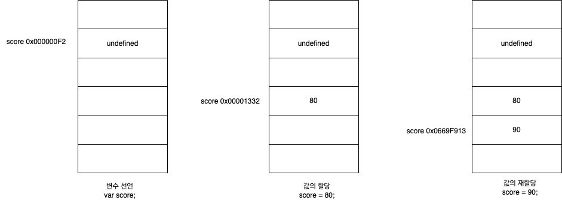

=> **원시 값은 변경 불가능한 값이므로 변수가 참조하던 메모리 공간의 주소가 변경되었다.**

원시 값이 변경 가능한 값이라면

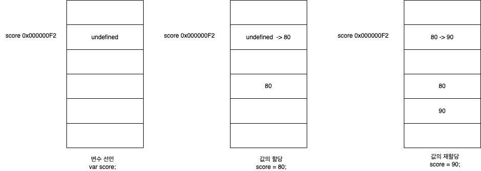

> 원시 값을 재할당하면 새로운 메모리 공간 확보하고 재할당한 값을 저장한 후 변수가 참조하던 메모리 공간의 주소를 변경한다. => 이러한 특성을 불변성 이라한다.

##### 불변성 갖는 원시 값을 할당한 변수는 재할당 이외에 변수 값을 변경할 수 있는 방법이 없다.

##### 유사 배열 객체

=> 배열처럼 인덱스로 프로퍼티 값에 접근할 수 있고 length 프로퍼티 갖는 객체를 말한다.

```javascript
var str = "string";
console.log(str[0]);

console.log(str.length); // 6
console.log(str.toUpperCase()); // STRING

문자열은 유사 배열이므로 인덱스 사용해 각 문자에 접근 할 수 있음
하지만 문자열은 원시 값이므로 변경은 안된다.

str[0] = 'S'; -> 에러가 발생하진 않음

console.log(str); // string

문자열이 메소드를 사용하는 방법 str.slice(2, 3)
1. new String(str) 로 인스턴스를 만들고
2. new String(str).slice(2, 3) 으로 slice 값을 반환한다.
```

##### 값에 의한 전달

```javascript
var score = 80;
var copy = score; => 새로운 숫자 80이 생성되어(메모리 공간을 확보하여) copy 변수에 할당

console.log(score, copy); // 80 80
console.log(score === copy); // true
score 변수와 copy 변수의 값 80은 다른 메모리 공간에 저장된 별개의 값이다.
```

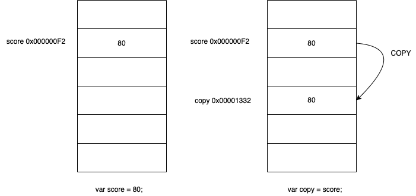

##### 변경 가능한 값

```javascript
person = {
  name: "Lee",
};
```

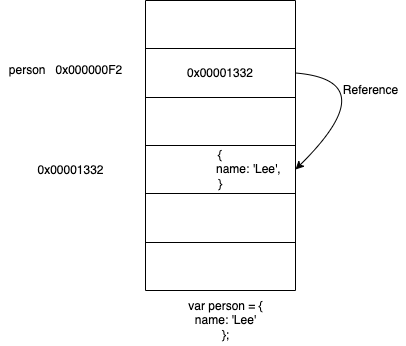

##### 얕은 복사 vs 깊은 복사

복사의 의미는 주솟값이 달라지는 것을 의미

```javascript

var a = {
  c: [1, 2, 3]
}

var b = a
a.c[0] = 4
b.c[0] // 4

객체를 프로퍼티 값으로 갖는 객체의 경우 얕은 복사는 한 단계까지만 복사하는 것
const o = {
    x: {
        y:1
    }
}
const c1 = {...o}
c1 === o  // false
c1.x === o.x // true

깊은 복사

var b = {
  c: [...a.c]
}
a.c[0] = 5
b.c[0] // 4

깊은 복사는 객체에 중첩되어 있는 객체까지 모두 복사하는 것을 말함

const a = require('lodash');
const c2 = a.cloneDeep(o);

c2 === 0 // false
c2.x === o.x // false
```

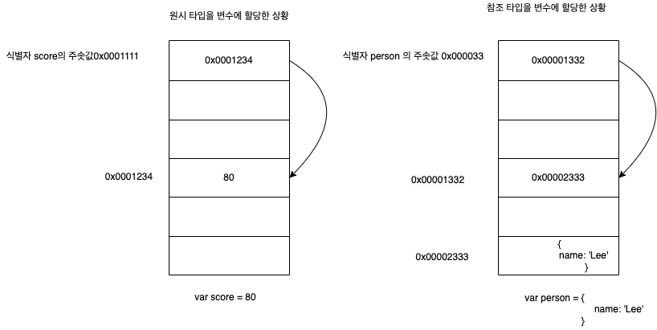

원시 타입을 할당받은 변수는 확보한 메모리 공간에 실제 값이 저장되지만
참조 타입을 할당받은 변수는 확보한 메모리 공간에 참조 값이 저장된다.

```javascript
var person1 = {
  name: "Lee",
};

var person2 = {
  name: "Lee",
};

person1 변수와 person2 변수의 참조값이 다르므로 false
person1 === person2; // false

프로퍼티 값인 name은 원시 타입이므로 메모리에 실제 값이 저장되 있으므로 true 이다
person1.name === person2.name; // true
```

# 12장 함수

##### 함수는 일련의 과정을 문으로 구현하고 코드 블록으로 감싸서 하나의 실행 단위로 정의한 것

##### 매개변수: 함수 내부로 입력을 전달받는 변수

```javascript
add => 함수이름, x, y => 매개변수
function add(x, y) {
  x + y => 반환값
  return x + y;
}
2, 5 => 입력되는 값: 인수
add(2, 5)
```

| 구성요소      | 설명                                                                                                                                                                                                      |
| ------------- | --------------------------------------------------------------------------------------------------------------------------------------------------------------------------------------------------------- |
| 함수이름      | 함수 이름은 식별자 => 식별자 네이밍 규칙 준수해야 함, 함수이름은 함수 몸체 내에서만 참조할 수 있는 식별자, 함수 이름은 생략 가능, 이름이 있는 함수를 기명 함수, 이름이 없는 함수를 무명/익명 함수라 한다. |
| 매개변수 목록 | 0개 이상의 매개변수를 소괄호로 감싸고 쉼표로 구분, 각 매개변수에는 함수 호출할 때 지정한 인수가 순서대로 할당됨(매개변수 목록은 순서에 의미가 있음) 매개변수는 함수 몸체 내에서 변수와 동일하게 취급      |
| 함수 몸체     | 함수가 호출되었을 때 일괄적으로 실행될 문들을 하나의 실행단위로 정의한 코드 블록, 함수 몸체는 함수 호출에 의해 실행된다.                                                                                  |

> 일반 객체는 호출할 수 없지만 함수는 호출할 수 있다.

#### 함수 정의

| 함수 정의 방식                           | 예시                                              |
| ---------------------------------------- | ------------------------------------------------- |
| 함수 선언문(표현식이 아닌 문)            | function add(x,y){return x + y;}                  |
| 함수 표현식(값으로 평가되는 표현식인 문) | var add = function(x, y) {return x + y;};         |
| Function 생성자 함수                     | var add = new Function('x', 'y', 'return x + y'); |
| 화살표 함수                              | var add = (x, y) => x + y;                        |

```javascript
함수 선언문은 표현식이 아닌 문이지만 코드의 문맥에 따라 표현식인 문으로도 쓰인다.

var add = function add(x, y){
  return x + y;
}
add(2, 5) //7

{} 처럼 블록문인지 객체 리터럴인지 모르는 중의적인 상황에 자바스크립트는 코드 문맥에 따라 해석이 달라진다.

단독으로 {} 쓰인 경우에는 블록문으로 해석하지만
값으로 표현되어야 할 문맥(할당 연산자의 우변)에서 피연산자로 사용되면 객체 리터럴로 해석한다.
이와 같이 기명 함수 또한 중의적 코드이다.
피연산자로 사용되지 않는 기명 함수는 함수 선언문(표현식이 아닌 문)으로 해석하고,
변수에 할당하거나 피연산자로 사용하면 함수 리터럴 표현식으로 해석한다.
```

```javascript
function foo() {
  console.log("foo");
}
foo(); // foo

함수 선언문을 피연산자로 사용하면 선언문이 아니라 함수 리터럴 표현식으로 해석된다.
(function bar() {console.log('bar');})
bar(); // ReferenceError: bar is not defined

함수 리터럴에서 함수 이름은 함수 몸체 내에서만 참조할 수 있는 식별자이다.
=> 함수를 가리키는 식별자가 없다는 것과 마찬가지
```

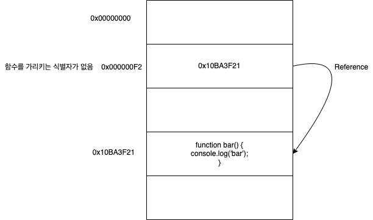

```javascript
var d = function c() {}
console.dir(d);
ƒ c()
  arguments: null
  caller: null
  length: 0
  name: "c"

식별자 d가 함수이름 c인 함수 참조하고 있는 상황이다.

function foo() {} foo는 함수 몸체 내부에서만 유효한 식별자 이므로 foo 로 함수를 호출할 수 없어야 한다.
함수 객체를 가리키는 식별자가 없으면 생성된 함수 객체를 참조할 수 없으므로 호출할 수도 없다

=> 자바스크립트 엔진은 생성된 함수를 호출하기 위해 함수 이름과 동일한 이름의 식별자를 암묵적으로 생성하고 거기에 함수 객체를 할당한다.

var foo = function foo(x, y) {
  return x + y;
};
이런식으로 식별자를 생성한다는 것
```

> 함수는 함수 이름으로 호출하는 것이 아니라 함수 객체를 가리키는 식별자로 호출한다.

```javascript
var add = function foo(x, y) return x + y;

add(2, 5) // 7
foo(2, 5) ReferenceError: foo is not defined

함수 이름은 함수 몸체 내에서만 유효한 식별자 이므로
```

#### 함수 호이스팅

```javascript
console.dir(add); // f add(x, y)
console.dir(sub); // undefined

console.log(add(2, 5)); // 7
console.log(sub(2, 5)); // TypeError: sub is not a function

function add(x, y) {
  return x + y;
}

var sub = function (x, y) {
  return x - y;
};

여타 다른 선언문과 마찬가지로 함수 선언문은 런타임 실행 이전인 소스코드 평가 과정에서 선언문으 미리 실행하기 때문이다.
```

#### Function 생성자 함수

```javascript
var add1 = function () {
  var a = 10;
  return function (x, y) {
    return x + y + a;
  };
};

add1(1, 2); // 13

var add2 = (function () {
  var a = 10;
  return new Function("x", "y", "return x + y + a;");
})();

add2(1, 2); // ReferenceError:

Function 생성자 함수로 생성한 함수는 클로저를 생성하지 않는다.
함수 선언문이나 함수 표현식으로 생성한 함수와 다르게 동작한다.
```

#### 화살표 함수

- 항상 익명 함수로 정의한다.
- 생성자 함수로 사용할 수 없다.
- 기존 함수와 this 바인딩 방식 다름
- prototype 프로퍼티가 없음
- arguments 객체 생성하지 않음

```javascript
var add = (x, y) => x + y;
add(2, 5); // 7
```

1. 매개변수는 함수를 정의할 때 선언
2. 함수 몸체 내부에서 변수와 동일하게 취급
3. 함수가 호출되면 함수 몸체 내에서 암묵적으로 매개변수가 생성
4. 일반 변수와 마찬가지로 undefined 로 초기화된 이후 인수가 순서대로 할당된다.

```javascript
함수는 매개변수의 개수와 인수의 개수가 일치하는지 체크하지 않음

매개변수 > 인수

function add(x, y) {
  return x + y;
}

add(2) // Naxn

매개변수 y = undefined 인 상황
2 + undefined 이므로 NaN이 반환된다.

매개변수 < 인수
function add(x, y) {
  return x + y;
}
add(2, 5, 10) // 7

모든 인수는 암묵적으로 arguments 객체의 프로퍼티로 보관된다.
그래서 10 인수가 버려지는 것이 아니다.

function add(x, y) {
  console.log(arguments); // Arguments(3) [2, 5, 10, ...]
  return x + y;
}

add(2, 5, 10)
```

```javascript
function add(x, y) {
  return x + y;
}

add(2) // NaN
add('a', 'b') // 'ab'

1. 자바스크립트는 매개변수와 인수의 개수가 일치하는지 확인하지 않음 => 매개변수에 default 값 지정해주는 것으로 해결 할 수 있음
2. 자바스크립트는 동적 타입 언어. => 매개변수의 타입을 사전에 지정할 수 없음
```

#### 반환문

1. 반환문은 함수의 실행을 중단하고 함수 몸체를 빠져나간다.
2. return 키워드 뒤에 오는 표현식을 평가해 반환한다.

**반환값이나 반환문 생략시 undefined 반환한다.**

#### 즉시 실행 함수

```javascript
(function () {
  var a = 3;
  var b = 5;
  return a * b;
})(); //  15


즉시 실행 함수에도 인수 전달 가능하다.

var res = (function (a, b) {
  return a * b;
})

res // 15
```

#### 중첩 함수

```javascript
function outer() {
  var x = 1;

  중첩 함수
  function inner() {
    var y = 2;
    console.log(x + y); // 3
  }

  inner();
}

outer();
```

#### 콜백 함수

```javascript
function repeat1(n) {
  for (var i = 0; i < n; i++) console.log(i);
}
repeat1(5); // 0 1 2 3 4

repeat1 함수는 console.log(i)에 강하게 의존하고 있다. => 반복문 내부에서 다른 일 하고 싶다면 함수를 새롭게 정의해야 한다.

function repeat2(n) {
  for(var i = 0 ; i < n ; i++){
    if (i % 2) console.log(i);
  }
}

repeat2(5); //1 3

function repeat(n, f) {
  for (var i = 0 ; i < n ; i++){
    f(i);
  }
}

var logAll = function(i) {
  console.log(i);
};

repeat(5, logAll); // 0 1 2 3 4

var logOdds = function(i) {
  if (i % 2) console.log(i)
};

repeat(5, logOdds); // 1 3

함수의 매개변수를 통해 다른 함수의 내부로 전달되는 함수를 콜백 함수라고 한다.
매개변수를 통해 함수의 외부에서 콜백 함수를 전달받은 함수를 고차 함수라 한다.
```

**콜백 함수는 코차 함수에 의해 호출되며 이때 고차 함수는 필요에 따라 콜백 함수에 인수를 전달할 수 있다. => 고차 함수에 콜백 함수를 전달할 때 콜백 함수를 호출하지 않고 함수 자체를 전달해야 한다.**
=> 함수 자체를 전달해야 하므로 함수 객체를 참조하고 있는 식별자를 매개변수로 전달해 주는것이다.

```javascript
콜백 함수가 고차 함수 내부에만 호출된다면 콜백 함수를 익명 함수 리터럴로 정의하면서 곧바로 고차 함수에 전달하는 것이 일반적이다.


function repeat(n, f) {
  for (var i = 0; i < n; i++) {
    f(i);
  }
}

repeat(5, function (i) {
  if (i % 2) console.log(i);
}); // 1 3
```

#### 순수 함수와 비순수 함수

##### 순수함수: 외부 상태에 의존하지도 않고 변경하지도 않는, 부수 효과가 없는 함수

=> 외부 상태에 의존하지 않고 오직 매개변수를 통해 함수 내부로 전달된 인수에게만 의존해 값을 생성해 반환

```javascript
var count = 0;
function increase(n) {
  return ++n;
}
count = increase(count);
count; // 1

count = increase(count);
count; // 2
```

##### 비순수 함수: 외부 상태에 의존하거나 외부 상태를 변경하는, 부수효과가 있는 함수

```javascript
var count = 0;

function increase() {
  return ++count;
}

increase();
count; // 1

increase();
count; // 2
```

함수 내부에서 외부 상태를 직접 참조하면 외부 상태에 의존하게 되어 반환값이 변할 수 있고, 외부 상태도 변경할 수 있으므로 비순수 함수이다.

# 23장 실행 컨텍스트

#### 소스코드의 타입

> 4 가지 타입의 소스코드는 실행 컨텍스트를 생성한다.

| 소스코드의 타입 | 설명                                                                                          |
| --------------- | --------------------------------------------------------------------------------------------- |
| 전역 코드       | 전역에 존재하는 소스코드, 전역에 정의된 함수, 클래스 등의 내부 코드는 포함되지 않음           |
| 함수 코드       | 함수 내부에 존재하는 소스코드, 함수 내부에 중첩된 함수, 클래스 등의 내부 코드는 포함되지 않음 |
| eval 코드       | 빌트인 전역 함수인 eval 함수에 인수로 전달되어 실행되는 소스코드                              |
| 모듈 코드       | 모듈 내부에 존재하는 소스코드, 모듈 내부의 함수, 클래스 등의 내부 코드는 포함되지 않음        |

#### 전역 코드

1. var 키워드로 선언된 전역 변수와 함수 선언문으로 정의된 전역 함수
2. 전역 객체의 프로퍼티와 메서드로 바인딩하고 참조하기 위해 전역 객체와 연결되어야 함
3. 2번을 위해 전역 코드가 평가되면 전역 실행 컨텍스트가 생성

#### 함수 코드

1. 지역 스코프 생성
2. 지역 변수, 매개변수, arguments 객체 관리
3. 생성된 지역 스코프를 전역 스코프에서 시작하는 스코프 체인의 일원으로 연결해야 함
4. 3번을 위해 함수 코드가 평가되면 함수 실행 컨텍스트가 생성

#### eval 코드

1. strict mode(엄격 모드)에서 자신만의 독자적인 스코프 생성
2. eval 코드 평가되면 eval 실행 컨텍스트 생성

#### 모듈 코드

1. 모듈별로 독립작인 모듈 스코프 생성
2. 모듈 코드 평가되면 모듈 실행 컨텍스트 생성

#### 소스코드의 평가와 실행

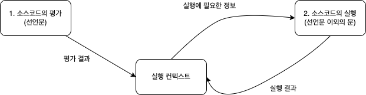

**자바스크립트 엔진은 소스코드를 2개의 과정인 소스코드의 평가와 소스코드의 실행 과정으로 나누어 처리한다.**

1. 소스코드 평가 과정에서 실행 컨텍스트 생성, 변수, 함수 등의 선언문 먼저 실행
2. 1번에서 생성된 변수, 함수 식별자를 키로 실행 컨텍스트가 관리하는 스코프(렉시컬 환경의 환경 레코드)에 등록되고 undefined로 초기화 됨
3. 소스코드 평가 과정 끝나면 선언문 제외한 소스코드가 순차적 실행
4. 소스코드 실행에 필요한 변수나 함수의 참조를 실행 컨텍스트의 스코프에서 검색해서 취득
5. 변수 값의 변경 등 소스코드의 실행 결과는 다시 실행 컨텍스트가 관리하는 스코프에 등록됨

```javascript
const x = 1;
const y = 2;

function foo(a) {
  const x = 10;
  const y = 20;

  console.log(a + x + y); // 130
}

foo(100);

console.log(x + y); // 3
```

1. 전역 코드 평가 => 전역 변수, 전역 함수는 전역 객체의 프로퍼티와 메서드가 됨
2. 전역 코드 실행 => 코드 순차적 실행하며 값 할당하고 함수 호출 => 순차적 실행되던 전역 코드의 실행을 일시 중단하고 함수 내부로 진입
3. 함수 코드 평가 => 매개변수, 지역 변수 선언문 실행 => 실행 컨텍스트가 관리하는 지역 스코프에 등록, 지역 변수처럼 사용할 수 있는 arguments 객체 생성되어 지역 스코프에 등록 => this 바인딩도 결정
4. 함수 코드 실행
   1. 선언된 변수에 값 할당, console.log 메서드 호출
   2. 식별자 console을 스코프 체인 통해 검색(함수 코드의 지역 스코프는 상위 스코프인 전역 스코프와 연결 되있어야 함)
   3. console 식별자는 스코프 체인에 등록되있지 않고 전역 객체에 프로퍼티로 존재
   4. log 프로퍼티를 console 객체의 프로토타입 체인 통해 검색
   5. console.log 메서드에 인수로 전달된 표현식 a + x + y (a,x,y 식별자는 스코프 체인 통해 검색)평가됨

**코드 실행되려면**

1. 스코프 구분
2. 식별자와 바인딩된 값 관리
3. 중첩 관계에 의해 스코프 체인 형성하여 식별자 검색 가능해야함
4. 전역 객체의 프로퍼티도 전역 변수처럼 검색 할 수 있어야 함

##### 실행 컨텍스트

1. 식별자 등록하고 관리하는 스코프(렉시컬 환경으로 관리)
2. 코드 실행 순서 관리(실행 컨텍스트 스택으로 관리)

#### 실행 컨텍스트 스택

```javascript
const x = 1;

function foo() {
  const y = 2;

  function bar() {
    const z = 3;
    console.log(x + y + z);
  }
  bar();
}

foo(); // 6
```


#### 렉시컬 환경

```javascript
const x = 1;

function foo() {
  const y = 2;
  console.log(x + y);
}
```

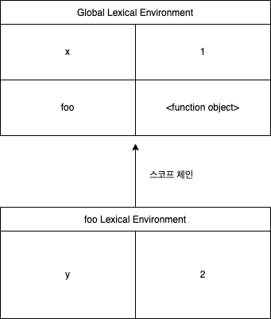

#### 실행 컨텍스트의 생성과 식별자 검색 과정

```javascript
var x = 1;
const y = 2;

function foo(a) {
  var x = 3;
  const y = 4;

  function bar(b) {
    const z = 5;
    console.log(a + b + x + y + z);
  }
  bar(10);
}
foo(20); // 42
```

##### 전역 객체 생성

전역 객체(전역 코드 평가 이전에 생성) == 빌트인 전역 프로퍼티 + 빌트인 전역 함수 + 표준 빌트인 객체 => 전역 객체도 프로토타입 체인의 일원

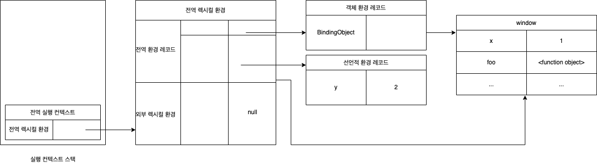

1. 전역 실행 컨텍스트 생성 -> 실행 컨텍스트 스택에 푸시
2. 전역 렉시컬 환경 생성하고 전역 실행 컨텍스트에 바인딩
3. 전역 환경 레코드 생성
   1. 객체 환경 레코드
   - var 키워드로 선언한 전역 변수, 전역 함수들은 객체 환경 레코드에서 관리
   - let, const 키워드로 선언한 전역 변수는 선언적 환경 레코드에서 관리
   - 객체 환경 레코드에 연결된 BindingObject 통해 전역 변수, 전역 함수는 전역 객체의 프로퍼티와 메서드가 된다.(이 메커니즘으로 전역 객체 식별자 없이 전역 객체의 프로퍼티를 참조할 수 있게 됨)
   - x 와 foo 가 전역 객체의 프로퍼티와 메서드가 됨
   2. 선언적 환경 레코드 생성
   - let, const 키워드로 선언한 전역 변수(let, const 키워드로 선언한 변수에 할당한 함수 표현식)은 선언적 환경 레코드에 등록되고 관리
   - 전역 객체의 프로퍼티가 되지 않음
   - const 키워드로 선언한 변수는 선언 단계와 초기화 단계가 분리되어 진행 => 런타임에 실행 흐름이 변수 선언문에 도달하기 전까지 **일시적 사각지대**에 빠지게 됨

##### 외부 렉시컬 환경에 대한 참조 결정 => 상위 스코프를 가리킨다.

전역 코드를 포함하는 소스코드 없으므로 외부 렉시컬 환경에 대한 참조엔 null 이 할당됨

##### 식별자 결정

1. 식별자 결정 위해 식별자 검색할 때는 실행 중인 실행 컨텍스트에서 식별자 검색 시작
2. 렉시컬 환경에서 검색할 수 없으면 외부 렉시컬 환경에 대한 참조가 가리키는 렉시컬 환경(상위 스코프)로 이동하여 식별자 검색한다.

#### foo 함수 코드 평가

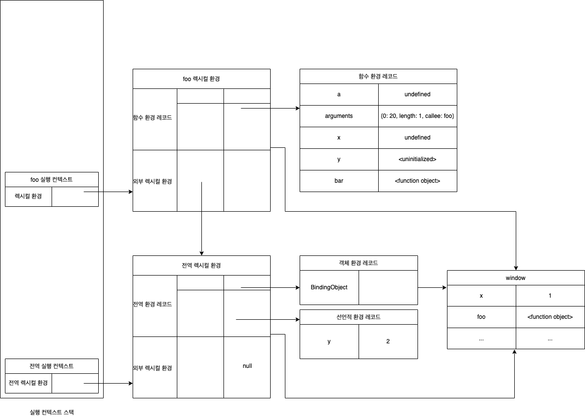

1. 함수 실행 컨텍스트 생성
2. 함수 렉시컬 환경 생성
   - 함수 환경 레코드 생성 => 매개변수, arguments 객체, 지역 변수, 중첩 함수를 등록하고 관리
   - foo 함수는 일반 함수로 호출되었으므로 this는 전역 객체를 가리킨다.
   - 외부 렉시컬 환경에는 전역 렉시컬 환경의 참조가 할당

#### foo 함수 코드 실행

1. 식별자 결정 위해 실행 컨테긋트의 렉시컬 환경에서 식별자 검색 시작

#### bar 함수 코드 평가

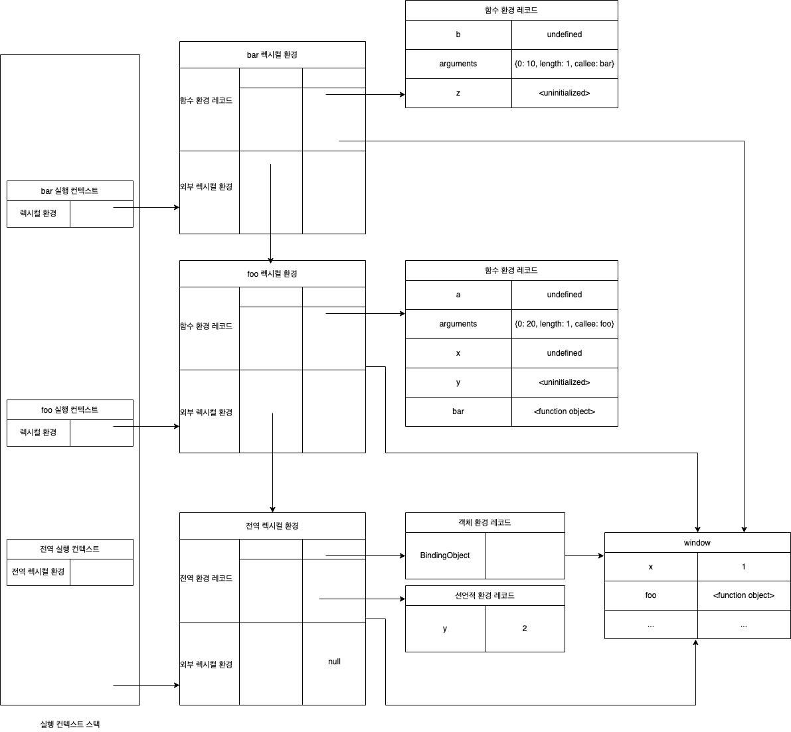

#### bar 함수 코드 실행

> 스코프 체인: 현재 실행중인 실행 컨텍스트의 렉시컬 환경에서 시작해서 외부 렉시컬 환경에 대한 참조로 이어지는 렉시컬 환경의 연속

1. console 식별자를 찾기 위해 스코프 체인에서 검색 => 전역 렉시컬 환경의 객체 환경 레코드의 BindingObject 통해 전역 객체에서 찾을 수 있음

2. log 메서드 검색 => console 객체의 프로토타입 체인 통해 메서드 검색
3. 표현식 a + b + x + y + z의 평가
   a, x, y는 foo 렉시컬 환경
   b, z bar 렉시컬 환경에서 검색

#### bar 함수 코드 실행 종료

실행 컨텍스트 스택에서 bar 함수 실행 컨텍스트 팝되어 제거
bar 함수 실행 컨텍스트가 소멸되었다 해도 bar 함수 렉시컬 환경을 누군가 참조하고 있다면 bar 렉시컬 환경은 소멸하지 않음

#### foo 함수 코드 실행 종료

#### 전역 코드 실행 종료

#### 실행 컨텍스트와 블록 레벨 스코프

- if 문의 코드 블록이 실행되면 새로운 렉시컬 환경을 생성하여 기존의 렉시컬 환경을 교체

#### 렉시컬 스코프

**자바스크립트 엔진은 함수를 어디서 호출했는지가 아니라 함수를 어디에 정의했는지에 따라 상위 스코프를 결정한다. => 렉시컬 스코프(정적 스코프)라 한다.**

# 13장 스코프

- 모든 식별자는 자신이 선언된 위치에 의해 다른 코드가 식별자 자신을 참조할 수 있는 유효 벙뮈가 결정됨
- 식별자가 유효한 범위

```javascript
var var1 = 1;

if (true) {
  var var2 = 2;
  if (true) {
    var var3 = 3;
  }
}

function foo() {
  var var4 = 4;

  funciton bar() {
    var var5 = 5;
  }
}

console.log(var1);  // 1
console.log(var2);  // 2
console.log(var3);  // 3
console.log(var4);  // ReferenceError: var4 is not defined
console.log(var5);  // ReferenceError: var4 is not defined

```

> 코드가 어디서 실행되고 주변에 어떤 코드가 있는지를 => 렉시컬 환경이라 부른다.
> 코드의 문맥은 렉시컬 환경으로 이뤄짐 이를 구현한 것이 실행 컨텍스트

렉시컬 환경

- 스코프 체인은 실행 컨텍스트의 렉시컬 환경을 단방향으로 연결한 것
- 전역 렉시컬 환경은 코드가 로드되면 곧바로 생성
- 함수 렉시컬 환경은 함수가 호출되면 생성

**대부분의 프로그래밍 언어는 함수 몸체만이 아니라 모든 코드 블록(if, for, while, try/catch 등)이 지역 스코프를 만든다. => 블록 레벨 스코프**
**var 키워드로 선언된 변수는 오로지 함수의 코드 블록(함수 몸체)만을 지역 스코프로 인정함**

```javascript
var x = 1;
const a = 1;

if (true) {
  var x = 10;
  const a = 2;
  console.log(x); // 10
  console.log(a); // 2
}

console.log(x); // 10
console.log(a); // 1
```

# 14장 전역 변수의 문제점

##### 지역 변수의 생명 주기는 함수의 생명 주기와 일치한다.

##### 호이스팅은 스코프를 단위로 동작한다.

**var 키워드로 선언한 전역 변수의 생명주기는 전역 객체의 생명주기와 일치한다.**

#### 네임스페이스 오염

자바스크립트는 파일이 분리되어 있어도 하나의 전역 스코프를 공유한다는 것
=> 다른 파일 내에서 동일한 이름으로 명명된 전역 변수나 전역 함수가 같은 스코프 내에 존재할 수 있음

#### 전역 변수의 사용을 억제하는 방법

##### 즉시 실행 함수

```javascript
(function () {
  var foo = 10;
})();

변수를 즉시 실행 함수로 감싸 지역변수로 만든다.
```

##### 네임스페이스 객체

```javascript
전역에 네임스페이스 역할 담당할 객체 생성하고 전역 변수로 사용하고 싶은 변수를 프로퍼티로 추가하는 방법
var MYAPP = {};
MYAPP.name = "Lee";
console.log(MYAPP.name);
```

##### 모듈 패턴

```javascript
var Counter = (function () {
  var num = 0;

  return {
    increase() {
      return ++num;
    },
    decrease() {
      return --num;
    },
  };
})();

Counter.num; // undefined
Counter.increase(); // 1
Counter.increase(); // 2
Counter.decrease(); // 1
Counter.decrease(); // 0

즉시 실행 함수는 외부에 노출하고 싶은 변수나 함수를 담아 반환한다. => public 멤버
외부에 노출하고 싶지 않은 변수나 함수는 반환하는 객체에 추가하지 않으면 private 멤버가 된다.
```

##### ES6 모듈

```HTML
ES6 모듈로 파일 자체의 독자적인 모듈 스코프를 제공
script type 으로 module, 확장자는 mjs를 사용하면 됨

<script type="module" src="lib.mjs"></script>
<script type="module" src="app.mjs"></script>
```

# 15장 let, const 키워드와 블록 레벨 스코프

#### 블록 레벨 스코프

let 키워드로 선언한 변수는 모든 코드 블록(함수, if문, while문, try/catch 문 등)을 지역 스코프로 인정함

```js
let foo = 1;

{
  let foo = 2;
  let bar = 3;
}

foo; // 1
bar; // ReferenceError

let i = 10;

function foo() {
  let i = 100;

  for (let i = 1; i < 3; i++) {
    console.log(i); // 1 2
  }
  console.log(i); // 100
}

foo();

console.log(i); // 100
```

**let 선언한 변수는 선언 단계와 초기화 단계가 분리되어 진행 => JS 엔진에 의해 암묵적으로 선언 단계가 먼저 실행되지만 초기화 단계는 변수 선언문에 도달했을 때 실행됨**

```js
런타임 이전에 선언 단계 실행 => 변수 초기화 되지 않음
초기화 이전의 일시적 사각지대에선 변수 참조할 수 없음
console.log(foo) // referenceError: foo is not defined

let foo; 변수 선언문에서 초기화 단계 실행
console.log(foo); // undefined

foo = 1 할당문에서 할당 단계 실행
console.log(foo) // 1

```

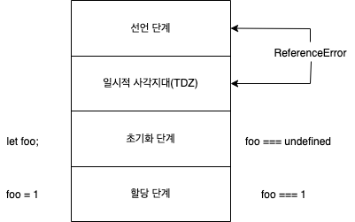

#### const 키워드

**const 키워드로 선언한 변수는 반드시 선언과 동시에 초기화해야 한다**

```js
const foo; // SyntaxError: Missing initializer in const declaration
```
