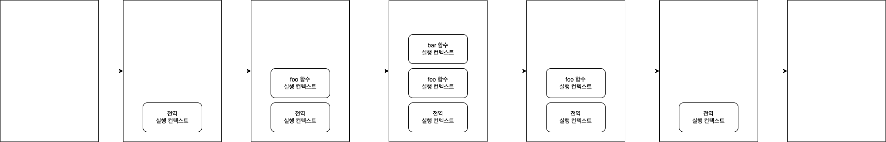

# 4장 변수

> 변수: 하나의 값을 저장하기 위해 확보한 메모리 공간 자체 또는 그 메모리 공간을 식별하기 위해 붙인 이름

```javascript
result = 10 + 20;
```

##### 식별자는 어떤 값을 구별해서 식별할 수 있는 고유한 이름

##### 변수 이름(식별자)는 값이 아니라 메모리 주소를 기억하고 있음

- 메모리 공간에 저장된 값을 식별할 수 있는 고유한 이름 -> 변수 이름(변수명)
- 변수에 저장된 값을 변수 값
- 변수에 값을 저장하는 것을 할당(대입, 저장)
- 변수에 저장된 값을 읽어 들이는 것을 참조

```javascript
var score;
```

다음과 같이 변수 이름 등록하고 값을 저장할 메모리 공간 확보
변수 선언에 의해 확보된 메모리 공간은 자바스크립트 엔진에 의해 undefined라는 값이 암묵적으로 할당되어 초기화 됨

#### 실행 컨텍스트

- 변수 이름 비롯한 모든 식별자는 실행 컨텍스트에 등록
- 자바스크립트 엔진이 소스코드 평가하고 실행하기 위해 필요한 환경 제공
- 코드의 실행 결과를 실제로 관리하는 영역
- 자바스크립트 엔진은 실행 컨텍스트 통해 식별자와 스코프 관리한다.

**ReferenceError**
자바스크립트 엔진에 등록되지 않은 식별자를 참조하려 했을 때 발생하는 에러

#### 변수 선언의 실행 시점과 변수 호이스팅

```javascript
console.log(score); // undefined
var score; // 변수 선언문
```

- 변수 선언이 소스코드가 한 줄씩 순차적으로 실행되는 시점에 실행되는것이 아님
- 런타임 이전 단계에서 실행됨

- 자바스크립트 엔진은 소스코드 한 줄씩 순차 실행하기 앞서 먼저 소스코드 평가 과정 거치면서 소스코드 실행 준비함
- 소스코드 평가 과정에서 엔진은 변수 선언, 모든 선언문을 소스코드에서 찾아내 먼저 실행시킴 그 후 평가과정 끝나면 모든 선언문 제외하고 소스코드를 한 줄씩 순차적으로 실행한다.

> 호이스팅: 변수 선언문이 코드의 선두로 끌어 올려진 것처럼 동작하는 자바스크립트 고유의 특징을 지칭하는 말

**변수 값의 할당은 소스코드가 순차적으로 실행되는 런타임 시점에 실행 됨**

```javascript
console.log(score);
var score;
score = 80;
console.log(score);
```

```javascript
console.log(score);
score = 80;
var score;
console.log(score); // 80
```

- 변수 호이스팅으로 변수가 선언이 됨
- 그 후 런타임 실행 시점에 변수에 값이 할당되고
- 결과 값으로 80이 나온다.

```javascript
console.log(score);
score = 80;
var score = 50;
console.log(score); // 50
```

- 50값 할당이 제일 마지막에 할당되었으므로 50 출력

##### 가비지 콜렉터(garbage collector)

- 메모리 공간을 주기적 검사하여 더 이상 사용되지 않는 메모리 해제하는 기능
- 어떤 식별자도 참조하지 않는 메모리 공간을 해제하는 기능
- 자바스크립트에 내장되어 있는 가비지 콜렉터를 통해 메모리 누수 방지

##### 값은 식(표현식)이 평가되어 생성된 결과

##### 표현식: 값으로 평가될 수 있는 문(statement) 이다.

=> 표현식이 평가되면 새로운 값을 생성하거나 기존 값을 참조한다.

##### 문: 프로그램을 구성하는 기본 단위이자 최소 실행 단위

##### 토큰: 문법적인 의미를 가지며, 문법적으로 더 이상 나눌 수 없는 코드의 기본 요소 의미

=> 키워드, 식별자, 연산자, 리터럴, 세미콜론, 마침표 등

#### 표현식인 문과 표현식이 아닌 문

```javascript
1, 2, 1 + 2, x = 1 + 2 는 모두 표현식
x = 1 + 2 는 표현식이면서 완전한 문이기도 함

var foo = var x; // 변수 선언문은 값으로 평가될 수 없으므로 에러 발생

var foo = x = 100; // 표현식인 문은 값처럼 사용 가능
console.log(foo) // 100
```

# 6장 데이터 타입

```javascript
console.log(10 / 0); // infinity
console.log(10 / -0); // -Infinity

typeof NaN === "number"; // true

12341231231n === BigInt(12341231231); // true
```

##### 일반 문자열 내에서는 줄바꿈 허용되지 않음

```javascript
var str = 'Hello
word.';
// SyntaxError: Invalid or unexpected token
```

#### 심벌 타입

- 변경 불가능한 원시 타입의 값
- 심벌 값은 다른 값과 중복 되지 않는 유일무이한 값
- 이름이 충돌할 위험이 없는 객체의 유일한 프로퍼티 키 만들기 위해 사용

```javascript
var key = Symbol("key");
console.log(typeof key); // symbol

var obj = {};
// 이름이 충돌할 위험이 없는 유일무이한 값인 심벌을 프로퍼티 키로 사용
obj[key] = "value";
console.log(obj[key]); // value

Symbol()에 들어가는 인수는 그저 구분하기 위해 사용하는 것일 뿐
인수 없이 사용해도 중복이 없느 고유한 값을 이용할 수 있다.
```

```javascript
var a = 100;
var b = 100

식별자 a, b 변수가 저장된 주소는 다르고 각각의 변수에 할당된 값의 주소가 같음

ex)
0x111: 식별자 a, 0x123: 100
0x112: 식별자 b, 0x123: 100
```

##### 동적 타이핑

자바스크립트의 변수는 선언이 아닌 할당에 의해 타입이 결정 => 재할당에 의해 변수의 타입은 언제든지 동적으로 변할 수 잇음

# 7장 연산자

```javascript
for (let i ; i < 10 ; i++) === for(let i ; i < 10 ; ++i)
결과 값 똑같다. i++, ++i 는 평가가 나중에 이뤄지기 때문

```

+, - 단항 연산자는 숫자 타입이 아닌 피연산자에 사용하면 피연산자를 숫자 타입으로 변환하여 반환 => 피연산자 변경하는것은 아니고 부호 반전한 값을 생성해 반환

```javascript
var x = "1";

console.log(+x); // 1 => 문자열을 숫자로 타입 변환
console.log(x); // '1' x는 그대로 이다.

x = true;
console.log(+x); // 1 => 불리언 값을 숫자로 타입 변환
console.log(x); // true

x = false;
console.log(+x); // 0
console.log(x); // false

x = "Hello";
console.log(+x); // NaN(Not a Number) => 문자열을 숫자로 타입 변환할 수 없으므로 NaN 반환
console.log(x); // 'Hello'

-"10" - // -10 => 문자열 숫자로 타입 변환
  -true; // -1
-"Hello"; // => NaN
```

#### 문자열 연결 연산자

**+ 연산자는 피연산자 중 하나 이상이 문자열인 경우 문자열 연결 연산자로 동작, 그 외는 산술 연산자로 동작한다.**

```javascript
'1' + 2; // '12'
1 + '2'; // '12'

true는 1로 타입 변환
1 + true; // 2

1 + false // 1

1 + null // 1 => null은 0으로 타입 변환

1 + undefined; // NaN => undefined 는 숫자로 타입 변환되지 않음

숫자를 string 형으로 빠르게 변환하기 위해 123+'' 이런식으로 쓴다
```

##### 할당문은 값으로 평가되는 표현식인 문으로서 할당된 값으로 평가된다.

```
var x;
console.log(x = 10); // 10
```

#### 비교 연산자

| 비교 연산자 | 의미        | 사례    | 설명                     | 부수효과 |
| ----------- | ----------- | ------- | ------------------------ | -------- |
| ==          | 동등 비교   | x == y  | x와 y의 값이 같음        | X        |
| ===         | 일치 비교   | x === y | x와 y의 값과 타입이 같음 | X        |
| !=          | 부동등 비교 | x != y  | x와 y의 값이 다름        | X        |
| !==         | 불일치 비교 | x !== y | x와 y의 값과 타입이 다름 | X        |

**동등 비교(==) 연산자는 좌항과 우항의 피연산자 비교할 때 먼저 암묵적 타입 변환을 통해 타입을 일치시킨 후 같은 값인지 비교**

```javascript
5 == 5; //true
5 == "5"; // true

"0" == ""; // false
0 == ""; // true
0 == "0"; // true
false == "false"; // false
false == "0"; //true
false == null; //false
false == undefined; // false

동등비교 연산자는 예측하기 어려우므로 사용하지 않는 편이 좋음
```

**일치 비교(===) 연산자는 좌항과 우항의 피연산자가 타입도 같고 값도 같은 경우에 한하여 true를 반환한다.**

```javascript
NaN === NaN // false

NaN은 자신과 일치하지 않는 유일한 값 => 숫자가 NaN인지 조사하려면 빌트인 함수 Number.isNaN 사용

Number.isNaN(NaN); // true
Number.isNaN(10); // false
Number.isNaN(1 + undefined); // true
```

Object.is 메서드

> 예측 가능한 정확한 비교 결과를 반환
> -0 === +0 // true
> Object.is(-0, +0) // false
> Object.is(NaN, NaN) // true

#### 삼항 조건 연산자

```javascript
var x = 2;
var result = x % 2 ? "홀수" : "짝수";
console.log(result);
```

```javascript
var x = 10;
var result = if (x % 2) {result = '홀수';} else {result = '짝수';}; // SyntaxError: Unexpected token if

if ... else 문은 표현식이 아닌 문 => 값처럼 사용할 수 없음
```

**삼항 조건 연산자 표현식은 값으로 평가할 수 있는 표현식인 문**

#### 논리 연산자

```javascript
true || true; // true
true || false; // true
false || true; // true
false || false; // false

true && true; // true
true && false; // false
false && true; // false
false && false; // false

!true; // false
!false; // true
```

```javascript
!0; // true
!"Hello"; // false
```

**논리합(||) 또는 논리곱(&&) 연산자 표현식의 평가 결과는 불리언 값 아닐 수도 있음**
=> 논리합, 논리곱 연산자 표현식은 언제나 2개의 피연산자 중 어느 한쪽으로 평가됨

```javascript
"Cat" && "Dog"; // 'Dog'
```

#### 쉼표 연산자

```javascript
var x, y, z
x = 1, y = 2, z = 3; // 3

function a() {
  var x, y
  return x = 1, y = 2, console.log(x), console.log(x*y), x+y
  => 마지막 피연산자의 평가 결과인 3 반환
}
쉼표 연산자는 왼쪽 피연산자부터 차례대로 피연산자를 평가하고 마지막 피연산자의 평가가 끝나면 마지막 피연산자의 평가 결과를 반환한다.
```

#### typeof 연산자

```javascript
typeof null // object
typeof /test/gi //object
typeof function() {} // function

typeof null => 자바스크립트의 첫 번째 버전의 버그
null 타입 확인할 때는 === 연산자 사용
```

#####지수연산자
-5 \*\* 2 // SyntaxError
(-5) \*\* 2 // 25
var num = 5
num \*\*= 2 // 25

#### 그 외의 연산자

| 연산자     | 개요                                                        |
| ---------- | ----------------------------------------------------------- |
| ?.         | 옵셔널 체이닝 연산자                                        |
| ??         | null 병합 연산자                                            |
| delete     | 프로퍼티 삭제                                               |
| new        | 생성자 함수를 호출할 때 사용하여 인스턴스를 생성            |
| instanceof | 좌변의 객체가 우변의 생성자 함수와 연결된 인스턴스인지 판별 |
| in         | 프로퍼티 존재 확인                                          |

```javascript
옵셔널 체이닝 연산자

const obj = {
  a: {
    b: {
      c: {
        d: 1,
      },
    },
  },
};

const obj2 = {
  a: {
    b: 0,
  },
};

obj.a?.b?.c?.d // 1
obj2.a?.b?.c? // undefined

null 병합 연산자

const a = obj2.a?.b?.c? ?? 10
// 10
const a = obj2.a?.b ?? 10
// 0

앞의 피연산자 값이 null 이면 10 할당
null이 아니면 앞 피연산자 값 할당

delete 연산자
var o = {a: 1};

delete o.a;
console.log(o); // {}
```

# 8장 제어문

##### 제어문: 조건에 따라 코드 블록을 실행(조건문)하거나 반복 실행 할 때 사용

##### 블록문: 0개 이상의 문을 중괄호로 묶은 것, 블록문 => 하나의 실행 단위로 취급, 코드 블록 내의 문이 하나뿐이라면 중괄호를 생략할 수 있음

```javascript
// 블록문
{
  var foo = 10;
  console.log(foo); // 10
}

// 제어문
var x = 1;
if (x < 10) {
  x++;
}
```

경우의 수가 세 가지 인 경우 삼항 조건 연산자

```javascript
var num = 2;
var kind = num ? (num > 0 ? "양수" : "음수") : "영";
console.log(kind); // 양수
```

#### Switch 문

> if ... else 문의 조건식은 불리언 값으로 평가되어야 하지만 switch 문의 표현식은 불리언 값보단 문자열이나 숫자 값인 경우가 많다.

```javascript
var month = 11;
var monthName;

switch (month) {
  case 10:
    monthName = "October";
  case 11:
    monthName = "November";
  case 12:
    monthName = "December";
  default:
    monthName = "Invalid month";
}

console.log(monthName); // Invalid month
```

=> **표현식의 평가 결과와 일치하는 case 문으로 이동한 후 switch 문 끝날 때까지 이후의 모든 case 문과 default 문 실행했기 때문 이를 폴스루라 한다.**

> 레이블 문: 식별자가 붙은 문

```javascript
outer: for (var i = 0; i < 3; i++) {
  for (var j = 0; j < 3; j++) {
    console.log(i + j);
    if (i + j === 3) break outer;
  }
}

break outer 로 식별자 outer for 문이 break 하게 된다.
{
  outer: for (var i = 0; i < 3; i++) {
    for (var j = 0; j < 3; j++) {
      console.log(i + j);
      if (i + j === 3) break outer;
    }
  }
}

for문이 표현식이 아닌 문이기 때문에 객체가 아니라 식별자로 판단하고 블록 실행
혼동할 수 있기 때문에 사용하지 않는걸 추천
```

# 9장 타입 변환과 단축 평가

```javascript
var x = 10;

// 명시적 타입 변환
// 숫자를 문자열로 타입 캐스팅
var str = x.toString();
console.log(typeof str, str); // string 10

// x 변수의 값이 변경된 것은 아님
console.log(typeof x, x); // number 10
```

```javascript
var x = 10;

//암묵적 타입 변환, 타입 강제 변환
var str = x + "";
console.log(typeof str, str); // string 10

// x 변수의 값이 변경된 것은 아님
console.log(typeof x, x); // number 10
```

> falsy data: 0, '', false, NaN, undefined, null

##### 숫자 타입으로 변환

```javascript
1 - "1"; // 0
1 * "10"; // 10
1 / "one"; // NaN
"1" > 0; // true

+""; // 0
+"string"; // NaN
+null; // 0

+undefined + // NaN
  {} + // NaN
  [] + // 0
  [10, 20] + // NaN
  function () {}; // NaN
```

##### 단축 평가

| 단축 평가 표현식    | 평가 결과 |
| ------------------- | --------- |
| true \|\| anything  | true      |
| false \|\| anything | anything  |
| true && anything    | anything  |
| false && anything   | false     |

단축 평가를 사용하여 if문 대체

```javascript
var done = true;
var message = "";

if (done) message = "완료";

message = done && "완료";
console.log(message); // 완료

done = false
message = done && '완료' || '미완료 -> 왼쪽에서부터 계산
console.log(message) // 미완료


객체를 가리키기를 기대하는 변수가 null 또는 undefined가 아닌지 확인하고 프로퍼티 참조할 때

var elem = null
var value = elem && elem.value

함수 매개변수에 기본값 설정할 때
undefined 에러 방지

function getStringLength(str) {
  str = str || '';
  return str.length
}

getStringLength(); // 0
getStringLength('hi'); // 2

매개변수의 기본값 설정이 더 낫다
function getStringLength(str = '') {
  return str.length
}
```

##### 옵셔널 체이닝 연산자

```javascript
var elem = null;

elem 이 null 또는 undefined이면 undefined 반환하고, 그렇지 않으면 우항의 프로퍼티 참조 이어감

var value = elem?.value
console.log(value); // undefined

좌항 피연산자가 false 로 평가되는 Falsy 값이여도 null 또는 undefined 가 아니기만 하면 우항의 프로퍼티 참조 이어감

var str = '';
var length = str?.length;
console.log(length); // 0
```

##### null 병합 연산자

좌항의 피연산자가 null 또는 undefined 만인 경우 우항의 피연산자를 반환하고 아니면 좌항의 피연산자를 반환

```javascript
var foo = null ?? "default string";
console.log(foo); // default string
```

# 10장 객체 리터럴

##### 객체타입은 다양한 타입의 값(원시 값 또는 다른 객체)을 하나의 단위로 구성한 복합적인 자료구조

> 자바스크립트는 객체 기반의 프로그래밍 언어, 자바스크립트를 구성하는 거의 모든 것이 객체이다.(원시 값을 제외한 나머지 값(함수, 배열, 정규 표현식 등))

원시 타입은 단 하나의 값만 나타냄

**객체**(클래스와 인스턴스를 포함한 개념)

- 프로퍼티: 객체의 상태를 나타내는 값
- 메서드: 프로퍼티(상태 데이터)를 참조하고 조작할 수 있는 동작

**인스턴스**

- 클래스에 의해 생성되어 메모리에 저장된 실체
- 클래스는 인스턴스를 생성하기 위한 템플릿 역할

##### 자바스크립트는 프로토타입 기반 객체지향 언어로서 클래스 기반 객체지향 언어와는 달리 다양한 객체 생성 방법 지원

- 객체 리터럴
- Object 생성자 함수
- 생성자 함수
- Object.create 메서드
- 클래스

```javascript
var person = {
  name: "Lee",
  sayHello: function () {
    console.log(`Hello My name is ${this.name}.`);
  },
};

여기서 this는 person을 가리킨다.
this 키워드는 객체 자신을 가리키기 위한 참조변수이다.

console.log(typeof person); // object
console.log(person); // {name: "Lee", sayHello: f}

객체의 중괄호는 블록문이 아니기 때문에 닫는 중괄호에 세미콜론 필요
```

프로퍼티 키: 빈 문자열 포함하는 모든 문자열 또는 심벌 값
프로퍼티 값: 자바스크립트에서 사용할 수 있는 모든 값

> 프로퍼티 키는 자바스크립트에서 사용 가능한 유효한 이름인 경우 따옴표 생략 가능하다
> => 식별자 네이밍 규칙 따르지 않는 이름에는 따옴표 사용해야 함

```javascript
var foo = {
  0: 1,
  1: 2,
  2: 3,
};

console.log(foo); // {0: 1, 1: 2, 2: 3}

프로퍼티 키에 문자열이나 심벌 값 외의 값 사용하면 암묵적 타입 변환 통해 문자열이 됨(따옴표가 붙지 않아도 내부적으로 문자열로 변환된다.)


var foo = {
  name: 'Lee',
  name: 'kim',
};

console.log(foo); // {name: "kim"}
프로퍼티 키 중복 선언하면 나중에 선언한 프로퍼티로 덮어씌어 진다.
```

```javascript
var person = {
  'last-name': 'Lee',
  name: "Lee",
  1: 10
};

console.log(person.name);
console.log(person["name"]);

대괄호 프로퍼티 접근 연산자 내부에 지정하는 프로퍼티 키는 따옴표로 감싸야한다.

객체에 존재하지 않는 프로퍼티에 접근하면 undefined 반환한다.
ReferenceError 발생하지 않음

console.log(person.age) // undefined


프로퍼티 키가 식별자 네이밍 규칙을 준수하는 이름 => 마침표 표기법, 대괄호 표기법 모두 사용 가능

네이밍 규칙 준수하지 않으면 => 대괄호 표기법만 사용가능

person.'last-name'; // SyntaxError
person.last-name // 브라우저 환경: NaN, Node.js 환경: ReferenceError: name is not defined

브라우저 환경
-> person.last 평가 => undefined 로 평가
-> person.last-name == undefined - name(식별자로 해석)
-> 전역 변수 name은 전역 객체인 window의 프로퍼티으로 존재한다.
-> name == window.name(기본값은 빈 문자열)
=> undefined - '' 으로 해석되어 NaN 발생

Node.JS 환경
-> name 이라는 식별자가 없으므로 ReferenceError: name is not defined 에러 발생 된다.

person[last-name]; // ReferenceError: last is not defined
person['last-name']; // Lee

// 프로퍼티 키가 숫자로 이뤄진 문자열인 경우 따옴표 생략 가능
person.1 // SyntaxError: unexpected number
person.'1' // SyntaxError: Unexpected string
person[1]; // 10
person['1'] // 10

```

#### 프로퍼티 동적 생성

```javascript
var person = {
  name: "Lee",
};

person.age = 20;

console.log(person); // {name: "Lee", age: 20}

프로퍼티 삭제

person.address 프로퍼티가 없어도 에러가 생기지 않는다.
```

#### 프로퍼티 축약 표현

```javascript
var x = 1,
  y = 2;

var obj = {
  x: x,
  y: y,
};

console.log(obj); // {x: 1, y: 2}

const obj = { x, y };

console.log(obj); // {x: 1, y: 2}
```

#### 계산된 프로퍼티 이름

```javascript
var prefix = "prop";
var i = 0;

var obj = {};
obj[prefix + "-" + ++i] = i;
obj[prefix + "-" + ++i] = i;
obj[prefix + "-" + ++i] = i;

console.log(obj); // {prop-1: 1, prop-2: 2, prop-3: 3}

obj = {
  [`${prefix} - ${++i}`]: i
  [`${prefix} - ${++i}`]: i
  [`${prefix} - ${++i}`]: i
}

console.log(obj); // {prop-1: 1, prop-2: 2, prop-3: 3}
```

### 메서드 축약표현

```javascript
const obj = {
    name: "Lee",
    sayHi: function() {
        console.log(`Hi ${this.name}`);
    }
}
console.dir(obj)

Object
name: "Lee"
sayHi: ƒ ()
  arguments: null
  caller: null
  length: 0
  name: "sayHi"
prototype:
  constructor: ƒ ()
  [[Prototype]]: Object
[[FunctionLocation]]: VM376:3
[[Prototype]]: ƒ ()
[[Scopes]]: Scopes[2]
[[Prototype]]: Object


const obj2 = {
    name: 'Lee',
    sayHi() {
        console.log(`Hi ${this.name}`);
    }
};
console.dir(obj2);

Object
name: "Lee"
sayHi: ƒ sayHi()
  length: 0
  name: "sayHi"
  arguments: (...)
  caller: (...)
[[FunctionLocation]]: VM658:3
[[Prototype]]: ƒ ()
[[Scopes]]: Scopes[2]
[[Prototype]]: Object

const a = new obj.sayHi();
Hi undefined

const b = new obj2.sayHi();
Uncaught TypeError: obj2.sayHi is not a constructor
    at <anonymous>:1:11

메시지 축약 사용한 obj2의 sayHi 는 prototype 가 없어서 생성자 함수로 생성할 수 없다.
```

# 11장 원시 값과 객체의 비교

- 원시 타입의 값은 변경 불가능한 값
- 객체(참조) 타입의 값(객체)는 변경 가능한 값
- 원시 값을 변수에 할당하면 변수(확보된 메모리 공간)에는 실제 값이 저장
- 객체를 변수(확보된 메모리 공간)에는 참조 값이 저장됨
- 원시 값 갖는 변수를 다른 변수에 할당하면 원본의 원시 값이 복사되어 전달 => 값에 의한 전달이라 한다.
- 객체를 가리키는 변수를 다른 변수에 할당하면 원본의 참조 값이 복사되어 전달 => 참조에 의한 전달이라 한다.

```javascript
const a = {}
a = 5
Uncaught TypeError: Assignment to constant variable.
at <anonymous>:2:3

const 변수에 재할당은 불가

const 키워드 사용해 선언한 변수에 할당한 원시 값(상수)은 변경할 수 없다.
const 키워드 사용해 선언한 변수에 할당한 객체는 변경할 수 있다.

a.name = 5
console.log(a) // {name: 5}
동적으로 프로퍼티 생성하는 것은 된다.
```


=> **원시 값은 변경 불가능한 값이므로 변수가 참조하던 메모리 공간의 주소가 변경되었다.**

원시 값이 변경 가능한 값이라면


> 원시 값을 재할당하면 새로운 메모리 공간 확보하고 재할당한 값을 저장한 후 변수가 참조하던 메모리 공간의 주소를 변경한다. => 이러한 특성을 불변성 이라한다.

##### 불변성 갖는 원시 값을 할당한 변수는 재할당 이외에 변수 값을 변경할 수 있는 방법이 없다.

##### 유사 배열 객체

=> 배열처럼 인덱스로 프로퍼티 값에 접근할 수 있고 length 프로퍼티 갖는 객체를 말한다.

```javascript
var str = "string";
console.log(str[0]);

console.log(str.length); // 6
console.log(str.toUpperCase()); // STRING

문자열은 유사 배열이므로 인덱스 사용해 각 문자에 접근 할 수 있음
하지만 문자열은 원시 값이므로 변경은 안된다.

str[0] = 'S'; -> 에러가 발생하진 않음

console.log(str); // string

문자열이 메소드를 사용하는 방법 str.slice(2, 3)
1. new String(str) 로 인스턴스를 만들고
2. new String(str).slice(2, 3) 으로 slice 값을 반환한다.
```

##### 값에 의한 전달

```javascript
var score = 80;
var copy = score; => 새로운 숫자 80이 생성되어(메모리 공간을 확보하여) copy 변수에 할당

console.log(score, copy); // 80 80
console.log(score === copy); // true
score 변수와 copy 변수의 값 80은 다른 메모리 공간에 저장된 별개의 값이다.
```


##### 변경 가능한 값

```javascript
person = {
  name: "Lee",
};
```


##### 얕은 복사 vs 깊은 복사

복사의 의미는 주솟값이 달라지는 것을 의미

```javascript

var a = {
  c: [1, 2, 3]
}

var b = a
a.c[0] = 4
b.c[0] // 4

객체를 프로퍼티 값으로 갖는 객체의 경우 얕은 복사는 한 단계까지만 복사하는 것
const o = {
    x: {
        y:1
    }
}
const c1 = {...o}
c1 === o  // false
c1.x === o.x // true

깊은 복사

var b = {
  c: [...a.c]
}
a.c[0] = 5
b.c[0] // 4

깊은 복사는 객체에 중첩되어 있는 객체까지 모두 복사하는 것을 말함

const a = require('lodash');
const c2 = a.cloneDeep(o);

c2 === 0 // false
c2.x === o.x // false
```


원시 타입을 할당받은 변수는 확보한 메모리 공간에 실제 값이 저장되지만
참조 타입을 할당받은 변수는 확보한 메모리 공간에 참조 값이 저장된다.

```javascript
var person1 = {
  name: "Lee",
};

var person2 = {
  name: "Lee",
};

person1 변수와 person2 변수의 참조값이 다르므로 false
person1 === person2; // false

프로퍼티 값인 name은 원시 타입이므로 메모리에 실제 값이 저장되 있으므로 true 이다
person1.name === person2.name; // true
```

# 12장 함수

##### 함수는 일련의 과정을 문으로 구현하고 코드 블록으로 감싸서 하나의 실행 단위로 정의한 것

##### 매개변수: 함수 내부로 입력을 전달받는 변수

```javascript
add => 함수이름, x, y => 매개변수
function add(x, y) {
  x + y => 반환값
  return x + y;
}
2, 5 => 입력되는 값: 인수
add(2, 5)
```

| 구성요소      | 설명                                                                                                                                                                                                      |
| ------------- | --------------------------------------------------------------------------------------------------------------------------------------------------------------------------------------------------------- |
| 함수이름      | 함수 이름은 식별자 => 식별자 네이밍 규칙 준수해야 함, 함수이름은 함수 몸체 내에서만 참조할 수 있는 식별자, 함수 이름은 생략 가능, 이름이 있는 함수를 기명 함수, 이름이 없는 함수를 무명/익명 함수라 한다. |
| 매개변수 목록 | 0개 이상의 매개변수를 소괄호로 감싸고 쉼표로 구분, 각 매개변수에는 함수 호출할 때 지정한 인수가 순서대로 할당됨(매개변수 목록은 순서에 의미가 있음) 매개변수는 함수 몸체 내에서 변수와 동일하게 취급      |
| 함수 몸체     | 함수가 호출되었을 때 일괄적으로 실행될 문들을 하나의 실행단위로 정의한 코드 블록, 함수 몸체는 함수 호출에 의해 실행된다.                                                                                  |

> 일반 객체는 호출할 수 없지만 함수는 호출할 수 있다.

#### 함수 정의

| 함수 정의 방식                           | 예시                                              |
| ---------------------------------------- | ------------------------------------------------- |
| 함수 선언문(표현식이 아닌 문)            | function add(x,y){return x + y;}                  |
| 함수 표현식(값으로 평가되는 표현식인 문) | var add = function(x, y) {return x + y;};         |
| Function 생성자 함수                     | var add = new Function('x', 'y', 'return x + y'); |
| 화살표 함수                              | var add = (x, y) => x + y;                        |

```javascript
함수 선언문은 표현식이 아닌 문이지만 코드의 문맥에 따라 표현식인 문으로도 쓰인다.

var add = function add(x, y){
  return x + y;
}
add(2, 5) //7

{} 처럼 블록문인지 객체 리터럴인지 모르는 중의적인 상황에 자바스크립트는 코드 문맥에 따라 해석이 달라진다.

단독으로 {} 쓰인 경우에는 블록문으로 해석하지만
값으로 표현되어야 할 문맥(할당 연산자의 우변)에서 피연산자로 사용되면 객체 리터럴로 해석한다.
이와 같이 기명 함수 또한 중의적 코드이다.
피연산자로 사용되지 않는 기명 함수는 함수 선언문(표현식이 아닌 문)으로 해석하고,
변수에 할당하거나 피연산자로 사용하면 함수 리터럴 표현식으로 해석한다.
```

```javascript
function foo() {
  console.log("foo");
}
foo(); // foo

함수 선언문을 피연산자로 사용하면 선언문이 아니라 함수 리터럴 표현식으로 해석된다.
(function bar() {console.log('bar');})
bar(); // ReferenceError: bar is not defined

함수 리터럴에서 함수 이름은 함수 몸체 내에서만 참조할 수 있는 식별자이다.
=> 함수를 가리키는 식별자가 없다는 것과 마찬가지
```


```javascript
var d = function c() {}
console.dir(d);
ƒ c()
  arguments: null
  caller: null
  length: 0
  name: "c"

식별자 d가 함수이름 c인 함수 참조하고 있는 상황이다.

function foo() {} foo는 함수 몸체 내부에서만 유효한 식별자 이므로 foo 로 함수를 호출할 수 없어야 한다.
함수 객체를 가리키는 식별자가 없으면 생성된 함수 객체를 참조할 수 없으므로 호출할 수도 없다

=> 자바스크립트 엔진은 생성된 함수를 호출하기 위해 함수 이름과 동일한 이름의 식별자를 암묵적으로 생성하고 거기에 함수 객체를 할당한다.

var foo = function foo(x, y) {
  return x + y;
};
이런식으로 식별자를 생성한다는 것
```

> 함수는 함수 이름으로 호출하는 것이 아니라 함수 객체를 가리키는 식별자로 호출한다.

```javascript
var add = function foo(x, y) return x + y;

add(2, 5) // 7
foo(2, 5) ReferenceError: foo is not defined

함수 이름은 함수 몸체 내에서만 유효한 식별자 이므로
```

#### 함수 호이스팅

```javascript
console.dir(add); // f add(x, y)
console.dir(sub); // undefined

console.log(add(2, 5)); // 7
console.log(sub(2, 5)); // TypeError: sub is not a function

function add(x, y) {
  return x + y;
}

var sub = function (x, y) {
  return x - y;
};

여타 다른 선언문과 마찬가지로 함수 선언문은 런타임 실행 이전인 소스코드 평가 과정에서 선언문으 미리 실행하기 때문이다.
```

#### Function 생성자 함수

```javascript
var add1 = function () {
  var a = 10;
  return function (x, y) {
    return x + y + a;
  };
};

add1(1, 2); // 13

var add2 = (function () {
  var a = 10;
  return new Function("x", "y", "return x + y + a;");
})();

add2(1, 2); // ReferenceError:

Function 생성자 함수로 생성한 함수는 클로저를 생성하지 않는다.
함수 선언문이나 함수 표현식으로 생성한 함수와 다르게 동작한다.
```

#### 화살표 함수

- 항상 익명 함수로 정의한다.
- 생성자 함수로 사용할 수 없다.
- 기존 함수와 this 바인딩 방식 다름
- prototype 프로퍼티가 없음
- arguments 객체 생성하지 않음

```javascript
var add = (x, y) => x + y;
add(2, 5); // 7
```

1. 매개변수는 함수를 정의할 때 선언
2. 함수 몸체 내부에서 변수와 동일하게 취급
3. 함수가 호출되면 함수 몸체 내에서 암묵적으로 매개변수가 생성
4. 일반 변수와 마찬가지로 undefined 로 초기화된 이후 인수가 순서대로 할당된다.

```javascript
함수는 매개변수의 개수와 인수의 개수가 일치하는지 체크하지 않음

매개변수 > 인수

function add(x, y) {
  return x + y;
}

add(2) // Naxn

매개변수 y = undefined 인 상황
2 + undefined 이므로 NaN이 반환된다.

매개변수 < 인수
function add(x, y) {
  return x + y;
}
add(2, 5, 10) // 7

모든 인수는 암묵적으로 arguments 객체의 프로퍼티로 보관된다.
그래서 10 인수가 버려지는 것이 아니다.

function add(x, y) {
  console.log(arguments); // Arguments(3) [2, 5, 10, ...]
  return x + y;
}

add(2, 5, 10)
```

```javascript
function add(x, y) {
  return x + y;
}

add(2) // NaN
add('a', 'b') // 'ab'

1. 자바스크립트는 매개변수와 인수의 개수가 일치하는지 확인하지 않음 => 매개변수에 default 값 지정해주는 것으로 해결 할 수 있음
2. 자바스크립트는 동적 타입 언어. => 매개변수의 타입을 사전에 지정할 수 없음
```

#### 반환문

1. 반환문은 함수의 실행을 중단하고 함수 몸체를 빠져나간다.
2. return 키워드 뒤에 오는 표현식을 평가해 반환한다.

**반환값이나 반환문 생략시 undefined 반환한다.**

#### 즉시 실행 함수

```javascript
(function () {
  var a = 3;
  var b = 5;
  return a * b;
})(); //  15


즉시 실행 함수에도 인수 전달 가능하다.

var res = (function (a, b) {
  return a * b;
})

res // 15
```

#### 중첩 함수

```javascript
function outer() {
  var x = 1;

  중첩 함수
  function inner() {
    var y = 2;
    console.log(x + y); // 3
  }

  inner();
}

outer();
```

#### 콜백 함수

```javascript
function repeat1(n) {
  for (var i = 0; i < n; i++) console.log(i);
}
repeat1(5); // 0 1 2 3 4

repeat1 함수는 console.log(i)에 강하게 의존하고 있다. => 반복문 내부에서 다른 일 하고 싶다면 함수를 새롭게 정의해야 한다.

function repeat2(n) {
  for(var i = 0 ; i < n ; i++){
    if (i % 2) console.log(i);
  }
}

repeat2(5); //1 3

function repeat(n, f) {
  for (var i = 0 ; i < n ; i++){
    f(i);
  }
}

var logAll = function(i) {
  console.log(i);
};

repeat(5, logAll); // 0 1 2 3 4

var logOdds = function(i) {
  if (i % 2) console.log(i)
};

repeat(5, logOdds); // 1 3

함수의 매개변수를 통해 다른 함수의 내부로 전달되는 함수를 콜백 함수라고 한다.
매개변수를 통해 함수의 외부에서 콜백 함수를 전달받은 함수를 고차 함수라 한다.
```

**콜백 함수는 코차 함수에 의해 호출되며 이때 고차 함수는 필요에 따라 콜백 함수에 인수를 전달할 수 있다. => 고차 함수에 콜백 함수를 전달할 때 콜백 함수를 호출하지 않고 함수 자체를 전달해야 한다.**
=> 함수 자체를 전달해야 하므로 함수 객체를 참조하고 있는 식별자를 매개변수로 전달해 주는것이다.

```javascript
콜백 함수가 고차 함수 내부에만 호출된다면 콜백 함수를 익명 함수 리터럴로 정의하면서 곧바로 고차 함수에 전달하는 것이 일반적이다.


function repeat(n, f) {
  for (var i = 0; i < n; i++) {
    f(i);
  }
}

repeat(5, function (i) {
  if (i % 2) console.log(i);
}); // 1 3
```

#### 순수 함수와 비순수 함수

##### 순수함수: 외부 상태에 의존하지도 않고 변경하지도 않는, 부수 효과가 없는 함수

=> 외부 상태에 의존하지 않고 오직 매개변수를 통해 함수 내부로 전달된 인수에게만 의존해 값을 생성해 반환

```javascript
var count = 0;
function increase(n) {
  return ++n;
}
count = increase(count);
count; // 1

count = increase(count);
count; // 2
```

##### 비순수 함수: 외부 상태에 의존하거나 외부 상태를 변경하는, 부수효과가 있는 함수

```javascript
var count = 0;

function increase() {
  return ++count;
}

increase();
count; // 1

increase();
count; // 2
```

함수 내부에서 외부 상태를 직접 참조하면 외부 상태에 의존하게 되어 반환값이 변할 수 있고, 외부 상태도 변경할 수 있으므로 비순수 함수이다.

# 23장 실행 컨텍스트

#### 소스코드의 타입

> 4 가지 타입의 소스코드는 실행 컨텍스트를 생성한다.

| 소스코드의 타입 | 설명                                                                                          |
| --------------- | --------------------------------------------------------------------------------------------- |
| 전역 코드       | 전역에 존재하는 소스코드, 전역에 정의된 함수, 클래스 등의 내부 코드는 포함되지 않음           |
| 함수 코드       | 함수 내부에 존재하는 소스코드, 함수 내부에 중첩된 함수, 클래스 등의 내부 코드는 포함되지 않음 |
| eval 코드       | 빌트인 전역 함수인 eval 함수에 인수로 전달되어 실행되는 소스코드                              |
| 모듈 코드       | 모듈 내부에 존재하는 소스코드, 모듈 내부의 함수, 클래스 등의 내부 코드는 포함되지 않음        |

#### 전역 코드

1. var 키워드로 선언된 전역 변수와 함수 선언문으로 정의된 전역 함수
2. 전역 객체의 프로퍼티와 메서드로 바인딩하고 참조하기 위해 전역 객체와 연결되어야 함
3. 2번을 위해 전역 코드가 평가되면 전역 실행 컨텍스트가 생성

#### 함수 코드

1. 지역 스코프 생성
2. 지역 변수, 매개변수, arguments 객체 관리
3. 생성된 지역 스코프를 전역 스코프에서 시작하는 스코프 체인의 일원으로 연결해야 함
4. 3번을 위해 함수 코드가 평가되면 함수 실행 컨텍스트가 생성

#### eval 코드

1. strict mode(엄격 모드)에서 자신만의 독자적인 스코프 생성
2. eval 코드 평가되면 eval 실행 컨텍스트 생성

#### 모듈 코드

1. 모듈별로 독립작인 모듈 스코프 생성
2. 모듈 코드 평가되면 모듈 실행 컨텍스트 생성

#### 소스코드의 평가와 실행


**자바스크립트 엔진은 소스코드를 2개의 과정인 소스코드의 평가와 소스코드의 실행 과정으로 나누어 처리한다.**

1. 소스코드 평가 과정에서 실행 컨텍스트 생성, 변수, 함수 등의 선언문 먼저 실행
2. 1번에서 생성된 변수, 함수 식별자를 키로 실행 컨텍스트가 관리하는 스코프(렉시컬 환경의 환경 레코드)에 등록되고 undefined로 초기화 됨
3. 소스코드 평가 과정 끝나면 선언문 제외한 소스코드가 순차적 실행
4. 소스코드 실행에 필요한 변수나 함수의 참조를 실행 컨텍스트의 스코프에서 검색해서 취득
5. 변수 값의 변경 등 소스코드의 실행 결과는 다시 실행 컨텍스트가 관리하는 스코프에 등록됨

```javascript
const x = 1;
const y = 2;

function foo(a) {
  const x = 10;
  const y = 20;

  console.log(a + x + y); // 130
}

foo(100);

console.log(x + y); // 3
```

1. 전역 코드 평가 => 전역 변수, 전역 함수는 전역 객체의 프로퍼티와 메서드가 됨
2. 전역 코드 실행 => 코드 순차적 실행하며 값 할당하고 함수 호출 => 순차적 실행되던 전역 코드의 실행을 일시 중단하고 함수 내부로 진입
3. 함수 코드 평가 => 매개변수, 지역 변수 선언문 실행 => 실행 컨텍스트가 관리하는 지역 스코프에 등록, 지역 변수처럼 사용할 수 있는 arguments 객체 생성되어 지역 스코프에 등록 => this 바인딩도 결정
4. 함수 코드 실행
   1. 선언된 변수에 값 할당, console.log 메서드 호출
   2. 식별자 console을 스코프 체인 통해 검색(함수 코드의 지역 스코프는 상위 스코프인 전역 스코프와 연결 되있어야 함)
   3. console 식별자는 스코프 체인에 등록되있지 않고 전역 객체에 프로퍼티로 존재
   4. log 프로퍼티를 console 객체의 프로토타입 체인 통해 검색
   5. console.log 메서드에 인수로 전달된 표현식 a + x + y (a,x,y 식별자는 스코프 체인 통해 검색)평가됨

**코드 실행되려면**

1. 스코프 구분
2. 식별자와 바인딩된 값 관리
3. 중첩 관계에 의해 스코프 체인 형성하여 식별자 검색 가능해야함
4. 전역 객체의 프로퍼티도 전역 변수처럼 검색 할 수 있어야 함

##### 실행 컨텍스트

1. 식별자 등록하고 관리하는 스코프(렉시컬 환경으로 관리)
2. 코드 실행 순서 관리(실행 컨텍스트 스택으로 관리)

#### 실행 컨텍스트 스택

```javascript
const x = 1;

function foo() {
  const y = 2;

  function bar() {
    const z = 3;
    console.log(x + y + z);
  }
  bar();
}

foo(); // 6
```



#### 렉시컬 환경

```javascript
const x = 1;

function foo() {
  const y = 2;
  console.log(x + y);
}
```


#### 실행 컨텍스트의 생성과 식별자 검색 과정

```javascript
var x = 1;
const y = 2;

function foo(a) {
  var x = 3;
  const y = 4;

  function bar(b) {
    const z = 5;
    console.log(a + b + x + y + z);
  }
  bar(10);
}
foo(20); // 42
```

##### 전역 객체 생성

전역 객체(전역 코드 평가 이전에 생성) == 빌트인 전역 프로퍼티 + 빌트인 전역 함수 + 표준 빌트인 객체 => 전역 객체도 프로토타입 체인의 일원


1. 전역 실행 컨텍스트 생성 -> 실행 컨텍스트 스택에 푸시
2. 전역 렉시컬 환경 생성하고 전역 실행 컨텍스트에 바인딩
3. 전역 환경 레코드 생성
   1. 객체 환경 레코드
   - var 키워드로 선언한 전역 변수, 전역 함수들은 객체 환경 레코드에서 관리
   - let, const 키워드로 선언한 전역 변수는 선언적 환경 레코드에서 관리
   - 객체 환경 레코드에 연결된 BindingObject 통해 전역 변수, 전역 함수는 전역 객체의 프로퍼티와 메서드가 된다.(이 메커니즘으로 전역 객체 식별자 없이 전역 객체의 프로퍼티를 참조할 수 있게 됨)
   - x 와 foo 가 전역 객체의 프로퍼티와 메서드가 됨
   2. 선언적 환경 레코드 생성
   - let, const 키워드로 선언한 전역 변수(let, const 키워드로 선언한 변수에 할당한 함수 표현식)은 선언적 환경 레코드에 등록되고 관리
   - 전역 객체의 프로퍼티가 되지 않음
   - const 키워드로 선언한 변수는 선언 단계와 초기화 단계가 분리되어 진행 => 런타임에 실행 흐름이 변수 선언문에 도달하기 전까지 **일시적 사각지대**에 빠지게 됨

##### 외부 렉시컬 환경에 대한 참조 결정 => 상위 스코프를 가리킨다.

전역 코드를 포함하는 소스코드 없으므로 외부 렉시컬 환경에 대한 참조엔 null 이 할당됨

##### 식별자 결정

1. 식별자 결정 위해 식별자 검색할 때는 실행 중인 실행 컨텍스트에서 식별자 검색 시작
2. 렉시컬 환경에서 검색할 수 없으면 외부 렉시컬 환경에 대한 참조가 가리키는 렉시컬 환경(상위 스코프)로 이동하여 식별자 검색한다.

#### foo 함수 코드 평가


1. 함수 실행 컨텍스트 생성
2. 함수 렉시컬 환경 생성
   - 함수 환경 레코드 생성 => 매개변수, arguments 객체, 지역 변수, 중첩 함수를 등록하고 관리
   - foo 함수는 일반 함수로 호출되었으므로 this는 전역 객체를 가리킨다.
   - 외부 렉시컬 환경에는 전역 렉시컬 환경의 참조가 할당

#### foo 함수 코드 실행

1. 식별자 결정 위해 실행 컨테긋트의 렉시컬 환경에서 식별자 검색 시작

#### bar 함수 코드 평가


#### bar 함수 코드 실행

> 스코프 체인: 현재 실행중인 실행 컨텍스트의 렉시컬 환경에서 시작해서 외부 렉시컬 환경에 대한 참조로 이어지는 렉시컬 환경의 연속

1. console 식별자를 찾기 위해 스코프 체인에서 검색 => 전역 렉시컬 환경의 객체 환경 레코드의 BindingObject 통해 전역 객체에서 찾을 수 있음

2. log 메서드 검색 => console 객체의 프로토타입 체인 통해 메서드 검색
3. 표현식 a + b + x + y + z의 평가
   a, x, y는 foo 렉시컬 환경
   b, z bar 렉시컬 환경에서 검색

#### bar 함수 코드 실행 종료

실행 컨텍스트 스택에서 bar 함수 실행 컨텍스트 팝되어 제거
bar 함수 실행 컨텍스트가 소멸되었다 해도 bar 함수 렉시컬 환경을 누군가 참조하고 있다면 bar 렉시컬 환경은 소멸하지 않음

#### foo 함수 코드 실행 종료

#### 전역 코드 실행 종료

#### 실행 컨텍스트와 블록 레벨 스코프

- if 문의 코드 블록이 실행되면 새로운 렉시컬 환경을 생성하여 기존의 렉시컬 환경을 교체

#### 렉시컬 스코프

**자바스크립트 엔진은 함수를 어디서 호출했는지가 아니라 함수를 어디에 정의했는지에 따라 상위 스코프를 결정한다. => 렉시컬 스코프(정적 스코프)라 한다.**

# 13장 스코프

- 모든 식별자는 자신이 선언된 위치에 의해 다른 코드가 식별자 자신을 참조할 수 있는 유효 벙뮈가 결정됨
- 식별자가 유효한 범위

```javascript
var var1 = 1;

if (true) {
  var var2 = 2;
  if (true) {
    var var3 = 3;
  }
}

function foo() {
  var var4 = 4;

  funciton bar() {
    var var5 = 5;
  }
}

console.log(var1);  // 1
console.log(var2);  // 2
console.log(var3);  // 3
console.log(var4);  // ReferenceError: var4 is not defined
console.log(var5);  // ReferenceError: var4 is not defined

```

> 코드가 어디서 실행되고 주변에 어떤 코드가 있는지를 => 렉시컬 환경이라 부른다.
> 코드의 문맥은 렉시컬 환경으로 이뤄짐 이를 구현한 것이 실행 컨텍스트

렉시컬 환경

- 스코프 체인은 실행 컨텍스트의 렉시컬 환경을 단방향으로 연결한 것
- 전역 렉시컬 환경은 코드가 로드되면 곧바로 생성
- 함수 렉시컬 환경은 함수가 호출되면 생성

**대부분의 프로그래밍 언어는 함수 몸체만이 아니라 모든 코드 블록(if, for, while, try/catch 등)이 지역 스코프를 만든다. => 블록 레벨 스코프**
**var 키워드로 선언된 변수는 오로지 함수의 코드 블록(함수 몸체)만을 지역 스코프로 인정함**

```javascript
var x = 1;
const a = 1;

if (true) {
  var x = 10;
  const a = 2;
  console.log(x); // 10
  console.log(a); // 2
}

console.log(x); // 10
console.log(a); // 1
```

# 14장 전역 변수의 문제점

##### 지역 변수의 생명 주기는 함수의 생명 주기와 일치한다.

##### 호이스팅은 스코프를 단위로 동작한다.

**var 키워드로 선언한 전역 변수의 생명주기는 전역 객체의 생명주기와 일치한다.**

#### 네임스페이스 오염

자바스크립트는 파일이 분리되어 있어도 하나의 전역 스코프를 공유한다는 것
=> 다른 파일 내에서 동일한 이름으로 명명된 전역 변수나 전역 함수가 같은 스코프 내에 존재할 수 있음

#### 전역 변수의 사용을 억제하는 방법

##### 즉시 실행 함수

```javascript
(function () {
  var foo = 10;
})();

변수를 즉시 실행 함수로 감싸 지역변수로 만든다.
```

##### 네임스페이스 객체

```javascript
전역에 네임스페이스 역할 담당할 객체 생성하고 전역 변수로 사용하고 싶은 변수를 프로퍼티로 추가하는 방법
var MYAPP = {};
MYAPP.name = "Lee";
console.log(MYAPP.name);
```

##### 모듈 패턴

```javascript
var Counter = (function () {
  var num = 0;

  return {
    increase() {
      return ++num;
    },
    decrease() {
      return --num;
    },
  };
})();

Counter.num; // undefined
Counter.increase(); // 1
Counter.increase(); // 2
Counter.decrease(); // 1
Counter.decrease(); // 0

즉시 실행 함수는 외부에 노출하고 싶은 변수나 함수를 담아 반환한다. => public 멤버
외부에 노출하고 싶지 않은 변수나 함수는 반환하는 객체에 추가하지 않으면 private 멤버가 된다.
```

##### ES6 모듈

```HTML
ES6 모듈로 파일 자체의 독자적인 모듈 스코프를 제공
script type 으로 module, 확장자는 mjs를 사용하면 됨

<script type="module" src="lib.mjs"></script>
<script type="module" src="app.mjs"></script>
```

# 15장 let, const 키워드와 블록 레벨 스코프

#### 블록 레벨 스코프

let 키워드로 선언한 변수는 모든 코드 블록(함수, if문, while문, try/catch 문 등)을 지역 스코프로 인정함

```js
let foo = 1;

{
  let foo = 2;
  let bar = 3;
}

foo; // 1
bar; // ReferenceError

let i = 10;

function foo() {
  let i = 100;

  for (let i = 1; i < 3; i++) {
    console.log(i); // 1 2
  }
  console.log(i); // 100
}

foo();

console.log(i); // 100
```

**let 선언한 변수는 선언 단계와 초기화 단계가 분리되어 진행 => JS 엔진에 의해 암묵적으로 선언 단계가 먼저 실행되지만 초기화 단계는 변수 선언문에 도달했을 때 실행됨**

```js
런타임 이전에 선언 단계 실행 => 변수 초기화 되지 않음
초기화 이전의 일시적 사각지대에선 변수 참조할 수 없음
console.log(foo) // referenceError: foo is not defined

let foo; 변수 선언문에서 초기화 단계 실행
console.log(foo); // undefined

foo = 1 할당문에서 할당 단계 실행
console.log(foo) // 1

```


#### const 키워드

**const 키워드로 선언한 변수는 반드시 선언과 동시에 초기화해야 한다**

```js
const foo; // SyntaxError: Missing initializer in const declaration
```

# 16장 프로퍼티 어트리뷰트

##### 내부 슬롯과 내부 메서드 -> 자바스크립트 엔진의 구현 알고리즘을 설명하기 위해 ECMAScript 사양에서 사용하는 의사 프로퍼티와 의사 메서드 이다.

1. \[\[...]]로 감싼 이름들이 내부 슬롯과 내부 메서드이다
2. 자바스크립트 엔진에서 실제로 동작하지만 직접 접근할 수 있도록 외부에 공개된 객체의 프로퍼티는 아님
3. 일부 내부 슬롯과 내부 메서드에 한하여 간접적으로 접근할 수 있는 수단 제공
4. 모든 객체는 \[\[Prototype]] 이라는 내부 슬롯을 가짐
5. \[[Prototype]] 내부 슬롯의 경우 \_\_proto\_\_를 통해 간접적으로 접근할 수 있음

```js
const o = {};

o.[[Prototype]] // Uncaught SyntaxError

o.__proto__ // Object.prototype
```

##### 자바스크립트 엔진은 프로퍼티를 생성할 때 프로퍼티의 상태를 나타내는 프로퍼티 어트리뷰트를 기본값으로 자동 정의한다.

1. 프로퍼티의 상태란 프로퍼티의 값, 값의 갱신 가능 여부, 열거 가능 여부, 재정의 가능 여부를 뜻함
2. 내부 슬롯 \[[Value]], \[[Writable]], \[[Enumerable]], \[[Configurable]] -> 직접 접근 불가
3. Object.getOwnPropertyDescriptor 메서드 사용해서 간접적으로 확인 가능

```js
const person = {
  name: "Lee",
  age: 20,
};

Object.getOwnPropertyDescriptor(person, "name");
//{value: "Lee", writable: true, enumerable: true, configurable: true}

Object.getOwnPropertyDescriptor(객체의 참조, 프로퍼티 키) => 프로퍼티 디스크립터 객체 반환

Object.getOwnPropertyDescriptors(person) => 모든 프로퍼티의 프로퍼티 어트리뷰트 정보 제공하는 프로퍼티 디스크립터 객체 반환
=>
{
  name: {value: "Lee", writable: true, enumerable: true, configurable: true},
  age: {value: 20, writable: true, enumerable: true, configurable: true}
}

```

##### 데이터 프로퍼티

| 프로퍼티 어트리뷰트 | 프로퍼티 디스크립터 객체의 프로퍼티 | 설명                                                                                                                                                                                                                            |
| ------------------- | ----------------------------------- | ------------------------------------------------------------------------------------------------------------------------------------------------------------------------------------------------------------------------------- |
| \[[Value]]          | value                               | 프로퍼티 키를 통해 프로퍼티 값에 접근하면 반환되는 값, 프로퍼티 키를 통해 프로퍼티 값 변경하면 \[[Value]]에 값 재할당, 이때 프로퍼티가 없으면 프로퍼티 동적 생성하고 생성된 프로퍼티의 \[[Value]]에 값 저장                     |
| \[[Writable]]       | writable                            | 프로퍼티의 열거 가능 여부를 나타내며 불리언 값 가짐, \[[Writable]]의 값이 false인 경우 해당 프로퍼티의 \[[Value] 값 변경할 수 없는 읽기 전용 프로퍼티가 됨                                                                      |
| \[[Enumerable]]     | enumerable                          | 프로퍼티 열거 가능 여부 나타냄 불리언 값 가짐, \[[Enumerable]] 값 false인 경우 해당 프로퍼티는 for ... in 문이나 Object.keys 메서드 등으로 열거할 수 없음                                                                       |
| \[[Configurable]]   | configurable                        | 프로퍼티 재 정의 가능 여부 나타냄 불리언 값 가짐, \[[Configruable]] 값 false인 경우 해당 프로퍼티의 삭제, 어트리뷰트 값의 변경 금지됨, 단 \[[Writable]]이 true인 경우 \[[Value]] 변경과 \[[Writable]] false로 변경하는것은 허용 |

##### 접근자 프로퍼티

자체적으로 값 갖지 않고 다른 데이터 프로퍼티의 값 읽거나 저장할 때 사용하는 접근자 함수로 구성된 프로퍼티

| 프로퍼티 어트리뷰트 | 프로퍼티 디스크립터 객체의 프로퍼티 | 설명                                                                                                                                                                                                           |
| ------------------- | ----------------------------------- | -------------------------------------------------------------------------------------------------------------------------------------------------------------------------------------------------------------- |
| \[[Get]]            | get                                 | 접근자 프로퍼티 통해 데이터 프로퍼티 값 읽을 때 호출되는 접근자 함수, 접근자 프로퍼티 키로 프로퍼티 값에 접근하면 프로퍼티 어트리뷰트 \[[Get]]의 값, 즉 getter 함수 호출 -> 그 결과 프로퍼티 값으로 반환       |
| \[[Set]]            | set                                 | 접근자 프로퍼티 통해 데이터 프로퍼티 값 저장할 때 호출되는 접근자 함수, 접근자 프로퍼티 키로 프로퍼티 값 저장하면 프로퍼티 어트리뷰트 \[[Set]의 값, 즉 setter 함수가 호출되고 그 결과가 프로퍼티 값으로 저장됨 |
| \[[Enumerable]]     | enumerable                          | 데이터 프로퍼티의 \[[Enumerable]] 과 같음                                                                                                                                                                      |
| \[[Configurable]]   | configurable                        | 데이터 프로퍼티의 \[[Configurable]] 과 같음                                                                                                                                                                    |

```js
const person = {
  firstName: 'Ungmo',
  lastName: 'Lee',

  fullName은 접근자 함수로 구성된 접근자 프로퍼티
  getter 함수
  get fullName() {
    return `${this.firstName} ${this.lastName}`
  }

  set fullName(name) {
    [this.firstName, this.lastName] = name.split(' ');
  }
}

`${person.firstName} ${person.lastName}` // Ungmo Lee

접근자 프로퍼티 통해 프로퍼티 값의 저장
접근자 프로퍼티 fullName에 값을 저장하면 setter 함수 호출됨

person.fullName = 'Heegun Lee'
person // {firstName: "Heegun", lastName: "Lee"}

접근자 프로퍼티 fullName에 접근하면 getter 함수 호출됨
person.fullName // Heegun Lee

firstName은 데이터 프로퍼티
프로퍼티 어트리뷰트로 [[Value]], [[Writable]], [[Enumerate]], [[Configurable]]

fullName은 접근자 프로퍼티
프로퍼티 어트리뷰트로 [[Get]], [[Set]], [[Enumerable]], [[Configurable]]
```

**접근자 프로퍼티 fullName으로 프로퍼티 값에 접근 시**

1. \[[Get]] 내부 메서드가 호출됨
2. 프로퍼티 키 유효한지 확인(키는 문자열 또는 심벌이어야 함) 'fullName'은 유효한 프로퍼티 키
3. 프로토타입 체인에서 프로퍼티 검색 -> person 객체에 fullName 프로퍼티 존재
4. 검색된 fullName 프로퍼티가 데이터 프로퍼티인지 접근자 프로퍼티인지 확인
5. 접근자 프로퍼티 fullName의 프로퍼티 어트리뷰트 \[[Get]]의 값, 즉 getter 함수를 호출하여 그 결과 반환

##### 프로퍼티 정의

```js
const person = {};

Object.defineProperty(person, "firstName", {
  value: "Ungmo",
  writable: true,
  enumerable: true,
  configurable: true,
});

Object.defineProperty(person, "lastName", {
  value: "Lee",
});

let descriptor = Object.getOwnPropertyDescriptor(person, 'firstName')
console.log('firstName', descriptor);
// firstName {value: 'Ungmo', writable: true, enumerable: true, configurable: true}

디스크립터 객체의 프로퍼티 누락시키면 undefined, false 가 기본값
descriptor = Object.getOwnPropertyDescriptor(person, 'lastName');
console.log('lastName', descriptor);
// lastName {value: "Lee", writable: false, enumerable: false, configurable: false}

lastName 프로퍼티 [[Enumerable]의 값이 false이므로 열거되지 않음
console.log(Object.keys(person)) // ['firstName'] 만 나옴

[[Writable]] 값 false => 읽기 전용
person.lastName = 'kim' -> 값 변경 못함 에러는 안생기고 그냥 무시된다.

[[Configurable]] 값 false => 해당 프로퍼티 삭제 불가
delete person.lastName -> 에러 안생기고 그냥 무시

[[Configurable]] 값 false => 해당 프로퍼티 재정의 불가
Object.defineProperty(person, 'lastName', {enumerable: true}) -> Uncaught TypeError: Cannot redefine property: lastName 에러 생김


접근자 프로퍼티 정의

Object.defineProperty(person, 'fullName', {
  //getter 함수
  get() {
    return `${this.firstName} ${this.lastName}`
  }

  //setter 함수
  set(name) {
    [this.firstName, this.lastName] = name.split(' ')
  },

  enumerable: true,
  configurable: true
})

Object.getOwnPropertyDescriptor(person, 'fullName');
// fullName {get: f, set: f, enumerable: true, configurable: true}

person.fullName = 'Heegun Lee'
person
// {firstName: "Heegun", lastName: "Lee"}
```

##### 객체 변경 방지

| 구분           | 메서드                   | 프로퍼티 추가 | 프로퍼티 삭제 | 프로퍼티 값 읽기 | 프로퍼티 값 쓰기 | 프로퍼티 어트리뷰트 재정의 |
| -------------- | ------------------------ | ------------- | ------------- | ---------------- | ---------------- | -------------------------- |
| 객체 확장 금지 | Object.preventExtensions | X             | O             | O                | O                | O                          |
| 객체 밀봉      | Object.seal              | X             | X             | O                | O                | X                          |
| 객체 동결      | Object.freeze            | X             | X             | O                | X                | X                          |

```js
객체 확장 금지(프로퍼티 추가 금지)
const person = { name: "Lee" };

Object.preventExtensions(person);

Object.isExtensible(person); // false

에러 안생김 무시됨
person.age = 20;
Object.defineProperty(person, "age", { value: 20 });
delete person.name 삭제는 됨

객체 밀봉(읽기와 쓰기만 가능)
Object.seal(person)
Object.isSealed(person) // true

무시, strict mode에선 에러
person.age = 20
delete person.name
Object.defineProperty(person, 'name', {configurable: true})

프로퍼티 값 갱신은 가능
person.name = 'kim'

객체 동결(읽기만 가능)
Object.freeze(person);
Object.isProzen(person) // true

writable, configurable 이 false 값 가짐

무시, strict mode 에선 에러
person.age = 20
delete person.name
person.name = 'kim'
Object.defineProperty(person, 'name', {configurable: true})


const person = {
  name: "Lee",
  address: {city: "Seoul"}
}

Object.freeze(person)

직속 프로퍼티만 동결
Object.isProzen(person) // true

중첩 객체까진 동결하지 못함
Object.isProzen(person) // false
```

# 17장 생성자 함수에 의한 객체 생성

##### 생성자 함수란 new 연산자와 함께 호출하여 객체(인스턴스)를 생성하는 함수를 말함

String, Number, Boolean, Funciton, Array, Date, RegExp, Promise 등의 빌트인 생성자 함수 제공

**일반 함수와 동일한 방법으로 생성자 함수 정의하고 new 연산자와 함께 호출하면 해당 함수는 생성자 함수로 동작**

```js
const person = new Object();

person.name = "Lee";
person.sayHello = function () {
  console.log("Hi! My name is " + this.name);
};

person; // {name: "Lee", sayHello: f}
person.sayHello(); // Hi My name is Lee
```

객체 리터럴에 의한 객체 생성 방식은 직관적이고 간편하지만 단 하나의 객체만 생성한다.

**프로퍼티 구조가 동일한 객체를 수십 개 생성해야 할 때 생성자 함수가 편리하다**

```js
function Circle(radius) {
  생성자 함수 내부의 this는 생성자 함수가 생성할 인스턴스를 가리킴

  this.radius = radius;
  this.getDiameter = function () {
    return 2 * this.radius;
  };
}

const circle1 = new Circle(5);
const circle2 = new Circle(10);

circle1.getDiameter(); // 10
circle2.getDiameter(); // 20
```

#### this

**this는 객체 자신의 프로퍼티나 메서드 참조하기 위한 자기 참조 변수이다. this가 가리키는 값, 즉 this 바인딩은 함수 호출 방식에 따라 동적으로 결정됨**

| 함수 호출 방식       | this가 가리키는 값(this 바인딩)        |
| -------------------- | -------------------------------------- |
| 일반 함수로서 호출   | 전역 객체                              |
| 메서드로서 호출      | 메서드를 호출한 객체(마침표 앞의 객체) |
| 생성자 함수로서 호출 | 생성자 함수가 (미래에) 생성할 인스턴스 |

```js
function foo() {
  console.log(this);
}

foo(); // window

메서드로서 호출
const obj = { foo };
obj.foo() // obj

const inst = new foo(); // inst
```

```js
function Circle(radius) {
  this.radius = radius;
  this.getDiameter = function () {
    return 2 * this.radius;
  };
}
const circle3 = Circle(15); // undefined
radius // 15

new 연산자와 함께 호출 않았으므로 this는 전역 객체를 가리키게 되어 radius 15 값 나온다.
```

#### 생성자 함수의 인스턴스 생성 과정

1. 인스턴스 생성과 this 바인딩

```js
암묵적으로 빈 객체 생성 => 생성자 하뭇가 생성한 인스턴스
function Circle(radius) {
  console.log(this); // Circle {}

  this.radius = radius
  this.getDiameter = function () {
    return 2 * this.radius;
  }
}
```

2. 인스턴스 초기화

```js
function Circle(radius) {
  1. 암묵적으로 인스턴스 생성되고 this에 바인딩
  2. this에 바인딩 되어 있는 인스턴스 초기화

  this.radius = radius;
  this.getDiameter = function () {
    return 2 * this.radius;
  };
}
```

3. 인스턴스 반환

생성자 함수 내부의 모든 처리 끝나면 완성된 인스턴스가 바인딩된 this가 암묵적으로 반환 됨

this가 아닌 다른 객체를 명시적으로 반환하면 this 반환되지 못하고 명시한 객체가 반환됨
객체가 아닌 원시 값 반환한다면 무시된다.

```js
function Circle(radius) {
  console.log(this); // Circle {}

  this.radius = radius;
  this.getDiameter = function () {
    return 2 * this.radius;
  };

  return {};
}

const circle = new Circle(1);
circle; // {}
```

#### 내부 메서드 \[[Call]] 과 \[[Construct]]

함수는 객체이지만 일반 객체와는 다르게 호출할 수 있다.

```js
function foo() {}

foo.prop = 10;

foo.method = function () {
  console.log(this.prop);
};

foo.method(); //10
```

##### 함수가 일반 함수로서 호출되면 함수 객체의 내부 메서드 \[[Call]]이 호출되고 new 연산자와 함께 생성자 함수로서 호출되면 \[[Construct]]가 호출된다.

**모든 함수 객체는 호출할 수 있지만 모든 함수가 객체를 생성자 함수로서 호출할 수 있는 것은 아님**

##### 자바스크립트 엔진은 함수 정의를 평가하여 함수 객체를 생성할 때 함수 정의 방식에 따라 함수를 constructor, non-constructor로 구분

- constructor: 함수 선언문, 함수 표현식, 클래스(클래스도 함수)
- non-constructor: 메서드(메서드 축약 표현), 화살표 함수

```js
일반 함수 정의: 함수 선언문, 함수 표현식

function foo() {}
const bar = function () {};

프로퍼티 x의 값으로 할당된 것은 일반 함수로 정의된 함수이다. 이는 메서드로 인정하지 않음
const baz = {
  x: function () {}
}
일반 함수는 constructor 로 구분
new foo(); -> foo{}
new bar(); -> bar{}
new baz.x(); -> x {}

const arrow = () => {};
new arrow(); -> TypeError: arrow is not a constructor

메서드 축약 표현만 메서드로 인정
const obj = {
  x() {}
}

new obj.x(); -> TypeError: obj.x is not a constructor
```

#### new 연산자

```js
function add(x, y) {
  return x + y;
}
let inst = new add();
inst // {}

함수가 객체 반환하지 않았으므로 반환문이 무시되므로 빈 객체가 생성되어 반환

function createUser(name, role) {
  return {name, role};
}
inst = new createUser("Lee", "admin");
inst // {name: "Lee", role: "admin"}
```

#### new target

##### new 연산자와 함께 생성한 함수로서 호출되면 함수 내부의 new.target은 함수 자신을 가리킴 new 연산자 없이 일반 함수로 호출된 함수 내부의 new.target 은 undefined 이다.

```js
function Circle(radius) {
  if (!new.target) {
    return new Circle(radius);
  }
}
```

**String, Number, Boolean 생성자 함수는 new 연산자와 함께 호출했을 때, String, Number, Boolean 객체 생성하여 반환하지만
new 연산자 없이 호출하면 문자열, 숫자, 불리언 값을 반환 한다 => 데이터 타입 변환 가능**

# 18장 함수와 일급 객체

#### 일급 객체의 조건

1. 무명의 리터럴로 생성할 수 있다. => 런타임에 생성이 가능하다.
2. 변수나 자료구조(객체, 배열 등)에 저장할 수 있다.
3. 함수의 매개변수에 전달할 수 있다.
4. 함수의 반환값으로 사용할 수 있다.

함수 == 일급 객체 == 객체와 동일하게 사용 가능 => 객체는 값이므로 함수는 값과 동일하게 취급 가능, 함수는 값을 사용할 수 있는 곳(변수 할당문, 객체의 프로퍼티 값, 배열의 요소, 함수 호출의 인수, 함수 반환문) 어디서든지 리터럴로 정의할 수 있다.

#### 함수 객체의 프로퍼티

함수 === 객체 => 함수도 프로퍼티를 가질 수 있다.

```js
function square(number) {
  return number * number;
}

Object.getOwnPropertyDescriptors(square);

__proto__ 는 square 함수의 프로퍼티가 아니다.
__proto__는 Object.prototype 객체의 접근자 프로퍼티이다.
square 함수는 Object.prototype 객체로부터 __proto__ 접근자 프로퍼티를 상속받는다.

Object.getOwnPropertyDescriptor(Object.prototype, '__proto__')
{get: f, set: f, enumerable: false, configurable: true}

arguments, caller, length, name, prototype 프로퍼티는 모두 함수 객체의 데이터 프로퍼티이다.
=> 일반 객체에는 없는 함수 객체 고유의 프로퍼티

Object.prototype 객체의 프로퍼티는 모든 객체가 상속받아 사용할 수 있음
```

#### arguments 프로퍼티

- arguments 프로퍼티 값은 arguments 객체이다.
- arguments 객체는 함수 호출 시 전달된 인수들의 정보를 담고 있는 순회 가능한 유사 배열 객체이다.
- 함수 내부에서 지역 변수처럼 사용된다.
- 매개변수보다 전달된 인수가 적을 경우 남은 매개변수 = undefined로 초기화 상태 유지
- 매개변수보다 전달된 인수가 많은 경우 초과된 인수는 무시됨
- 초과된 인수는 암묵적으로 arguments 객체의 프로퍼티로 보관된다.
- arguments 객체는 인수를 프로퍼티 값으로 소유하고 프로퍼티 키는 인수의 순서를 나타낸다.
- arguments 객체의 callee 프로퍼티는 호출되어 arguments 객체를 생성한 함수 => 함수 자신을 가리킨다.
- arguments 객체의 Length 프로퍼티는 인수의 개수 가리킨다.

**arguments 객체는 매개변수 개수를 확정할 수 없는 가변 인자 함수를 구현할 때 유용**

```js
function sum() {
  let res = 0


  for(let i = 0; i < arguments.length; i++) {
    arguments 객체는 length 프로퍼티가 있는 유사 배열 객체이므로 for문으로 순회 가능
    res += arguments[i];
  }

  return res
}

sum() // 0
sum(1, 2) // 3
sum(1, 2, 3) // 6
```

##### 유사 배열 객체란 => length 프로퍼티 가진 객체로 for문으로 순회할 수 있는 객체를 말한다.

```js
function sum() {
  arguments 객체를 배열로 변환

  const array = Array.prototype.slice.call(arguments)
  return array.reduce(function (pre, cur) {
    return pre + cur;
  }, 0)
}

sum(1, 2) // 3
sum(1, 2, 3, 4, 5) // 15
```

#### caller 프로퍼티

```js
function foo(func) {
  return func();
}

function bar() {
  return bar.caller;
}

foo(bar); // function foo(func) {...}
bar(); // null

caller 프로퍼티는 함수 자신을 호출한 함수를 가리킨다.
```

#### length 프로퍼티

함수를 정의할 때 선언한 매개변수의 개수를 가리킨다.
**arguments 객체의 length 프로퍼티와 함수 객체의 length 프로퍼티의 값은 다를 수 있다.**
arguments length 프로퍼티 => 인자의 개수
함수 객체의 length 프로퍼티 => 매개변수의 개수

#### name 프로퍼티

```js
var namedFunc = function foo() {};
namedFunc.name; // foo

var anonymousFunc = function () {};
anonymousFunc.name; // anonymousFunc

function bar() {}
bar.name; // bar
```

#### \_\_proto\_\_ 접근자 프로퍼티

- 모든 객체는 \[[Prototype]]이라는 내부 슬롯 가짐
- \[[Prototype]] 내부 슬롯은 상속을 구현하는 프로토타입 객체를 가리킴
- \_\_proto\_\_ 프로퍼티는 \[[Prototype]] 내부 슬롯이 가리키는 프로토타입 객체에 접근하기 위해 사용하는 접근자 프로퍼티 이다.

```js
const obj = {a: 1}

객체 리터럴 방식으로 생성한 객체의 프로토타입 객체는 Object.prototype 임
obj.__proto__ === Object.prototype // true

객체 리터럴 방식으로 생성한 객체는 프로토타입 객체인 Object.prototype의 프로퍼티를 상속받음
```

#### prototype 프로퍼티

- 생성자 함수로 호출할 수 있는 함수 객체인 constructor를 가진 객체의 프로퍼티이다.
- non-constructor 에는 prototype 프로퍼티가 없다.

**prototype 프로퍼티는 함수가 객체를 생성하는 생성자 함수로 호출될 때 생성할 인스턴스의 프로토타입 객체를 가리킨다.**

# 19장 프로토타입

> 클래스도 함수이며 클래스와 생성자 함수는 모두 프로토타입 기반의 인스턴스를 생성하지만 정확히 동일하게 동작하진 않는다.
> 클래스는 생성자 함수보다 엄격하며 클래스는 생성자 함수가 제공하지 않는 기능도 제공한다.

##### 추상화: 다양한 속성 중에서 프로그램에 필요한 속상만 간추려 내어 표현하는 것

##### 객체

- 속성을 통해 여러 개의 값을 하나의 단위로 구성한 복합적인 자료구조
- 상태 데이터와 동작을 하나의 논리적인 단위로 묶은 복합적인 자료구조

```js
function Circle(radius) {
  this.radius = radius;
  this.getArea = funciton () {
    return Math.PI * this.radius ** 2
  }
}

const circle1 = new Circle(1);
const circle2 = new Circle(2);

circl1, circle2 인스턴스는 모두 getArea 메서드를 중복 생성한다. => 메모리 낭비, 퍼포먼스 악영향
10개의 인스턴스 생성하면 내용이 동일한 메서드도 10개 생성된다.
=> 상속을 통해 불필요한 중복 제거 필요
```

**자바스크리브는 프로토타입을 기반으로 상속을 구현한다**

```js
function Circle(radius) {
  this.radius = radius;
}

Circle.prototype.getArea = function () {
  return Math.PI * this.radius ** 2;
};

const circle1 = new Circle(1)
const circle2 = new Circle(2)

Circle 생성자 함수가 생성한 모든 인스턴스는 부모 객체의 역할을 하는
프로토타입 Circle.prototype으로부터 getArea 메서드를 상속받는다.

circle1.getArea === circle2.getArea // true
circle1.getArea() // 3.141592653589793
circle2.getArea() // 12.566370614359172
```


##### Circle 생성자 함수의 모든 인스턴스는 자신의 프로토타입, 상위(부모) 객체 역할을 하는 Circle.prototype의 모든 프로퍼티와 메서드를 상속받는다.

#### 프로토타입 객체

- 객체지향 프로그래밍의 근간을 이루는 객체 간 상속을 구현하기 위해 사용된다.
- 프로토타입은 어떤 객체의 상위(부모) 객체의 역할을 하는 객체로서 다른 객체에 공유 프로퍼티(메서드 포함)를 제공한다.
- 프로토타입을 상속받은 하위 객체는 상위 객체의 프로퍼티를 자신의 프로퍼티처럼 자유롭게 사용할 수 있다.
- 모든 객체는 \[[Prototype]]이라는 내부 슬롯을 가지고 내부 슬롯은의 값은 프로토타입의 참조다.
- 객체 리터럴에 의해 생성된 객체의 프로토타입은 Object.prototype 이다.
- 생성자 함수에 의해 생성된 객체의 프로토타입은 생성자 함수의 prototype 프로퍼티에 바인딩되어 있는 객체이다.


\[[Prototype]] 내부 슬롯에는 직접 접근할 수 없지만, 위 그림처럼 \_\_proto\_\_ 접근자 프로퍼티 통해 자신의 프로토타입, 즉 자신의 \[[Prototype]] 내부 슬롯이 가리키는 프로토타입에 간접적으로 접근할 수 있다.

```js
const obj = {};
const parent = {x: 1}

getter 함수인 get __proto__가 호출되어 obj 객체의 프로토타입을 취득
obj.__proto__

setter 함수인 set __proto__가 호출되어 obj 객체의 프로토타입을 교체
obj.__proto__ = parent

obj.x // 1
```

##### Object.prototype

- 모든 객체 프로토타입의 계층 구조인 프로토타입 체인에 묶여 있음
- 객체의 프로퍼티에 접근하려 할 때 해당 객체에 접근하려는 프로퍼티가 없으면 \_\_proto\_\_ 접근자 프로퍼티가 가리키는 참조를 따라 부모 역할 하는 프로토타입의 프로퍼티를 순차적으로 검색한다.
- 프로토타입 체인의 종점, 즉 프로토타입 체인의 최상위 객체는 Object.prototype이며 이 객체의 프로퍼티와 메서드는 모든 객체에 상속된다.

#### \_\_proto\_\_ 접근자 프로퍼티 통해 프로토타입에 접근하는 이유

```js
const parent = {};
const child = {};

child.__proto__ = parent;
parent.__proto__ = child; // TypeError: Cyclic __proto__ value
```

- 프로토타입 체인은 단방향 링크드 리스트로 구현되어야 한다.
- 프로퍼티 검색 방향이 한쪽 방향으로만 흘러가야함
- 순환 참조하는 프로토타입 체인은 체인 종점이 존재하지 않다.
- 프로퍼티 검색 시 무한 루프에 빠짐
- 아무런 체크 없이 무조건적으로 프로토타입 교체할 수 없도록 \_\_proto\_\_ 접근자 프로퍼티 통해 프로토타입에 접근하고 교체하도록 구현한 것

```js
const obj = {};
const parent = { x: 1 };

Object.getPrototypeOf(obj); // obj.__proto__
Object.setPrototypeOf(obj, parent); // obj.__proto__ = parent

obj.x; // 1

__proto__ 사용을 지양해야 한다. __proto__ 가 없는 객체도 있기 때문

const obj = Object.create(null)
```

#### 함수 객체의 prototype 프로퍼티

**함수 객체만이 소유하는 prototype 프로퍼티는 생성자 함수가 생성할 인스턴스의 프로토타입을 가리킨다.**

```js
함수 객쳋는 prototype 프로퍼티를 소유햔다.
(function () {}).hasOwnProperty('prototype') // true

({}).hasOwnProperty('prototype'); // false
```

**모든 객체가 가지고 있는(Object.prototype 으로부터 상속받은) \_\_proto\_\_ 접근자 프로퍼티와 함수 객체만이 가지고 있는 prototype 프로퍼티는 결국 동일한 프로토타입을 가리킨다**

| 구분                         | 소유        | 값                | 사용 주체   | 사용 목적                                                                    |
| ---------------------------- | ----------- | ----------------- | ----------- | ---------------------------------------------------------------------------- |
| \_\_proto\_\_ 접근자프로퍼티 | 모든 객체   | 프로토타입의 참조 | 모든 객체   | 객체가 자신의 프로토타입에 접근 또는 교체하기 위해 사용                      |
| prototype 프로퍼티           | constructor | 프로토타입의 참조 | 생성자 함수 | 생성자 함수가 자신이 생성할 객체(인스턴스)의 프로토타입을 할당하기 위해 사용 |

```js
생성자 함수
function Person(name) {
  this.name = name;
}

const me = new Person('Lee')

Person.prototype === me.__proto__ // true
```


```js
function Person(name) {
  this.name;
}

const me = new Person("Lee");

me.constructor === Person; // true

me 객체에는 constructor가 없지만 프로토타입인 Person.prototype에 있는 constructor를 상속받아 사용한다.
```

```js
const obj = {};

obj.constructor === Object; // true

obj 객체는 Object 생성자 함수로 생성한 객체가 아닌데도 constructor 프로퍼티로 Object 와 연결되어 있음
```

**프로토타입과 생성자 함수는 단독으로 존재할 수 없고 언제나 쌍으로 존재한다.**

##### 리터럴 표기법에 의해 생성된 객체도 생성자 함수와 연결된다. => 모든 객체는 생성자 함수와 연결되어 있다.

##### 프로토타입은 생성자 함수가 생성되는 시점에 더불어 생성된다.

##### 생성자 함수로서 호출할 수 있는 함수, 즉 constructor는 함수 정의가 평가되어 함수 객체를 생성하는 시점에 프로토타입도 더불어 생성된다.

```js
Person.prototype; //{constructor: f}

function Person(name) {
  this.name;
}

함수 선언문은 소스코드 평가 단계에 프로토타입과 같이 선언된다.
```


> 전역 객체는 표준 빌트인 객체(Object, String, Number, Function, Array ...)들과 환경에 따른 호스트 객체, var 키워드로 선언한 전역 변수와 전역 함수를 프로퍼티로 가짐

**프로토타입의 프로토타입은 언제나 Object.prototype 이다.**


**스코프 체인과 프로토타입 체인은 서로 연관없이 별도로 동작하는 것이 아니라 서로 협력하여 식별자와 프로퍼티를 검색하는데 사용된다.**

##### 오버라이딩

상위 클래스가 가지고 있는 메서드를 하위 클래스가 재정의하여 사용하는 방식

##### 섀도잉

상속 관계에 의해 프로퍼티가 가려지는 현상

> 하위 객체를 통해 프로토타입의 프로퍼티를 변경 또는 삭제하는 것은 불가능하다.

#### 생성자 함수에 의한 프로토타입의 교체

```js
const Person = (function () {
  function Person(name) {
    this.name;
  }

  Person.prototype = {
    sayHello() {
      console.log(`Hi! My name is ${this.name}`);
    },
  };

  return Person;
})();

const me = new Person("Lee");

constructor 프로퍼티는 자바스크립트 엔진이 프로토타입을 생성할 때 암묵적으로 추가한 프로퍼티이다.
Person.prototype 에 객체 리터럴을 할당하면 할당된 객체를 리턴한다.

me.constructor === Person // false
me.constructor === Object // true

Person.prototype = {
    constructor: Person,
    sayHello() {
      console.log(`Hi! My name is ${this.name}`);
    },
  };

constructor 프로퍼티를 추가하여 연결을 설정
```

#### instanceof 연산자

생성자 함수의 prototype에 바인딩된 객체가 프로토타입 체인 상에 존재하는지 확인

#### in 연산자

in 연산자는 객체가 속한 프로토타입 체인 상에 존재하는 모든 프로토타입에서 검색을 한다.

#### 프로퍼티 열거

for (변수 선언문 in 객체) {...}

```js
const person = {
  name: "Lee",
  address: "Seoul",
};

for (const key in person) {
  console.log(`${key}: ${person[key]}`);
}

for ... in 문도 객체가 상속받은 모든 프로토타입의 프로퍼티를 열거한다.
하지만 프로퍼티 마다 프로퍼티 디스크립터로 열거 여부를 정해 놓았기 때문에 부모 프로퍼티를 참조하지 않았다

모든 프로퍼토타입의 프로퍼티 중 프로퍼티 어트리뷰트 [[Enumerable]] 의 값이 true 인 프로퍼티를 순회하며 열거 한다.

프로퍼티 키가 심벌인 프로퍼티는 열거하지 않음


const obj = {
  2: 2,
  3: 3,
  1: 1,
  b: 'b',
  a: 'a'
}

for (const key in obj) {
  console.log(`${key}: ${obj[key]})
}
// 1: 1
// 2: 2
// 3: 3
// b: b
// a: a

for ... in 문은 숫자인 프로퍼티에 대해선 정렬을 실시한다.
```

```js
const person = {
  name: "Lee",
  address: "Seoul",
  __proto__: { age: 20 },
};


Object.keys(person); //['name', 'address']
=> 열거 가능한 프로퍼티 키를 배열로 반환

Object.values(person) // ["Lee", "Seoul"]
=> 열거 가능한 프로퍼티 값을 배열로 반환

Object.entries(person) // [["name", "Lee"], ["address", "Seoul"]]
열거 가능한 프로퍼티 키와 값의 쌍의 배열을 배열에 담아 반환
```

# 20장 strict mode

```js
function foo() {
  x = 10;
}

foo();

console.log(x); // 10
```

##### 암묵적 전역

1. 소스코드 런타임 중에 x 선언문을 찾아야 x에 값을 할당할 수 있기 때문에 JS엔진은 어디 선언되었는지 스코프 체인 통해 검색하기 시작
2. 변수의 선언이 존재하지 않기 때문에 ReferenceError 발생시킬 것 같지만 JS엔진은 암묵적으로 전역 객체에 x 프로퍼티 동적으로 생성

> strict mode 는 자바스크립트 언어의 문법을 좀 더 엄격히 적용하여 오류 발생시킬 가능성이 높거나 자바스크립트 엔진의 최적화 작업에 문제를 일으킬 수 있는 코드에 대해 명시적인 에러를 발생시킨다.

#### strict mode의 적용

전역의 선두 또는 함수 몸체의 선두에 'use strict' 를 추가하면 된다.
전역에 적용한 strict mode는 스크립트 단위로 적용된다.

```js
<script>
  'use strict';
</script>

<script>
  x = 1; <- 에러 발생하지 않음
</script>
```

**strict mode 는 즉시 실행 함수로 감싼 스크립트 단위로 적용하는 것이 바람직 하다.**

#### strict mode가 발생시키는 에러

```js
'use strict';

암묵적 전역

x = 1
console.log(x) // ReferenceError

변수, 함수, 매개변수의 삭제
var x = 1
delete x; // SyntaxError: Delete of an unqualified indentifier in stirct mode.

function foo(a){
  delete a // SyntaxError: Delete of an unqualified indentifier in stirct mode.
}
delete foo; // SyntaxError: Delete of an unqualified indentifier in stirct mode.

매개변수 이름의 중복

function foo(x, x) {
  return x + x;
}

with 문(전달된 객체를 스코프 체인에 추가)의 사용

with({ x: 1}) {
  cnosole.log(x)
}
```

#### strict mode 적용에 의한 변화

```js
일반 함수의 this

'use strict';

function foo() {
  console.log(this) // undefined
}

foo();

function Foo() {
  console.log(this) // Foo
}

new Foo();


(function (a) {
  a = 2;

  console.log(arguments); // { 0: 1, length: 1}
}(1));
```

# 21장 빌트인 객체

##### 표준 빌트인 객체

- Object, String, Number, Boolean, Symbol, Date, Math, Array 등
- ECMAScript 사양에 정의된 객체
- 자바스크립트 실행 환경과 관계없이 언제나 사용 가능
- 전역 객체의 프로퍼티로서 제공

생성자 함수인 표준 빌트인 객체들은 프로토타입 메서드와 정적 메서드를 제공한다.

##### 호스트 객체

- ECMAScript 사양에 정의되어 있진 않음
- 자바스크립트 실행 환경에서 추가로 제공하는 객체를 말한다.
- 브라우저 환경에선 DOM, BOM, Canvas, Storage 등 클라이언트 사이드 Web API를 호스트 객체로 제공
- Node.js 환경에선 고유의 API를 호스트 객체로 제공

##### 사용자 정의 객체

- 표준 빌트인, 호스트 객체처럼 제공되는게 아니라 사용자가 정의한 객체

#### 원시값과 래퍼 객체

```js
const str = 'hello';

원시 타입인 문자열이 프로퍼티와 메서드를 갖고 있는 객체처럼 동작한다.
str.length // 5
str.toUpperCase() // HELLO


원시값에 대해 마치 객체처럼 접근하면 자바스크립트 엔진이 원시값을 암묵적으로 연관된 객체를 생성하여 생성된 객체로 프로퍼티에 접근하거나
메서드를 호출하고 다시 원시값으로 되돌리기 때문
```

**문자열, 숫자, 불리언 값에 대해 객체처럼 접근하면 생성되는 임시 객체를 래퍼 객체라고 한다.**

1. 문자열에 대해 마침표 표기법으로 접근하면 그 순간 래퍼 객체인 String 생성자 함수의 인스턴스가 생성된다.
2. 문자열은 래퍼 객체의 \[[StringData]] 내부 슬롯에 할당된다.
3. 인스턴스는 String.prototype의 메서드를 상속받아 사용 할 수 있다.
4. 객체의 처리가 종료되면 식별자에 \[[StringData]] 내부 슬롯에 할당된 원시값을 갖도록 되돌린다.
5. 래퍼 객체는 가비지 컬렉션의 대상이 된다.


#### 전역 객체

코드가 실행되기 이전 단계에 자바스크립트 엔진에 의해 어떤 객체보다도 먼저 생성되는 특수한 객체
브라우저 환경에서는 window가 전역객체를 가리키고
Node.js 환경에서는 global이 가리킨다.

> 전역 객체는 표준 빌트인 객체(Object, String, Number, Funciton, Array 등)와 환경에 따른
> 호스트 객체(클라이언트 Web API 또는 Node.js의 호스트 API), 그리고
> var 키워드로 선언한 전역 변수와 전역 함수를 프로퍼티로 갖는다

- 여러 개의 script 태그를 통해 자바스크립트 코드를 분리해도 하나의 전역 객체 window를 공유한다.

#### encodeURI/decodeURI

> 인코딩이란 URI의 문자들을 이스케이프 처리하는 것을 의미한다.
> 이스케이프 처리는 네트워크 통해 정보 공유할 때 어떤 시스템에서도 읽을 수 있는 아스키 문자 셋으로 변환하는 것
> URL은 아스키 문자 셋으로만 구성되어야 하기 때문에 인코딩이 필요하다

#### 암묵적 전역

```js
console.log(x); // undefined
console.log(y); // ReferenceError

var x = 10;

function foo() {
  y는 변수 선언 없이 단지 전역 객체의 프로퍼티로 추가되었을 뿐 변수가 아니다.
  변수가 아니므로 호이스팅이 발생하지 않는다.

  y = 20; // window.y = 20
}

foo();

console.log(x + y); // 30
```

# 22장 this

```js
const circle = {
  radius: 5,

  getDiameter() {
    return 2 * circle.radius;
  },
};
자기 자신을 참조하기 위해 circle 사용 => 자기 자신이 속한 객체를 재귀적으로 참조하는 방식은 바람직하지 않다.

자신이 속한 객체 또는 자신이 생성할 인스턴스를 가리키는 특수한 식별자가 필요
```

##### this는 자신이 속한 객체 또는 자신이 생성할 인스턴스를 가리키는 자기 참조 변수이다.

- this는 자바스크립트 엔진에 의해 암묵적 생성
- 함수 호출하면 arguments 객체와 this가 암묵적으로 함수 내부에 전달된다.
- this가 가리키는 값, 즉 this 바인딩은 함수 호출 방식에 의해 동적으로 결정된다.

> this 바인딩 => 식별자와 값을 연결하는 과정 의미. 예를들어 변수 이름(식별자)과 확보된 메모리 공간의 주소를 바인딩하는 것 처럼

```js
var value = 1;

const obj = {
  value: 100,
  foo() {
    console.log("foo's this: ", this); // {value: 100, foo: f}
    console.log("foo's this.value: ", this.value); // 100

    function bar() {
      console.log(this); // window
      console.log(this.value); // 1
    }

    bar();
  },
};
obj.foo();

메서드 내에서 정의한 중첩 함수도 일반 함수로 호출되면 중접 함수 내부의 this에는 전역 객체가 바인딩 된다.
```

**일반 함수로 호출된 모든 함수(중첩 함수, 콜백 함수 포함) 내부의 this에는 전역 객체가 바인딩 된다.**

```js
메서드 내부의 중첩 함수나 콜백 함수의 this 바인딩을 메서드의 this 바인딩과 일치시키기 위한 방법

var value = 1;

const obj = {
  value: 100,
  foo() {
    const that = this;

    setTimeout(function() {
      console.log(that.value); // 100
    }, 1000)
  }
}
obj.foo();


const obj = {
  value: 100,
  foo() {
    setTimeout(function() {
      console.log(this.value); // 100
    }.bind(this), 1000)
  }
}
obj.foo();

const obj = {
  value: 100,
  foo() {
    setTimeout(() => console.log(this.value), 1000) // 100
  }
}
```

#### 메서드 호출

```js
const person = {
  name: "kwon",
  getName() {
    return this.name;
  },
};

const anotherPerson = {
  name: "Kim",
};

anotherPerson.getName = person.getName;
anotherPerson.getName(); // Kim

const getName = person.getName;

getName(); // '' => 일반 함수로 호출된 함수 내부의 this.name 은 window.name 을 가리키므로
```


**this에 바인딩될 객체는 호출 시점에 결정된다.**

```js
function getThisBinding() {
  return this;
}

const thisArg = { a: 1 };

getThisBinding(); // window

getThisBinding.apply(thisArg); // {a: 1}
getThisBinding.call(thisArg); // {a: 1}
getThisBinding.bind(thisArg); // {a: 1}
```

| 함수 호출 방식                                             | this 바인딩                                                            |
| ---------------------------------------------------------- | ---------------------------------------------------------------------- |
| 일반 함수 호출                                             | 전역 객체                                                              |
| 메서드 호출                                                | 메서드를 호출한 객체                                                   |
| 생성자 함수 호출                                           | 생성자 함수가 (미래에) 생성할 인스턴스                                 |
| Function.prototype.apply/call/bind 메서드에 의한 간접 호출 | Function.prototype.apply/call/bind 메서드에 첫 번째 인수로 전달한 객체 |

# 24장 클로저

#### 렉시컬 스코프

**자바스크립트 엔진은 함수를 어디서 호출했는지가 아니라 함수를 어디에 정의했는지에 따라 상위 스코프를 결정한다. => 렉시컬 스코프(정적 스코프)라 한다.**

> 전역 함수는 전역 코드가 평가되는 시점에 평가되어 함수 객체를 생성하고 전역 객체 window의 메서드가 된다.
> 이때 생성된 함수 객체의 내부 슬롯 \[[Environment]] 에는 함수 정의가 평가된 시점, 즉 전역 코드 평가 시점에 실행중인 실행 컨텍스트의 렉시컬 환경인 전역 렉시컬 환경의 참조가 저장된다.

#### 클로저와 렉시컬 환경

```js
const x = 1;

function outer() {
  const x = 10;
  const inner = function () {
    console.log(x);
  };
  return inner;
}

const innerFunc = outer();
innerFunc(); //10

outer 함수 호출하면 outer 함수는 중첩 함수 inner를 반환하고 생명주기를 마감한다(실행 컨텍스트 스택에서 제거)
outer 함수의 지역 변수 x와 변수 값 10을 저장하고 있던 x 도 생명주기를 마감한다 => x 변수에 접근할 방법 없어 보임

외부 함수보다 중첩 함수가 더 오래 유지되는 경우 중첩 함수는 이미 생명 주기가 종료한 외부 함수의 변수를 참조할 수 있다.
=> 이러한 중첩 함수를 클로저 라 부른다.

1. outer 함수 객체가 평가되어 함수 객체 생성할 때 현재 실행중인 실행컨텍스트의 렉시컬 환경(전역)을 outer 함수 객체의 [[Environment]] 내부 슬롯에 상위 스코프로서 저장한다.
2. 중첩 함수 inner가 런타임에 평가되어 내부 슬롯 [[Environment]] 내부 슬롯에 outer 함수의 렉시컬 환경을 저장한다.
3. outer 함수 종료하면 inner 함수 반환 => outer 함수 생명 주기 종료
4. inner 함수 호출하면 inner 함수의 실행 컨텍스트가 생성되고 실행 컨텍스트 스택에 푸시됨
```

**outer 함수의 실행 컨텍스트는 실행 컨텍스트 스택에서 제거되지만 outer 함수의 렉시컬 환경까지 소멸하는 것은 아니다.**

- outer 함수의 렉시컬 환경은 inner 함수의 \[[Environment]] 내부 슬롯에 의해 참조되어 있기 때문
- inner 함순는 전역 변수 innerFunc에 의해 참조되고 있어 가비지 컬렉션의 대상이 되지 않기 때문

##### 클로저는 중첩 함수로서 외부 함수보다 더 오래 유지되야 하고 상위 렉시컬 환경을 참조하고 있어야 한다.

#### 클로저의 활용

- 클로저는 상태를 안전하게 변경하고 유지하기 위해 사용
- 상태를 안전하게 은닉하고 특정 함수에게만 상태 변경을 허용하기 위해 사용

```js
let num = 0;

const increase = function () {
  return ++num;
};

increase(); // 1
increase(); // 2
increase(); // 3

위 코드는 좋지 못한 코드이다. 바르게 동작 하기 위해선 전제 조건이 지켜져야 하기 때문이다.
1. 카운트 상태(num 변수의 값)는 increase 함수 호출되기 전까지 변경되지 않고 유지되어야 한다.
2. 이를 위해 카운트 상태(num 변수의 값)는 increase 함수만이 변경할 수 있어야 한다.
=> 누구든지 접근 가능하고 변경도 가능하다.

increase 함수 만이 num 변수를 참조하고 변경 할 수 있게 해야한다.

const increase = function () {
  let num = 0

  return ++ num
}
increase() // 1
increase() // 1
increase() // 1

num을 지역 변수로 변경하여 의도치 않은 상태 변경을 방지 => 오직 increase 함수만이 num 변수의 상태 변경 가능하다.
num이 이전 상태를 유지하지 못함
=> 클로저 필요

const increase = (function () {
  let num = 0

  return function () {
    return ++num
  }
}());
increase() // 1
increase() // 2
increase() // 3

상태가 의도치 않게 변경되지 않도록 안전하게 은닉하고 특정 함수에게만 상태 변경을 허용하여 상태를 안전하게 변경하고 유지하기 위해 사용
```

```js

const counter = (function () {
  let num = 0

  return {
    increase() {
      return ++ num
    }

    decrease() {
      return --num
    }
  }
})

counter.increase // 1
counter.increase // 2
counter.decrease // 1
counter.decrease // 0

클로저인 메서들르 갖는 객체를 반환
객체 리터럴은 스코프를 만들지 않음
따라서 메서드들의 상위 스코프는 즉시 실행 함수의 렉시컬 환경이다.
```

```js
const counter = function () {
  let num = 0;

  function Counter() {
    // this.num = 0 프로퍼티는 public 하므로 은닉되지 않는다.
  }

  Counter.prototype.increase = function () {
    return ++num;
  };

  Counter.prototype.decrease = function () {
    return --num;
  };

  return Counter;
};
```

#### 함수형 프로그래밍에서 클로저의 활용

```js
function makeCounter(aux) {
  let counter = 0;

  return function () {
    counter = aux(counter);
    return counter;
  }
}

function increase(n) {
  return ++n
}

function decrease(n) {
  return --n
}

makeCounter 함수는 보조 함수를 인수로 전달받아 함수를 반환
const increaser = makeCounter(increase)

increaser() // 1
increaser() // 2

const decreaser = makeCounter(decrease)

const decreaser() // -1
const decreaser() // -2

makeCounter 함수를 호출해 함수를 반환할 때 반환된 함수는 자신만의 독립된 렉시컬 환경을 갖는다.
호출하면 그때마다 새로운 makeCounter 함수 실행 컨텍스트의 렉시컬 환경 생성되기 때문

counter 를 공유하여 카운터의 증감이 연동되게 하려면 렉시컬 환경을 공유하게 만들어야 한다.
=> 렉시컬 환경을 공유하는 클로저를 만들고, 고차 함수를 1번만 호출해서 사용 해야 한다.

const counter = (function () {
  let counter = 0;

  return function (aux) {
    counter = aux(counter)
    return counter
  }
}())

function increase(n) {
  return ++n
}

function decrease(n) {
  return --n
}

counter(increase) // 1
counter(increase) // 2
counter(decrease) // 1
counter(decrease) // 0
```

#### 캡슐화와 정보 은닉

```js
function Person(name, age) {
  this.name;
  let _age = age;

  this.sayHi = function () {
    console.log(`Hi! My name is ${this.name}. I am ${_age}`);
  };

  Person.prototype.sayHi = function () {
    _age 변수를 참조할 수 없다.
    console.log(`Hi! My name is ${this.name}. I am ${_age}`);
  }
}

const me = new Person("Lee", 20);
me.sayHi(); // Hi My name is Lee I am 20
me.name; // Lee
me._age; // undefined

_age 변수는 private 하다


const Person = (function () {
  let _age = 0

  function Person(name, age) {
    this.name = name
    _age = age
  }

  Person.prototype.sayHi = function () {
    console.log(`Hi! My name is ${this.name}. I am ${_age}`)
  }
  return Person
}())

const me = new Person("Lee", 20);
me.sayHi() // Hi My name is Lee. I am 20
me.name // Lee
me._age // undefined

const you = new Person("Kim", 30);
you.sayHi(); // Hi My name is Kim. I am 30

me.sayHi(); // Hi My name is Lee. I am 30

Person.prototype.sayHi 메서드가 단 한번 생성되는 클로저이기 때문에 발생하는 현상

sayHi 메서드의 상위 스코프는 어떤 인스턴스로 호출하더라도 하나의 동일한 상위 스코프를 사용하게 된다.
```

**let 이나 const 키워드를 사용하는 반복문은 코드 블록을 반복 실행할 때마다 새로운 렉시컬 환경을 생성한다.**

# 25장 클래스

#### 클래스와 생성자 함수의 차이

1. 클래스를 new 연산자 없이 호출하면 에러 발생, 생성자 함수는 일반 함수로서 호출된다.
2. 클래스는 상속을 지원하는 extends 와 super 키워드를 제공, 생성자 함수는 제공하지 않음
3. 클래스는 호이스팅이 발생하지 않는 것처럼 동작, 함수 선언문으로 정의된 함수는 함수 호이스팅, 함수 표현식으로 정의한 생성자 함수는 변수 호이스팅이 발생한다.
4. 클래스 내의 모든 코드에는 암묵적으로 strict mode가 지정되어 실행되며 해제할 수 없다.
5. 클래스의 constructor, 프로토타입 메서드, 정적 메서드는 모두 프로퍼티 어트리뷰트 \[[Enumerable]]의 값이 false 다 => 열거되지 않음

##### 클래스는 일급 객체이다

- 무명의 리터럴로 생성 가능 => 런타임에 생성이 가능하다
- 변수나 자료구조에 저장할 수 있다.
- 함수의 매개변수에 전달할 수 있다.
- 함수의 반환값으로 사용할 수 있다.

**클래스 몸체에서 정의할 수 있는 메서드는 constructor(생성자), 프로토타입 메서드, 정적 메서드 세 가지가 있다**

```js
class Person {

  생성자
  constructor(name) {
    인스턴스 생성 및 초기화
    this.name = name
  }

  프로토타입 메서드
  sayHi() {
    console.log(`Hi! My name is ${this.name}`)
  }

  정적 메서드
  static sayHello() {
    console.log('Hello!');
  }
}

인스턴스 생성
const me = new Person("Lee")
me.name // Lee
me.sayHi(); // Hi! My name is Lee
Person.sayHello() // Hello!
```

```js
const Person = "";

{
  console.log(Person); // ReferenceError: Cannot access 'Person' before initialization

  class Person {}
}

클래스 선언문도 호이스팅 발생하지만 let, const 키워드 처럼 호이스팅 된다.(일시작 사각지대 처럼)
```

> 클래스의 constructor 메서드와 프로토타입의 costructor 프로퍼티
> 이름만 같을 뿐 아무 연관이 없다. 프로토타입의 constructor 프로퍼티는 모든 프로토타입이 가지고 있는 프로퍼티이며, 생서자 함수를 가리킨다.

```js
class Person {

  constructor 생략하면 아래와 같이 빈 constructor가 암묵적으로 정의된다.
  constructor() {}
}
```

**constructor 내에서는 인스턴스의 생성과 동시에 인스턴스 프로퍼티 추가를 통해 인스턴스의 초기화를 실행한다.**

#### 정적 메서드와 프로토타입 메서드의 차이

1. 정적 메서드와 프로토타입 메서드는 자신이 속해 있는 프로토타입 체인이 다름
2. 정적 메서드는 클래스로 호출하고 프로토타입 메서드는 인스턴스로 호출한다.
3. 정적 메서드는 인스턴스 프로퍼티를 참조할 수 없지만 프로토타입 메서드는 인스턴스 프로퍼티를 참조할 수 있다.

#### 클래스에서 정의한 메서드의 특징

1. function 키워드 생략한 메서드 축약 표현 사용
2. 객체 리터럴과는 다르게 클래스에 메서드를 정의할 때 콤마 필요 없다.
3. 암묵적으로 strict mode로 실행된다.
4. 열거 할수 없다.
5. \[[Construct]] 를 갖지 않는 non-constructor 이다. => new 연산자와 함께 호출할 수 없다.

#### 클래스 필드 정의 제안

클래스 필드(필드 또는 멤버)는 클래스 기반 객체지향 언어에서 클래스가 생성할 인스턴스의 프로퍼티를 가리키는 용어이다.

**모든 클래스 필드는 인스턴스 프로퍼티가 된다**

```js
class Person {
  name = "Lee";

  getName = function () {
    return this.name;
  };
}

const me = new Person();
console.log(me); // Person {name: "Lee", getName: f}
me.getName; // Lee
```

```js
class Person {
  #name = "";

  constructor(name) {
    this.#name = name;
  }
}

const me = new Person("Lee");

me.#name; // SyntaxError

private 필드는 반드시 클래스 몸체에 정의해야 한다.

constructor(name) {
  this.#name = name // 에러 발생한다.
}
```

#### static 필드 정의 제안

```js
class MyMath {
  static pubic 필드 정의

  static PI = 22/7;

  static private 필드 정의
  static #num = 10

  static increment() {
    return ++MyMath.#num
  }
}

MyMath.PI //3.142857
MyMath.increment() // 11
```

#### 상속에 의한 클래스 확장

상속에 의한 클래스 확장은 기존 클래스를 상속받아 새로운 클래스를 확장하여 정의하는 것이다.

```js
class Animal {
  constructor(age, weight) {
    this.age = age;
    this.weight = weight;
  }

  eat() {
    return "eat";
  }

  move() {
    return "move";
  }
}

class Bird extends Animal {
  fly() {
    return "fly";
  }
}

const bird = new Bird(1, 5);

bird; // Bird {age: 1, weight: 5}
bird instanceof Bird; // true
bird instanceof Animal; // true

bird.eat(); // eat
bird.move(); // move
bird.fly(); // fly
```


> 생성자 함수는 클래스와 같이 상속을 통해 다른 생성자 함수를 확장할 수 있는 문법이 제공되지 않음

수퍼 클래스와 서브 클래스는 인스턴스의 프로토타입 체인뿐 아니라 클래스 간의 프로토타입 체인도 생성하므로
=> 프로토타입 메서드, 정적 메서드 모두 상속이 가능하다

#### 동적 상속

extends 키워드는 클래스 뿐 아니라 생성자 함수를 상속받아 클래스 확장할 수도 있다.

```js
function Base(a) {
  this.a = a;
}

class Derived extends Base {}

const derived = new Derived(1);
derived; // Derived {a: 1}
```

#### super 키워드

super 키워드는 함수처럼 호출할 수도 있고 this와 같이 식별자 처럼 참조할 수 있는 특수한 키워드 이다.

- super를 호출하면 수퍼클래스의 constructor 를 호출한다.
- super를 참조하면 수퍼클래스의 메서드를 호출할 수 있다.

```js
class Base {
  constructor(a, b) {
    this.a = a
    this.b = b
  }
}

class Derived extends Base {
  암묵적으로 constructor 가 정의된다.
  constructor(...args) { super(...agrs)}

}

const derived = new Derived(1, 2)
derived // Derived{a: 1, b: 2}
```

```js
class Base {
  constructor(a, b) {
    this.a = a;
    this.b = b;
  }
}

class Derived extends Base {
  constructor(a, b, c) {
    super(a, b);
    this.c = c;
  }
}

const derived = new Derived(1, 2, 3);
derived; // Derived {a: 1, b: 2, c: 3}
```

서브클래스에서 constructor를 생략하지 않는 경우 서브클래스의 constructor에서는 반드시 super 를 호출해야 한다.

```js
class Base {}

class Derived extends Base {
  constructor() {
    //ReferenceError: Must call super constructor in derived class before accessing 오류 발생
    console.log("constructor call");
  }
}

const derived = new Derived();

서브클래스의 constructor에서 super를 호출하기 전에는 this를 참조할 수 없다.
class Derived extends Base {
  constructor() {
    //ReferenceError
    this.a = 1;
    super();
  }
}

super 는 반드시 서브클래스의 constructor에서만 호출한다. 서브 클래스가 아닌 클래스의 constructor나 함수에서 super 호출하면 에러 발생한다.
```

```js
서브 클래스의 프로토타입 메서드 내에서 super.sayHi는 수퍼 클래스의 프로토타입 메서드 sayHi를 가리킨다.

class Base {
  constructor(name) {
    this.name = name
  }

  sayHi() {
    return `Hi! ${this.name}`
  }
}
  class Derived extends Base {
    sayHi() {
      return `${super.sayHi()}. how are you doeing?`;
    }
  }

const derived = new Derived("Lee");
derived.sayHi() // Hi! Lee. how are you doing?

super는 자신을 참조하고 있는 메서드(Derived의 sayHi)가 바인딩되어 있는 객체(Derived.prototype)의 프로토타입을 가리킨다.(Base.prototype)
=> super.sayHi는 Base.prototype.sayHi를 가라킨다.

[[HomeObject]]는 메서드 자신을 바인딩하고 있는 객체 가리킨다.
[[HomeObject]]를 통해 메서드 자신을 바인딩하고 있는 객체의 프로토타입을 찾을 수 있다.
Derived 클래스의 sayHi 메서드는 Derived.prototype에 바인딩 되어있다.
Derived 클래스의 sayHi 메서드의 [[HomeObject]]는 Derived.prototype 이고
이를 통해 Derived 클래스의 sayHi 메서드 내부의 super 참조가 Base.prototype으로 결정된다.
```

**메서드 축약 표현으로 정의된 함수만이 \[[HomeObject]]를 갖는다.**

> super 참조는 \[[HomeObject]]를 가지는 함수만이 참조를 할 수 있다.
> 객체 리터럴에서도 super 참조를 사용할 수 있다. 단 메서드 축약 표현으로 정의된 함수만 가능하다.

```js
const base = {
  name: "Lee",
  sayHi() {
    return `Hi! ${this.name}`;
  },
};

const derived = {
  __proto__: base,

  sayHi() {
    return `${super.sayHi()}. how are you doing?`;
  },
};

derived.sayHi(); // Hi! Lee. how are you doing?
```

#### 상속 클래스의 인스턴스 생성 과정

```js
class Rectangle {
  constructor(width, height) {
    this.width = width
    this.height = height
  }

  getArea() {
    return this.width * this.height
  }

  toString() {
    return `width = ${this.width}, height = ${this.height}`
  }
}

class ColorRedctangle extends Rectangle {
  constructor(width, height, color) {
    super(width, height)
    this.color = color
  }

  메서드 오버라이딩
  toString() {
    return super.toString() + `, color = ${this.color}`
  }
}

const colorRectangle = new ColorRectangle(2, 4, "red");
colorRectangle // ColorRectangle {width: 2, height: 4, color: "red"}
colorRectangle.getArea() // 8
colorRectangle.toString() // width = 2, height = 4, color = red
```

1. 서브클래스의 super 호출

- 자바스크립트 엔진은 수퍼, 서브 클래스 구분 위해 "base" 또는 "derived" 값 갖는 내부 슬롯 \[[ConstructorKind]]를 갖는다.
- 다른 클래스를 상속받지 않는 클래스는 "base" 로 설정되고 상속받는 클래스는 "derived"로 설정된다.
  **서브클래스는 자신이 직접 인스턴스 생성하지 않고 수퍼클래스에게 인스턴스 생성을 위임한다. 그래서 서브클래스 constructor에 super를 호출해야 하는 이유다**

2. 수퍼클래스의 인스턴스 생성과 this 바인딩

```js
수퍼클래스의 constructor 내부의 코드가 실행되기 이전에 암묵적으로 빈 객체를 생성한다.
빈 객체가 바로 클래스가 생성한 인스턴스 이다.

class Rectangle {
  constructor(width, height) {
    console.log(this) // ColorRectangle {}
    console.log(new.taget) // ColorRectangle
  }
}

인스턴스는 수퍼클래스가 생성한 것이다. 하지만 new 연산자와 함께 호출된 클래스가 서브클래스 이다.
=> 인스턴스는 new.target이 가리키는 서브클래스가 생성한 것으로 처리된다.

생성된 인스턴스의 프로토타입은 ColorRectangle.prototype 이다
```

3. 수퍼클래스의 인스턴스 초기화
   수퍼클래스의 constructor가 실행되어 this에 바인딩되어 있는 인스턴스를 초기화한다.
   => this에 바인딩 되어 있는 인스턴스에 프로퍼티를 추가하고 constructor가 인수로 전달받은 초기값으로 인스턴스의 프로퍼티를 초기화한다.

```js
class Rectangle {
  constructor(width, height) {
    console.log(this) // ColorRectangle {}

    인스턴스 초기화
    this.width = width;
    this.height = height;

    console.log(this) // ColorRectangle {width: 2, height: 4}
  }
}
```

4. 서브클래스 constructor로의 복귀와 this 바인딩
   super 호출 종료되고 => super 가 반환한 인스턴스가 this에 바인딩된다.
   서브클래스는 별도의 인스턴스 생성하지 않고 super가 반환한 인스턴스를 this에 바인딩하여 그대로 사용한다.

   **super가 호출되지 않으면 인스턴스가 없어 바인딩 할 수 없음, 그래서 super 호출 전에는 this 참조할 수 없었던 것**

5. 서브클래스의 인스턴스 초기화

6. 인스턴스 반환

```js
class ColorRectangle extends Rectangle {
  constructor(width, height, color) {
    super(width, height);

    console.log(this); // ColorRectangle {width: 2, height: 4}

    this.color = color;

    console.log(this); // ColorRectangle {width: 2, height: 4, color: "red"}
  }
}
```

# 26장 ES6 함수의 추가 기능

| ES6 함수의 구분 | constructor | prototype | super | arguments |
| --------------- | ----------- | --------- | ----- | --------- |
| 일반 함수       | O           | O         | X     | O         |
| 메서드          | X           | X         | O     | O         |
| 화살표 함수     | X           | X         | X     | X         |

**ES6 사양에서 메서드는 메서드 축약 표현으로 정의된 함수만을 의미**

#### 화살표 함수

- 함수 몸체가 하나의 문으로 구성된다면 함수 몸체를 감싸는 중괄호 \{}를 생략할 수 있다.
- 함수 몸체 내부의 문이 값으로 평가될 수 있는 표현식인 문이라면 암묵적으로 반환된다.

```js
const power = x => x ** 2
power(2) // 4

const power = x => return x ** 2
power(2) // 4
```

- 함수 몸체를 감싸는 중괄호 \{} 를 생략한 경우 함수 몸체 내부의 문이 표현식이 아닌 문이면 에러가 발생한다.
  => 중괄호 생략하려면 표현식인 문을 써야한다.

- 객체 리터럴을 반환하는 경우 객체 리터럴을 소괄호 \()로 감싸야 한다.

```js
const create = (id, content) => ({ id, content });
create(1, "javascript"); // {id: 1, content: "javascript"}
const create = (id, content) => {
  return { id, content };
};
```

- 함수 몸체가 여러 개의 문으로 구성되면 함수 몸체를 감싸는 중괄호 생략 불가 그리고 반환값이 있다면 명시적으로 반환해야 한다.
- 화살표 함수도 즉시 실행 함수로 사용할 수 있다.

#### 화살표 함수와 일반 함수의 차이

1. 화살표 함수는 인스턴스 생성할 수 없는 non-constructor 이다.

```js
const Foo = () => {};
new Foo(); // TypeError: Foo is not a constructor

화살표 함수는 인스턴스를 생성할 수 없으므로 prototype 프로퍼티가 없고 프로토타입도 생성하지 않는다.
```

2. 중복된 매개변수 이름을 선언할 수 없다.

```js
function nomal(a, a) {
  return a + a;
}
normal(1, 2); //4

const arrow = (a, a) => a + a; // SyntaxError 에러 발생
```

3. 화살표 함수는 함수 자체의 this, arguments, super, new.target 바인딩을 갖지 않음
   => 화살표 함수 내부에서 this, arguments, super, new.target 참조하면 스코프 체인 통해 상위 스코프의 this, arguments, super, new.target 참조한다.

#### this

```js
class Prefixer {
  constructor(prefix) {
    this.prefix = prefix;
  }

  add(arr) {
    return add.map(function (item) {
      return this.prefix + item;
      // TypeError
    });
  }
}

일반 함수로 호출된 콜백 함수의 this 는 전역 객체를 가리키는데 클래스 내부에는 strict mode 가 적용되므로
this에는 undefined 가 바인딩 된다.
```

1. add 메서드를 호출한 prefixer 객체를 가리키는 this를 일단 회피시킨 후 콜백 함수 내부에서 사용한다.

```js
add(arr) {
  const that = this;
  return arr.map(function (item) {
    return that.prefix + ' ' + item;
  });
}
```

2. Array.prototype.map의 두 번째 인수로 add 메서드를 호출한 prefixer 객체를 가리키는 this를 전달한다.

```js
add(arr) {
  return arr.map(function (item) {
    return this.prefix + ' ' + item;
  }, this);
}
```

3. Function.prototype.bind 메서드 사용하여 add 메서드를 호출한 prefixer 객체를 가리키는 this 를 바인딩한다.

```js
add(arr) {
  const that = this;
  return arr.map(function (item) {
    return that.prefix + ' ' + item;
  }.bind(this));
}
```

4. 화살표 함수 사용

```js
add(arr) {
  const that = this;
  return arr.map(item => this.prefix + item);
}

화살표 함수는 함수 자체의 this 바인딩을 갖지 않음
=> 화살표 함수 내부에서 this 참조하면 상위 스코프의 this를 그대로 참조한다 -> lexical this라 한다.
```

```js
class Base {
  constructor(name) {
    this.name = name;
  }

  sayHi() {
    return `Hi! ${this.name}`;
  }
}

class Derived extends Base {
  sayHi = () => `${super.sayHi()} how are you doing?`;
}

const derived = new Derived("Lee");
derived.sayHi(); // Hi! Lee how are you doing?

화살표 함수는 super 바인딩을 갖지 않으므로 super를 참조해도 에러 발생하지 않고
상위 스코프인 Derived 클래스의 constructor의 super 바인딩을 참조한다.
arguments 도 마찬가지
```

#### Rest 파라미터

**Rest 파라미터는 함수에 전달된 인수들의 목록을 배열로 전달받는다.**

```js
function foo(...rest) {
  console.log(rest); // [1, 2, 3, 4]
}
foo(1, 2, 3, 4);

Rest 파라미터는 선언된 매개변수에 할당된 인수를 제외한 나머지 인수들로 구성된 배열이 할당되는 것
function foo(...rest, param1, param2) {}
foo(1, 2, 3, 4, 5) // SyntaxError

rest 파라미터는 맨 마지막에 써야 한다.
그리고 단 하나만 선언 할 수 있다.
또한 함수 객체의 length 프로퍼티와 arguments 객체에 아무런 영향을 주지 않는다.
```

# 27장 배열

자바스크립트에 배열이라는 타입은 존재하지 않음, 배열은 객체 타입이다.

| 구분            | 객체                      | 배열          |
| --------------- | ------------------------- | ------------- |
| 구조            | 프로퍼티 키와 프로퍼티 값 | 인덱스와 요소 |
| 값의 참조       | 프로퍼티 키               | 인덱스        |
| 값의 순서       | X                         | O             |
| length 프로퍼티 | X                         | O             |

```js
const arr = [1, 2, 3, 4, 5];
arr.length = 3;

console.log(arr); // [1, 2, 3]

현재 length 프로퍼티 값보다 큰 숫자 값 할당하는 경우
const arr = [1]

arr.length = 3

console.log(arr) // [1, empty * 2]
=> 배열에는 아무 변함이 없다.

const sparse = [, 2, , 4]

console.log(sparse.length) // 4
console.log(sparse) // [empty, 2, empty, 4]
```

#### Array.from

```js
Array.from({ length: 2, 0: "a", 1: "b" }); // ['a', 'b']

Array.from("Hello"); // ['H', 'e', 'l', 'l', 'o']

Array.from({ length: 3 }); // [undefined, undefined, undefined]
Array.from({ length: 3 }, (_, i) => i); // [0, 1, 2]
```

```js
const arr = [];

arr[0] = 1;
arr['1'] = 2
arr['foo'] = 3
arr.bar = 4
arr[1.1] = 5
arr[-1] = 6

arr // [1, 2, foo: 3, bar: 4, '1.1': 5, '-1': 6]

프로퍼티는 length에 영향을 주지 않는다.
arr.length // 2
```

#### 배열 요소의 삭제

```js
const arr = [1, 2, 3]

Array.prototype.splice(삭제 시작할 인덱스, 삭제할 요소 수)

arr.splice(1, 1)
arr // [1, 3]
arr.length // 2
```

#### 배열 메서드

```js
const arr = [1]

push 메서드는 원본 배열을 직접 변경한다.
arr.push(2)

concat 메서드는 원본 배열을 직접 변경하지 않고 새로운 배열 생성하여 반환한다.
const result = arr.concat(3)
arr // [1, 2]
result // [1, 2, 3]

배열이면 true, 아니면 false
Array.isArray()


Array.indexOf
const arr = [1, 2, 2, 3]

요소 2를 검색하여 첫 번째로 검색된 요소의 인덱스를 반환
arr.indexOf(2) // 1
arr.indexOf(4) // -1
두 번째 인수는 검색 시작할 인덱스이다.
arr.indexOf(2, 2) // 2

Array.includes => 요소 존재하면 true, 없으면 false


Array.push => 인수로 전달받은 모든 값 원본 배열 arr의 마지막 요소로 추가하고 변경된 length 값 반환한다.

const arr = [1, 2]
let result = arr.push(3, 4);
result // 4
arr // [1, 2, 3, 4]

arr[arr.length] = 3 => push 보다 더 빠르다

원본 배열 변경하지 않고 push 방법
const newArr = [...arr, 3];
newArr // [1, 2, 3]

Array.pop => 마지막 요소 제거하고 제거한 요소 반환
```

<hr>

#### 스택 구현

##### 생성자 함수

```js
const Stack = (function () {
  function Stack(array = []) {
    if(!Array.isArray(array)) {
      throw new TypeError(`${array} is not an array`)
    }
    this.array = array
  }

  Stack.prototype = {
    constructor: Stack,

    push(value) {
      return this.array.push(value)
    }

    pop() {
      return this.array.pop()
    }

    entries() {
      return [...this.array]
    }
  }

  return Stack
}());

const stack = new Stack([1, 2])
stack.entries() // [1, 2]

stack.push(3) //[1, 2, 3]
stack.pop() // [1, 2]
```

##### 클래스

```js
class Stack {
  #array;

  constructor(array = []) {
    if (!Array.isArray(array)) {
      throw new TypeError(`${array} is not an array`);
    }

    this.#array = array;
  }

  push(value) {
    return this.#array.push(value);
  }

  pop() {
    return this.#array.pop();
  }

  entries() {
    return [...this.#array];
  }
}
```

<hr>

```js
Array.unshift => 인수로 전달받은 모든 값을 원본 배열의 선두에 요소로 추가하고 변경된 length 값 반환한다.
const arr = [1, 2]

let result = arr.unshift(3, 4)
result // 4
arr // [3, 4, 1, 1]

Array.shift => 원본 배열에서 첫 번째 요소 제거하고 제거한 요소 반환
const arr = [1, 2]
let result = arr.shift();
result // 1
arr // [2]
```

<hr>

#### 큐 구현

##### 생성자 함수

```js
const Queue = (function () {
  function Queue(array = []) {
    if (array.isArray(array)) {
      throw new TypeError(`${array} is not an array.`);
    }

    this.array = array;
  }

  Queue.prototype = {
    constructor: Queue,

    enqueue(value) {
      return this.array.push(value)
    }

    dequeue() {
      return this.array.shift();
    }

    큐의 복사본 배열 반환
    entries() {
      return [...this.array]
    }
  }
  return Queue
}());

const queue = new Queue([1, 2]);
queue.entries() // [1, 2]
queue.enqueue(3) // [1, 2, 3]
queue.dequeue(); // [2, 3]
```

##### 클래스로 큐 구현

```js
class Queue {
  #array;
  constructor(array = []) {
    if (Array.isArray(array)) {
      throw new TypeError(`${array} is not an array.`);
    }

    this.#array = array
  }

  enqueue(value) {
      return this.#array.push(value)
    }

    dequeue() {
      return this.#array.shift();
    }

    큐의 복사본 배열 반환
    entries() {
      return [...this.#array]
    }
}

const queue = new Queue([1, 2])
```

<hr>

```js
Array.concat

const arr1 = [1, 2]
const arr2 = [3, 4]

arr1.concat(arr2) // [1, 2, 3, 4]
arr1.concat(3) // [1, 2, 3]
arr1.concat(arr2, 5) // [1, 2, 3, 4, 5]

원본 배열은 변경되지 않는다.
arr // [1, 2]


Array.splice => 원본 배열 중간에 요소 추가하거나 제거하는 경우 사용, 원본 배열을 직접 변경한다.
const arr = [1, 2, 3, 4]
let result = arr.splice(1, 2, 20, 30)
result // [2, 3] 제거된 요소가 배열로 반환
arr // [1, 20, 30, 4]

두 번째 인수에 0을 지정하면 아무런 요소 제거하지않고 새로운 요소 삽입한다.
result = arr.splice(1, 0, 100)
arr // [1, 100, 2, 3, 4]
result // []

세 번째 인수 전달하지 않으면 원본 배열에서 지정된 요소를 제거하기만 한다.
result = arr.splice(1, 2)
result // [2, 3]
arr // [1, 4]

인덱스 1부터 모든 요소 제거
result = arr.splice(1)
result // [2, 3, 4]
arr // [1]

Array.slice => 시작 인덱스 ~ 끝 인덱스 전까지 복사하여 반환한다.
const arr = [1, 2, 3]
arr.slice(0, 1) // [1]
arr.slice(1, 2) // [2]

원본은 변경되지 않는다.
생성된 복사본은 얕은 복사를 통해 생성된다.


Array.join => 원본 배열의 모든 요소를 문자열로 변환한 후 인수로 전달받은 문자열로 연결한 문자열 반환한다.
const arr = [1, 2, 3, 4]

arr.join() // '1,2,3,4'
arr.join(':') // '1:2:3:4'

Array.reverse => 원본 배열 직접 reverse 로 변경한다.
const arr = [1, 2, 3]
let result = arr.reverse()
result // [3, 2, 1]
arr // [3, 2, 1]

Array.includes
arr.includes(2) // true
arr.includes(100) // false


Array.flat => 인수로 전달한 깊이만큼 재귀적으로 배열을 평탄화 한다.

[1, [2, [3, [4]]]].flat() // [1, 2, [3, [4]]]
[1, [2, [3, [4]]]].flat(Infinity) // [1, 2, 3, 4]
```

#### 배열 고차 함수

#### Array.sort

```js
const fruits = ["Banana", "Orange", "Apple"];

fruits.sort();
fruits; // ['Apple', 'Banana', 'Orange']

const points = [40, 100, 1, 5, 2, 25, 10];

points.sort();
points; // [1, 10, 100, 2, 25, 40, 5]

숫자는 문자열로 변환한 후 유니코드 코드 포인트 순으로 정렬한다.
그래서 오름차순으로 정렬되지 않는다.

['2', '10'].sort() // ["10", "2"]
[2, 10].sort() // [10, 2]

숫자 배열의 오름차순 정렬. 비교 함수의 반환값이 0보다 작으면 a를 우선하여 정렬한다.
points.sort((a, b) => a - b)
내림차순
points.sort((a, b) => b - a)

객체를 요소로 갖는 배열 정렬 방법
const todos = [
  {id: 4, content: 'JavaScript'},
  {id: 1, content: 'HTML'},
  {id: 2, content: 'CSS'}
]

function compare(key) {
  return (a, b) => (a[key] > b[key] ? 1 : (a[key] < b[key] ? -1 : 0));
}

todos.sort(compare('id'));

todos.sort(compare('content'))
```

#### forEach

```js
forEach 메서드는 콜백 함수 호출하면서 3개(요소값, 인덱스, this)의 인수를 전달한다.

const numbers = [1, 2, 3]

numbers.forEach((item, idx, arr) => {arr[idx] = item ** 2})
numbers // [1, 4, 9]

forEach 반환값은 항상 undefined 이다.

const result = [1, 2, 3].forEach(console.log);
console.log(result) // undefined
```

#### Array.map

콜백 함수의 반환값들로 구성된 새로운 배열 반환

```js
const numbers = [1, 4, 9]

const roots = numbers.map(item => Math.sqrt(item))
// numbers.map(Math.sqrt) 랑 같음

roots // [1, 2, 3]
원본 배열 변경하진 않음
numbers // [1, 4, 9]

[1, 2, 3].map((item, index, arr) => {
  console.log(`${item}, ${index}, ${arr}`);
})
```

**forEach 메서드는 단순히 반복문을 대체하기 위한 고차 함수이고, map 메서드는 요소값을 다른 값으로 매핑한 새로운 배열 생성하기 위한 고차 함수 이다.**

#### Array.filter

콜백 함수의 반환값이 true인 요소로만 구성된 새로운 배열을 반환한다.

```js
const numbers = [1, 2, 3, 4, 5];

const odds = numbers.filter((item) => item % 2);
odds; // [1, 3, 5]

filter 메서드가 생성하여 반환한 새로운 배열의 length 프로퍼티 값은 filter 메서드를 호출한 배열의 length 프로퍼티 값과 같거나 작다.
```

#### Array.reduce

```js
1부터 4까지 누적을 구한다.


| 구분         | accumulator | currentValue | idx | arr          | 콜백 함수의 반환값              |
| ------------ | ----------- | ------------ | --- | ------------ | ------------------------------- |
| 첫 번째 순회 | 0(초기값)   | 1            | 0   | [1, 2, 3, 4] | 1 (accumulator + currentValue)  |
| 두 번째 순회 | 1           | 2            | 1   | [1, 2, 3, 4] | 3 (accumulator + currentValue)  |
| 세 번째 순회 | 3           | 3            | 2   | [1, 2, 3, 4] | 6 (accumulator + currentValue)  |
| 네 번째 순회 | 6           | 4            | 3   | [1, 2, 3, 4] | 10 (accumulator + currentValue) |

const sum = [1, 2, 3, 4].reduce((accumulator, currentValue, idx, arr) => {
  return accumulator + currentValue
}, 0)

sum // 10

평균 구하기

const values = [1, 2, 3, 4, 5, 6]

const average = values.reduce((arr, cur, i, {length}) => {
  return i === length - 1 ? (arr + cur) / length : acc + cur;
}, 0)
average // 3.5

최댓값 구하기
const max = values.reduce((acc, cur) => (acc > cur ? acc : cur), 0);
max // 5
Math.max(...values) 가 더 편하다

요소의 중복 횟수 구하기

const fruits = ['banana', 'apple', 'orange', 'orange', 'apple'];

const count = fruits.reduce((acc, cur) => {
  acc[cur] = (acc[cur] || 0) + 1;
  return acc;
}, {});

count // {banana: 1, apple: 2, orange: 2}

중첩 배열 평탄화

const values = [1, [2, 3], 4, [5, 6]];
const flatten = values.reduce((acc, cur) => acc.concat(cur), [])

flatten // [1, 2, 3, 4, 5, 6]

Array.flat() 이 더편하다

중복 요소 제거
const values = [1, 2, 1, 3, 5, 4, 5, 3, 4, 4]

const result = values.reduce(
  (uniq, val, i, _values) => {
    return _values.indexOf(val) === i ? [...uniq, val] : uniq
  }
, [])

result // [1, 2, 3, 5, 4]

set 사용하는 것이 더 편하다
const result = [...new Set(values)]
result // [1, 2, 3, 5, 4]
```

#### Array.some

```js
or 같은 것
하나라도 참이면 true 반환
모두 거짓이면 false 반환

빈 배열은 언제나 false 이다.

[5, 10, 15].some((item) => item > 10) //true
[(5, 10, 15)].some((item) => item < 0); //false
```

#### Array.every

```js
and 같은 것
모두 참이여야 true
하나라도 거짓이면 false
빈 배열은 true 이다.

[5, 10, 15].every(item => item > 3) // true
[5, 10, 15].every(item => item > 10) // false
[].every(item => item > 3) // true
```

#### Array.find

반환값이 true인 첫 번째 요소를 배열이 아닌 요소로 반환

```js
const users = [
  { id: 1, name: "Lee" },
  { id: 2, name: "Kim" },
  { id: 3, name: "Choi" },
  { id: 4, name: "Park" },
];

users.find((user) => user.id === 2); // {id: 2, name: "Kim"}
```

#### Array.findIndex

반환값이 true인 첫 번째 요소의 인덱스 반환

```js
const users = [
  { id: 1, name: "Lee" },
  { id: 2, name: "Kim" },
  { id: 3, name: "Choi" },
  { id: 4, name: "Park" },
];

users.findIndex((user) => user.id === 2); // 1
```

#### Array.flatMap

map 메서드를 통해 생성된 새로운 배열을 평탄화 한다.

```js
const arr = ["hello", "world"];

arr.map((x) => x.split("")).flat(); // ['h', 'e', 'l', 'l', 'o', 'w', 'o', 'r', 'l', 'd']

arr.flatMap((x) => x.split("")); // ['h', 'e', 'l', 'l', 'o', 'w', 'o', 'r', 'l', 'd']

flatMap 은 1단계만 평탄화 할 수 있다.
```
