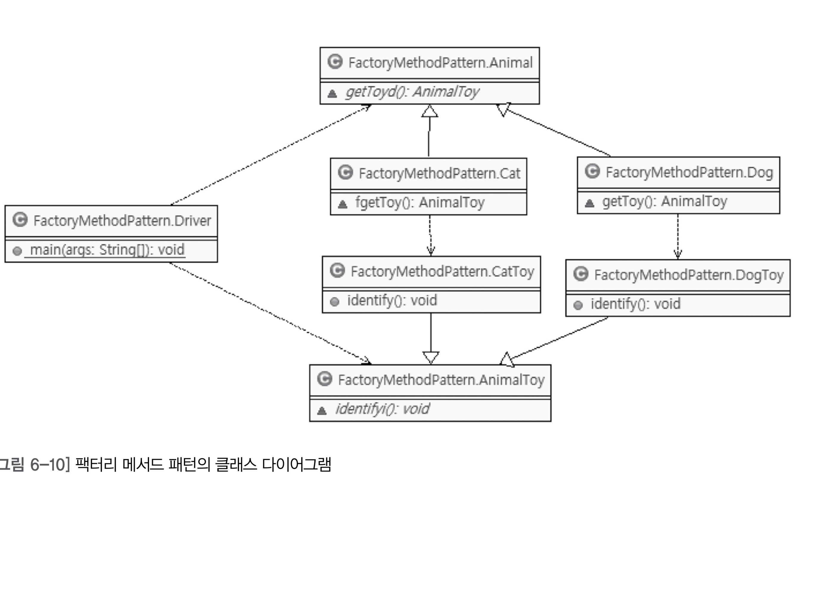

## 목차

[2장 자바와 절차적/구조적 프로그래밍](#2-자바와-절차적구조적-프로그래밍)

- [다시보는 main() 메서드: 메서드 스택 프레임](#다시보는-main-메서드-메서드-스택-프레임)

- [블록 구문과 메모리: 블록 스택 프레임](#블록-구문과-메모리-블록-스택-프레임)

[3장 자바와 객체 지향](#3장-자바와-객체-지향)

- [상속: 재사용 + 확장](#상속-재사용--확장)
- [다중 상속과 자바](#다중-상속과-자바)
- [캡슐화: 정보 은닉](#캡슐화-정보-은닉)

[4장 자바가 확장한 객체 지향](#4장-자바가-확장한-객체-지향)

- [abstract 키워드 - 추상 메서드와 추상 클래스](#abstract-키워드---추상-메서드와-추상-클래스)
- [생성자](#생성자)
- [클래스 생성 시의 실행 블록, static 블록](#클래스-생성-시의-실행-블록-static-블록)
- [interface 키워드와 implements 키워드](#interface-키워드와-implements-키워드)
- [super 키워드](#super-키워드)

[5장 객체 지향 설계 5원칙 - SOLID](#5장-객체-지향-설계-5원칙---solid)

- [SRP - 단일 책임 원칙](#srp---단일-책임-원칙)
- [OCP - 개방 폐쇄 원칙](#ocp---개방-폐쇄-원칙)
- [LSP - 리스코프 치환 원칙](#lsp---리스코프-치환-원칙)
- [ISP - 인터페이스 분리 원칙](#interface-키워드와-implements-키워드)
- [DIP - 의존 역전 원칙](#dip---의존-역전-원칙)

[6장 스프링이 사랑한 디자인 패턴](#6장-스프링이-사랑한-디자인-패턴)

- [어댑터 패턴(Adapter Pattern)](#어댑터-패턴adapter-pattern)
- [프록시 패턴(Proxy Pattern)](#프록시-패턴proxy-pattern)
- [데코레이터 패턴(Decorator Pattern)](#데코레이터-패턴decorator-pattern)
- [싱글턴 패턴(Singleton Pattern)](#싱글턴-패턴singleton-pattern)
- [템플릿 메서드 패턴(Template Method Pattern)](#템플릿-메서드-패턴template-method-pattern)
- [팩터리 메서드 패턴(Factory Method Pattern)](#팩터리-메서드-패턴factory-method-pattern)
- [전략 패턴(Strategy Pattern)](#전략-패턴strategy-pattern)
- [템플릿 콜백 패턴(Template Callback Pattern - 견본/회신 패턴)](#템플릿-콜백-패턴template-callback-pattern---견본회신-패턴)

[7장 스프링 삼각형과 설정 정보](#7장-스프링-삼각형과-설정-정보)
- [IoC/DI - 제어의 역전/의존성 주입](#iocdi---제어의-역전의존성-주입)

# 2. 자바와 절차적/구조적 프로그래밍

## 자바 프로그램의 개발과 구동

| 현실 세계                | 가상 세계(자바 월드)                            |
| ------------------------ | ----------------------------------------------- |
| 소프트웨어 개발 도구     | JDK- 자바 개발 도구: JVM용 소프트웨어 개발 도구 |
| 운영체제                 | JRE - 자바 실행 환경: JVM용 OS                  |
| 하드웨어 - 물리적 컴퓨터 | JVM - 자바 가상 기계: 가상의 컴퓨터             |

**자바 개발 도구인 JDK를 이용해, 개발된 프로그램은 JRE에 의해 가상의 컴퓨터인 JVM 상에서 구동된다.**

<hr>

#### 다시보는 main() 메서드: 메서드 스택 프레임

```java
public class Start {
    public static void main(String[] args) {
        System.out.println("Hello OOP!!!");
    }
}

1. JRE는 프로그램 안에 main() 메서드가 있는 확인
2. JRE는 JVM에게 목적 파일을 전해줌 JVM은 그 파일을 실행시킴
3. JVM은 가장 먼저 java.lang 패키지를 T 메모리의 스태틱 영역에 가져다 놓는다.
4. 개발자가 작성한 모든 클래스와 임포트 패키지 역시 스태틱 영역에 가져다 놓음
5. 스택 프레임을 스택 영역에 할당
6. 메서드의 인자 args를 저장할 변수 공간을 스택 프레임의 맨 밑에 확보
7. System.out.println 실행
8. 스택 프레임 소멸
9. JRE는 JVM 종료하고 JRE 자체도 운영체제 상의 메모리에서 사라진다.

스택 프레임은 메서드의 여는 중괄호를 만났을 때 마다 생긴다.
닫는 중괄호를 만나게되면 스택 프레임이 소멸
```

#### 블록 구문과 메모리: 블록 스택 프레임

```java
public class start3 {
    public static void main(String[] args) {
        int i = 10;
        int k = 20;

        if(i == 10) {
            int m = k + 5;
            k = m;
        } else {
            int p = k + 10;
            k = p;
        }
        // k = m + p;
    }
}

1. 여는 중괄호를 만나, if문의 참인 블록의 스택프레임 생성
2. if 스택 프레임 밖에 있으면서 main() 메서드 스택 프레임 안에 있는 k 변수를 연산에 참여시킴 m = k + 5; 실행
3. k = m 으로 k 25를 가지게 됨
4. 닫는 중괄호를 만나 if 블록 스택 프레임은 스택 영역에서 사라짐
5. k = m + p를 실행시키게 되면 m과 p 는 if 블록 스택 프레임이 사라진 뒤 이므로 변수를 찾을 수 없어 에러를 일으키게 된다.

외부 스택 프레임에서 내부 스택 프레임의 변수에 접근하는 것은 불가능하나 그 역은 가능하다
```

[돌아가기](#목차)

# 3장 자바와 객체 지향

> 추상화란 구체적인 것을 분해해서 관찰자가 관심 있는 특성만 가지고 재조합하는 것
> (구체적인 것을 분해해서 관심 영역(애플리케이션 경계에)에 있는 특성만 가지고 재조합 하는 것 = 모델링)

객체: 세상에 존재하는 유일무이한 사물
클래스: 분류, 집합 같은 속성과 기능을 가진 객체를 총칭하는 집합의 개념

#### 상속: 재사용 + 확장

> 상속은 재사용과 확장으로 이해해야 한다.(ex 분류도로 이해)

상속 관계에서 만족해야 할 문장

- 하위 클래스는 상위 클래스다.

**조직도**의 경우

- 아버지는 할아버지다 ??
- 아들은 아버지다 ??
- 딸은 아버지다 ??

**분류도**

- 포유류는 동물이다.
- 고래는 포유류다.
- 고래는 동물이다.

```java
아버지 영희아빠 = new 딸();
-> 딸을 낳으니 아버지 역할을 하는 영희아빠라 이름 지었다 -> ???

동물 뽀로로 = new 펭귄();
-> 펭귄을 낳으니 동물 역할을 하는 뽀로로라 이름 지었다.
```

> 클래스 명은 분류스럽게, 객체 참조 변수명은 유일무이한 사물처럼 작명해야 한다.

```java
public class 동물 {
    String myClass;

    동물() {
        myclass = "동물";
    }

    void showMe() {
        System.ou.println(myClass);
    }
}

public class 포유류 extends 동물 {
    포유류() {
        myClass = "포유류";
    }
    void showMe() {
        System.ou.println(myClass);
    }
}

public class 조류 extends 동물 {
    조류() {
        myClass = "조류";
    }
    void showMe() {
        System.ou.println(myClass);
    }
}

public class 고래 extends 포유류 {
    고래() {
        myClass = "고래";
    }
    void showMe() {
        System.ou.println(myClass);
    }
}

public class 박쥐 extends 포유류 {
    박쥐() {
        myClass = "박쥐";
    }
    void showMe() {
        System.ou.println(myClass);
    }
}

public class 참새 extends 조류 {
    참새() {
        myClass = "참새";
    }
    void showMe() {
        System.ou.println(myClass);
    }
}

public class 펭귄 extends 조류 {
    펭귄() {
        myClass = "펭귄";
    }
    void showMe() {
        System.ou.println(myClass);
    }
}

조류 bird = new 조류();
bird 라는 단어 자체는 객체보다는 클래스, 즉 분류에 더 가깝다.
조류의 나이는? -> 어색 => 클래스
bird의 나이는? -> 어색 => 클래스

public class Driver01 {
    public static void main(String[] args) {
        동물 animal = new 동물();
        포유류 mammalia = new 포유류();
        조류 bird = new 조류();
        고래 whale = new 고래();
        박쥐 bat = new 박쥐();
        참새 sparrow = new 참새();
        펭귄 penguin = new 펭귄();

        animal.showMe();
        mammalia.showMe();
        whale.showMe();
        bat.showMe();
        sparrow.showMe();
        penguin.showMe();
    }
}

public class Driver02 {
    public static void main(String[] args) {
        동물 animal = new 동물();
        동물 mammalia = new 포유류();
        동물 bird = new 조류();
        동물 whale = new 고래();
        동물 bat = new 박쥐();
        동물 sparrow = new 참새();
        동물 penguin = new 펭귄();

        animal.showMe();
        mammalia.showMe();
        whale.showMe();
        bat.showMe();
        sparrow.showMe();
        penguin.showMe();
    }
}
=> 하위 클래스는 상위 클래스다. == 하위 분류는 상위 분류다.

public class Driver02 {
    public static void main(String[] args) {
        동물[] animal = new 동물[7];
        animals[0] = new 동물();
        animals[1] = new 포유류();
        animals[2] = new 조류();
        animals[3] = new 고래();
        animals[4] = new 박쥐();
        animals[5] = new 참새();
        animals[6] = new 펭귄();
    }

    for(int idx = 0; idx < animal.length; idx++) {
        animals[idx].showMe();
    }
}
```

- 하위 클래스 is a kind of 상위 클래스
- 펭귄 is a kind of 조류 -> 펭귄은 조류의 한 분류다.
- 펭귄 is a kind of 동물 -> 펭귄은 동물의 한 분류다.
- 고래 is a kind of 동물 -> 고래는 동물의 한 분류다.

```
- 객체 지향의 상속은 상위 클래스의 특성을 재사용하는 것이다.
- 객체 지향의 상속은 상위 클래스의 특성을 확장하는 것이다.
- 객체 지향의 상속은 is a kind of 관계를 만족해야 한다.
```

#### 다중 상속과 자바

- 인터페이스: 구현 클래스 is able to 인터페이스
- 해석: 구현 클래스는 인터페이스 할 수 있다.
- 예제: 고래는 헤엄칠 수 있다.

상위 클래스는 하위 클래스에게 속성과 메서드 를 상속해 준다.
인터페이스는 클래스가 '무엇을 할 수 있다'라고 하는 기능을 구현하도록 강제한다.

```java
public class 동물 {
    String myClass;

    동물() {
        myClass = "동물";
    }

    void showMe() {
        System.out.println(myClass);
    }
}

public interface 날수있는 {
    void fly();
}
public interface 헤엄칠수있는 {
    void swim();
}

public class 포유류 extends 동물 {
    포유류() {
        myClass = "포유류";
    }
}

public class 조류 extends 동물 {
    조류() {
        myClass = "조류";
    }
}

public class 고래 extends 포유류 implements 헤엄칠수있는 {
    고래() {
        myClass = "고래";
    }

    @Override
    public void swim() {
        System.out.println(myClass + " 수영 중");
    }
}

public class 박쥐 extends 포유류 implements 날수있는 {
    박쥐() {
        myClass = "박쥐";
    }

    @Override
    public void fly() {
        System.out.println(myClass + "날고있다.");
    }
}


public class Driver {
    public static void main(String[] args) {
        날수있는 날라리1 = new 박쥐();
        날리1.fly();

        날수있는 날라리2 = new 참새();
        날라리2.fly();
    }
}
```

**하위 클래스의 인스턴스가 생성될 때 상위 클래스의 인스턴스도 함께 생성된다.**

**상위 클래스 타입의 객체 참조 변수를 사용하더라도 하위 클래스에서 오버라이딩(재정의)한 메서드가 호출된다.**

```java
class driver {
    public static void main(String[] args) {
        동물[] 동물들 = new 동물[5];

        동물들[0] = new 쥐();
        동물들[1] = new 고양이();
        동물들[2] = new 강아지();

        for(int i = 0; i < 동물들.length; i++) {
            동물들[i].울어보세요();
        }
    }
}

상위 클래스인 동물 클래스에 울어보세요() 메서드를 하위 클래스에서 오버라이딩 한 경우 각 동물들이 하위 클래스 타입에 맞게 울게된다.
```

#### 캡슐화: 정보 은닉

- 상속을 받지 않았다면 객체 멤버는 객체를 생성한 후 객체 참조 변수를 이용해 접근해야 한다.
- 정적 멤버는 클래스명.정적멤버 형식으로 접근하는 것을 권장한다.

[돌아가기](#목차)

# 4장 자바가 확장한 객체 지향

#### abstract 키워드 - 추상 메서드와 추상 클래스

```java
class driver {
    public static void main(String[] args) {
        동물[] 동물들 = new 동물[5];

        동물들[0] = new 쥐();
        동물들[1] = new 고양이();
        동물들[2] = new 강아지();

        for(int i = 0; i < 동물들.length; i++) {
            동물들[i].울어보세요();
        }
    }
}

각 동물들이 상속받은 울어보세요 메서드는 동물 클래스 인스턴스에선 어떻게 울어야 할까?
이럴 때 사용하는 것이 추상 메서드 이다.

public abstract class 동물 {
    abstract void 울어보세요();
}

추상 클래스는 인스턴스를 만들 수 없다.

- 동물 객체는 어떻게 울어야 하지? / 누가 실수로 동물 객체를 만들면 어떡하지?
- 동물 참조 변수 배열로 모든 동물을 울게 하려면 하위 클래스에서 오버라이딩할 울어보세요() 메서드가 동물 클래스에 필요한데..

위 두 가지 문제를 추상 메서드와 추상 클래스로 해결된다.
```

- 추상 클래스는 인스턴스, 즉 객체를 만들 수 없다. new를 사용할 수 없다.
- 추상 메서드는 하위 클래스에게 메서드의 구현을 강제한다. 오버라이딩 강제
- 추상 메서드를 포함하는 클래스는 반드시 추상 클래스여야 한다.

#### 생성자

클래스명()도 메서드 이다. 반환값이 없고 클래스명과 같은 이름을 가진 메서드를 객체를 생성하는 메서드라고해서 **객체 생성자 메서드**라 한다.

- 생성자는 컴파일 과정에서 컴파일러가 알아서 기본 생성자를 만들어 준다.
- 인자가 있는 생성자를 하나라도 만든다면 자바는 기본 생성자를 만들어 주지 않는다.

#### 클래스 생성 시의 실행 블록, static 블록

static 블록: 클래스가 스태틱 영역에 배치될 때 실행되는 코드 블록

```java

public class 동물 {
    static {
        System.out.println("동물 클래스 레디 온");
    }
}

public class Driver {
    public static void main(String[] args) {
        동물 뽀로로 = new 동물();
        동물 피카츄 = new 동물();
    }
}
동물 클래스의 인스턴스를 여러 개 만들어도 동물 클래스의 static 블록은 단 한 번만 실행된다.

class Animal {
    static int age = 0;

    static {
        System.out.println("Animal class ready on!");
    }
}

public class Driver {
    public static void main(String[] args) {
        System.out.println("main 메서드 시작!");
        System.out.println(Animal.age);
    }
}

main 메서드 시작!
Animal class ready on!
0

클래스 정보는 해당 클래스가 코드에서 맨 처음 사용될 때 T 메모리의 스태틱 영역에 로딩되며 이때 단 한번 해당 클래스의 static 블록이 실행된다.
```

클래스가 제일 처음 사용되는 것의 기준

- 클래스의 정적 속성을 사용할 때
- 클래스의 정적 메서드를 사용할 때
- 클래스의 인스턴스를 최초로 만들 때

> instanceof 연산자는 리스코프 치환 원칙을 어기는 코드에서 주로 나타나는 연산자이기에 리팩터링의 대상이 아닌지 점점해 봐야 한다.

#### interface 키워드와 implements 키워드

```java
인터페이스는 public 추상 메서드와 public 정적 상수만 가질 수 있다.

interface Speakable {
    double PI = 3.14159;
    final double absoluteZeroPoint = -275.15;

    void sayYes();
}


class Specker implements Speakable {
    public void sayYes() {
        System.out.println("I say No!!");
    }
}

public class Driver {
    public static void main(String[] args) {
        System.out.println(Speakable.absoluteZeroPoint);
        System.out.println(Speakable.PI);

        Specker reporter1 = new Specker();
        reporter1.sayYes();
    }
}

인터페이스는 추상 메서드와 정적 상수만 가질 수 있기에
따로 메서드에 public 과 abstract, 속성에 public과 static, final을 붙이지 않아도 자바가 알아서 붙여준다.
```

#### super 키워드

```java

class 동물 {
    void method() {
        System.out.println("동물");
    }
}

class 조류 extends 동물 {
    void method() {
        super.method();
        System.out.println("조류");
    }
}

class 펭귄 extends 조류 {
    void method() {
        super.method();
        System.out.println("펭귄");
    }
}

public class Driver {
    public static void main(String[] args) {
        펭귄 뽀로로 = new 펭귄();
        뽀로로.method();
    }
}
동물
조류
펭귄

super 클래스는 상위 클래스의 인스턴스에 접근할 수 있다
super.super 형태로는 접근 불가
```

펭귄[100] 과 같이 요소가 100개인 배열은 힙 영역에 생기는 펭귄 객체는 100개가 되고 그 안의 메서드도 100개가 만들어져야 한다.
그런데 객체 멤버 메서드는 각 객체별로 달라지는 것이 아니다.
객체 멤버 메서드에서 사용하는 객체 멤버 속성의 값만 다를 뿐이다.
똑같은 객체 멤버 메서드를 힙 영역에 100개 만든다는 것은 심각한 메모리 낭비이다.

그래서 **JVM은 지능적으로 객체 멤버 메서드를 스태틱 영역에 단 하나만 보유한다.**

[돌아가기](#목차)

# 5장 객체 지향 설계 5원칙 - SOLID

#### SOLID

- SRP: 단일 책임 원칙
- OCP: 개방 폐쇄 원칙
- LSP: 리스코프 치환 원칙
- ISP: 인터페이스 분리 원칙
- DIP: 의존 역전 원칙

## SRP - 단일 책임 원칙

> 어떤 클래스를 변경해야 하는 이유는 오직 하나뿐이어야 한다.

#### 속성이 SRP를 지키지 않은 경우

```java
class 사람 {
    String 군번;
}

사람 로미오 = new 사람();
사람 줄리엣 = new 사람();
줄리엣.군번 = "12312312312";

줄리엣이 가진 군번 속성에 값을 할당하거나 읽어오는 코드를 제제할 방법이 없음
사람 클래스를 남자 클래스와 여자 클래스로 분할하고 남자 클래스에만 군번 속성 갖게하는 것이 단일 책임 원칙이다.
남자와 여자 클래스의 공통점은 사람 클래스로 정의하고 각자 상속하여 차이점만 구현하면 된다.
```

#### 메서드가 단일 책임 원칙을 지키지 않은 경우

```java
class 강아지 {
    final static Boolean 수컷 = true;
    final static Boolean 암컷 = false;
    Boolean 성별;

    void 소변보다() {
        if(this.성별 == 수컷) {
            한쪽 다리를 들고 소변 본다
        }
        else {
            뒷 다리 두개를 굽혀 앉은 자세로 소변 본다.
        }
    }
}

메서드에서 수컷, 암컷에 따라 분기 처리가 진행된다
메서드가 수컷 강아지의 행위와 암컷 강아지의 행위를 모두 구현하려 하기에 단일 책임 원칙 위배하고 있는 것이다.

abstract class 강아지 {
    abstract void 소변보다();
}

class 수컷강아지 extends 강아지 {
    void 소변보다() {
        한쪽 다리를 들고 소변 본다
    }
}

class 암컷강아지 extends 강아지 {
    void 소변보다() {
        뒷다리 두 개로 앉은 자세로 소변 본다.
    }
}
```

## OCP - 개방 폐쇄 원칙

> 소프트웨어 엔티티(클래스, 모듈, 함수 등)은 확장에 대해선 열려 있어야 하지만 변경에 대해선 닫혀 있어야 한다.

=> 자신의 확장에는 열려 있고, 주변의 변화에 대해선 닫혀 있어야 한다.

자바 애플리케이션은 JDBC 인터페이스를 상속하기 때문에 데이터베이스가 바뀌더라도 Connection 설정하는 부분 외에는 따로 수정할 것이 없다.

```java
public class App {
    public static void main(String args[]) {
        자동차 운전자1 = new 마티즈();
        운전자1.창문개방();
        자동차 운전자2 = new 쏘나타();
        운전자2.창문개방();

        //창문 수동 개방
        // 창문 자동 개방
    }
}

interface 자동차 {
    void 창문개방();
}

class 마티즈 implements 자동차 {
    public String myCar = "마티즈입니다.";
    public void 창문개방() {
        System.out.println("창문 수동 개방");
    }
}

class 쏘나타 implements 자동차{

    public void 창문개방() {
        System.out.println("창문 자동 개방");
    }
}
운전자는 자동차에 영향 받지 않고 변화하지 않으며 자동차는 다양한 자동차가 생길 수 있으므로 확장에 개방돼 있다.
```

## LSP - 리스코프 치환 원칙

> 서브 타입은 언제나 자신의 기반 타입으로 교체할 수 있어야 한다.

- 하위 분류는 상위 분류의 한 종류다.
- 구현 분류는 인터페이스할 수 있어야 한다.

**하위 클래스의 인스턴스는 상위형 객체 참조 변수에 대입해 상위 클래스의 인스턴스 역할을 하는데 문제가 없어야 한다.**

```java
아버지 춘향이 = new 딸();
춘향이에게 아빠의 역할을 맡긴다. => 상속이 조직도나 계층 형태로 구축
동물 뽀로로 = new 펭귄(); => 상속이 분류도로 구축 옳음
```

## ISP - 인터페이스 분리 원칙

> 클라이언트는 자신이 사용하지 않는 메서드에 의존 관계를 맺으면 안된다.

남자 클래스를 토막 내지 않고 여자친구를 만날 때는 남자친구 역할만 할 수 있게 인터페이스로 제한하고, 어머니와 있을 때는 아들 인터페이스로 제한 하고, 직장 상사 앞에서는 사원 인터페이스로 제한하는 것이다.
=> 인터페이스 분할 원칙의 핵심

## DIP - 의존 역전 원칙

> 고차원 모듈은 저차원 모듈에 의존하면 안 된다.
> 이 두 모듈 모두 다른 추상회된 것에 의존해야 한다.
> 추상화된 것은 구체적인 것에 의존하면 안된다.
> 구체적인 것이 추상화된 것에 의존해야 한다.
> 자주 벽여되는 구체 클래스에 의존하지 마라

자동차 -> 스노우 타이어
자동차 -> 타이어 <- 스노우 타이어
자동차가 구체적인 타이어가 아닌 추상화된 타이어 인터페이스에만 의존하게 함으로써 타이어가 바껴도 자동차는 그 영향을 받지 않는다.

스노우 타이어는 그 무엇에도 의존하지 않는 클래스였는데, 추상적인 것인 타이어 인터페이스에 의존하게 되었다.
=> **의존의 방향이 역전된 것.**

자신보다 변하기 쉬운 것에 의존하던 것을 추상화된 인터페이스나 상위 클래스를 두어 변하기 쉬운 것의 변화에 영향받지 않게 하는 것이 의존 역전 원칙.

- SRP(단일 책임 원칙): 어던 클래스를 변경해야 하는 이유는 오직 하나뿐이어야 한다.
- OCP(개방 폐쇄 원칙): 자신의 확장에는 열려 있고, 주변의 변화에 대해서는 닫혀 있어야 한다.
- LSP(리스코프 치환 원칙): 서브 타입은 언제나 자신의 기반 타입으로 교체할 수 있어야 한다.
- ISP(인터페이스 분리 원칙): 클라이언트는 자신이 사용하지 않는 메서드에 의존 관계를 맺으면 안 된다.
- DIP(의존 역전 원칙): 자신보다 변하기 쉬운 것에 의존하지 않는다.

[돌아가기](#목차)

# 6장 스프링이 사랑한 디자인 패턴

| 요리            | 객체 지향 프로그래밍(OOP)              |
| --------------- | -------------------------------------- |
| 요리도구        | 4대 원칙(캡슐화, 상속, 추상화, 다형성) |
| 요리도구 사용법 | 설계 원칙(SOLID)                       |
| 레시피          | 디자인 패턴                            |

## 어댑터 패턴(Adapter Pattern)

> 개방 폐쇄 원칙을 활용한 설계 패턴

```java
public class ServiceA {
    void runServiceA() {
        System.out.println("ServiceA");
    }
}

public class ServiceB {
    void runServiceB() {
        System.out.println("ServiceB");
    }
}

public class ClientWithNoAdapter {
    public static void main(String[] args) {
        ServiceA sa1 = new ServiceA();
        ServiceB sb1 = new ServiceB();

        sa1.runServiceA();
        sb1.runServiceB();
    }
}

sa1, sb1 참조변수를 통해 호출하는 각 메서드가 비슷한 일을 한다.
```

**어댑터 패턴 적용**

```java
public class AdapterServiceA {
    ServiceA sa1 = new ServiceA();

    void runService() {
        sa1.runServiceA();
    }
}

public class AdapterServiceB {
    Service sb1 = new ServiceB();

    void runService() {
        sb1.runServiceB();
    }
}

public class ClientWithAdapter {
    public static void main(String[] args) {
        AdapterServiceA asa1 = new AdapterServiceA();
        AdapterServiceB asb1 = new AdapterServiceB();

        asa1.runService();
        asb1.runService();
    }
}

ServiceA와 ServiceB의 메서드를 runService()라고 하는 같은 이름의 메서드로 호출해서 사용할 수 있게 해주는 변환기다.
```

**어댑터 패턴은 합성, 즉 객체를 속성으로 만들어서 참조하는 디자인 패턴이다.**

> 호출 당하는 쪽의 메서드를 호출하는 쪽의 코드에 대응하도록 중간에 변환기를 통해 호출하는 패턴

## 프록시 패턴(Proxy Pattern)

```java
public class Service {
    public String runSomething() {
        return "서비스 짱!!!";
    }
}

public class ClientWithNoProxy {
    public static void main(String[] args) {
        Service service = new Service();
        System.out.println(service.runSomething());
    }
}
```

**프록시 패턴 적용**

```java
public interface IService {
    String runSomething();
}

public class Service implements IService {
    public String runSomething() {
        return "서비스 짱!!!";
    }
}

public class Proxy implements IService {
    IService service1;

    public String runSomething() {
        System.out.println("호출에 대한 흐름 제어가 주목적, 반환 결과를 그대로 전달");

        service1 = new Service();
        return service1.runSomething();
    }
}

public class ClientWithProxy {
    public static void main(String[] args) {
        IService proxy = new Proxy();
        System.out.println(proxy.runSomething());
    }
}
```

- 대리자는 실제 서비스와 같은 이름의 메서드를 구현한다. -> 인터페이스 사용
- 대리자는 실제 서비스에 대한 참조 변수를 갖는다. -> 합성
- 대리자는 실제 서비스와 같은 이름을 가진 메서드를 호출하고 그 값을 클라이언트에게 돌려준다.
- 대리자는 실제 서비스의 메서드 호출 전후에 별도의 로직을 수행할 수도 있다.

**프록시 패턴은 개방 폐쇄 원칙과 의존 역전 원칙이 적용된 설계 패턴이다.**

[돌아가기](#목차)

## 데코레이터 패턴(Decorator Pattern)

|                 |                                                                                                                    |
| --------------- | ------------------------------------------------------------------------------------------------------------------ |
| 프록시 패턴     | 제어 흐름 변경하거나 별도의 로직 처리를 목적으로 함 클라이언트가 받는 반환값을 특별한 경우 아니면 변경하지 않는다. |
| 데코레이터 패턴 | 클라이언트가 받는 반환값에 장식 더함                                                                               |

```java
public interface IService {
    public abstract String runSomething();
}

public class Service implements IService {
    public String runSomething() {
        return "서비스 짱!!!";
    }
}

public class Decoreator implements IService {
    IService service;

    public String runSomething() {
        System.out.println("호출에 대한 장식이 주목적, 클라이언트에게 반환 결과에 장식을 더하여 전달");

        service = new Service();
        return "정말" + service.runSomething();
    }
}

public class ClientWithDecolator {
    public static void main(String[] args) {
        IService decoreator = new Decoreator();
        System.out.println(decoreator.runSomething());
    }
}
```

- 장식자는 실제 서비스와 같은 이름의 메서드를 구현한다. -> 인터페이스 사용
- 장식자는 실제 서비스에 대한 참조 변수를 갖는다(합성)
- 장식자는 실제 서비스의 같은 이름을 가진 메서드를 호출하고 그 반환값에 장식을 더해 클라이언트에게 돌려준다.
- 장식자는 실제 서비스의 메서드 호출 전후에 별도의 로직 수행 가능하다.

**메서드 호출의 반환값에 변화를 주기 위해 중간에 장식자를 두는 패턴**

[돌아가기](#목차)

## 싱글턴 패턴(Singleton Pattern)

> 싱글턴 패턴이란
> 인스턴스를 하나만 만들어 사용하기 위한 패턴. 커넥션 풀, 스레드 풀, 디바이스 설정 객체 등과 같은 경우 인스턴스 여러 개 만들면 불필요한 자원 사용하게 되므로 싱글턴 패턴을 사용한다.

- new를 실행할 수 없도록 생성자에 private 접근 제어자를 지정한다.
- 유일한 단일 객체를 반환할 수 있는 정적 메서드가 필요
- 유일한 단일 객체를 참조할 정적 참조 변수가 필요

```java
public class Singleton {
    static Singleton singletonObject; // 정적 참조 변수

    private Singleton() {}; // private 생성자

    // 객체 반환 정적 메서드
    public static Singleton getInstance() {
        if(singletonObject == null) {
            singletonObject = new Singleton();
        }

        return singletonObject;
    }
}

단일 객체인 경우 공유 객체로 사용되기 때문에 속성을 갖지 않게 하는것이 정석이다.
```

[돌아가기](#목차)

## 템플릿 메서드 패턴(Template Method Pattern)

```java
public class Dog {
    public void playWithOwner() {
        System.out.println("귀염둥이 이리온 ...");
        System.out.println("멍! 멍!");
        System.out.println("꼬리 살랑 살랑~");
        System.out.println("잘했어");
    }
}

public class Cat {
    public void playWithOwner() {
        System.out.println("귀염둥이 이리온 ...");
        System.out.println("야옹~ 야용~");
        System.out.println("꼬리 살랑 살랑~");
        System.out.println("잘했어");
    }
}

2번째 System.out.println만 빼고는 모두 동일한 코드를 가진다.
=> 상속을 통해 동일한 부분(중복)은 상위 클래스로, 달라지는 부분만 하위 클래스로 분할하고 싶다.
```

```java
public abstract class Animal {
    // 템플릿 메서드
    public void playWithOwner() {
        System.out.println("귀염둥이 이리온 ...");
        play();
        runSomething();
        System.out.println("잘했어");
    }

    // 추상 메서드
    abstract void play();

    // Hook(갈고리) 메서드
    void runSomething() {
        System.out.println("꼬리 살랑 살랑~");
    }
}

public class Dog extends Animal {
    @Override
    // 추상 메서드 오버라이딩
    void play() {
        System.out.println("멍! 멍!");
    }

    @Override
    // Hook(갈고리) 메서드 오바리이딩
    void runSomething() {
        System.out.println("멍! 멍!~ 꼬리 살랑 살랑~");
    }
}

public class Cat extends Animal {
    @Override
    // 추상 메서드 오버라이딩
    void play() {
        System.out.println("야옹~ 야옹~");
    }

    @Override
    // Hook(갈고리) 메서드 오바리이딩
    void runSomething() {
        System.out.println("야옹~ 야옹~ 꼬리 살랑 살랑~");
    }
}

public class Driver {
    public static void main(String[] args) {
        Animal bolt = new Dog();
        Animal Kitty = new Cat();

        bolt.playWithOwner();

        kitty.playWithOwner();
    }
}


상위 클래스인 Animal에는 템플릿(견본)을 제공하는 playWithOwner() 메서드와 하위 클래스에게 구현 강제하는 play() 추상 메서드, 하위 크래스가 선택적으로 오버라이딩 할 수 있는 runSomething() 메서드가 있다.
```

> 상위 클래스에 공통 로직 수행하는 템플릿 메서드와 하위 클래스에 오버라이딩 강제하는 추상 메서드 또는 선택적으로 오버라이딩 할 수 있는 훅 메서드를 두는 패턴을 템플릿 메서드 패턴이라 한다.

**상위 클래스의 템플릿 메서드에서 하위 클래스가 오버라이딩한 메서드를 호출하는 패턴**

[돌아가기](#목차)

## 팩터리 메서드 패턴(Factory Method Pattern)

```java
public abstract class Animal {
    // 추상 팩터리 메서드
    abstract AnimalToy getToy();
}

// 팩터리 메서드가 생성할 객체의 상위 클래스
public abstract class AnimalToy {
    abstract void identify();
}

public class Dog extends Animal {
    // 추상 팩터리 메서드 오버라이딩

    @Override
    AnimalToy getToy() {
        return new DogToy();
    }
}

// 팩터리 메서드가 생성할 객체
public class DogToy extends AnimalToy {
    public void identify() {
        System.out.println("나는 테니스공! 강아지의 친구!");
    }
}

public class Cat extends Animal {
    // 추상 팩터리 메서드 오버라이딩

    @Override
    AnimalToy getToy() {
        return new CatToy();
    }
}

// 팩터리 메서드가 생성할 객체
public class CatToy extends AnimalToy {
    @Override
    public void identify() {
        System.out.println("나는 캣타워! 고양이의 친구!");
    }
}

public class Driver {
    public static void main(String[] args) {
        //팩터리 메서드를 보유한 객체들 생성
        Animal bolt = new Dog();
        Animal kitty = new Cat();

        // 팩터리 메서드가 반환하는 객체들
        AnimalToy boltBall = bolt.getToy();
        AnimalToy kittyTower = kitty.getToy();

        // 팩터리 메서드가 반환한 객체들을 사용
        boltBall.identify();
        kittyTower.identify();
    }
}
```



**오바라이딩 된 메서드가 객체를 반환하는 패턴**

[돌아가기](#목차)

## 전략 패턴(Strategy Pattern)

- 전략 메서드를 가진 전략 객체
- 전략 객체를 사용하는 컨텍스트(전략 객체의 사용자/소비자)
- 전략 객체를 생성해 컨텍스트에 주입하는 클라이언트(제3자 전략 객체의 공급자)

```java
public interface Strategy {
    public abstract void runStrategy();
}

public class StrategyGun implements Strategy {
    @Override
    public void runStrategy() {
        System.out.println("탕, 타당, 타다당");
    }
}

public class StrategySword implements Strategy {
    @Override
    public void runStrategy() {
        System.out.println("챙.. 채챙챙 챙챙");
    }
}

public class StrategyBow implements Strategy {
    @Override
    public void runStrategy() {
        System.out.println("슝.. 쐐액.. 쉑, 최종 병기");
    }
}

무기(전략)를 사용할 군인(컨텍스트) 구현
public class Soldier {
    void runContext(Strategy strategy) {
        System.out.println("전투 시작");
        strategy.runStrategy();
        System.out.println("전투 종료");
    }
}

무기(전략)를 조달(생성)해서 군인(컨텍스트)에게 지급(주입)해 줄 보급 장교(클라이언트, 제3자) 구현
public class Client {
    public static void main(String[] args) {
        Strategy strategy = null;
        Soldier rambo = new Soldier();

        // 총을 람보에게 전달해서 전투를 수행하게 한다.
        strategy = new StrategyGun();
        rambo.runContext(strategy);

        // 검을 람보에게 전달해서 전투 수행하게 한다.
        strategy = new StrategySword();
        rambo.runContext(strategy);

        // 활을 람보에게 전달해서 전투 수행하게 한다.
        strategy = new StrategyBow();
        rambo.runContext(strategy);
    }
}
```

**클라이언트가 전략을 생성해 전략을 실행할 컨텍스트에 주입하는 패턴**

[돌아가기](#목차)

## 템플릿 콜백 패턴(Template Callback Pattern - 견본/회신 패턴)

> 템플릿 콜백 패턴은 전략 패턴의 변형으로,
> 스프링의 DI에서 사용하는 특별한 형태의 전략 패턴이다.

```java
public interface Strategy {
    public abstract void runStrategy();
}

public class Soldier {
    void runContext(Strategy strategy) {
        System.out.println("전투 시작");
        strategy.runStrategy();
        System.out.println("전투 종료");
    }
}

public class Client {
    public static void main(String[] args) {
        Soldier rambo = new Soldier();

        rambo.runContext(new Strategy() {
            @Override
            public void runStrategy() {
                System.out.println("총! 초초총!");
            }
        });

        rambo.runContext(new Strategy() {
            @Override
            public void runStrategy() {
                System.out.println("칼! 카가갈 칼!");
            }
        });

        rambo.runContext(new Strategy() {
            @Override
            public void runStrategy() {
                System.out.println("도끼! 독독..도끼");
            }
        });
    }
}

중복된 코드가 보임
```

```java
public interface Strategy {
    public abstract void runStrategy();
}

public class Soldier {
    void runContext(String weaponSound) {
        System.out.println("전투 시작");
        executeWeapon(weaponSound).runStrategy();
        System.out.println("전투 종료");
    }

    private Strategy executeWeapon(final String weaponSound) {
    return new Strategy() {
        @Override
        public void runStrategy() {
            System.out.println(weaponSound);
            }
        }
    }
}

public class Client {
    public static void main(String[] args) {
        Soldier rambo = new Soldier();

        rambo.runContext("총! 초초종총 총!");
        rambo.runContext("칼! 카각갈 칼");
        rambo.runContext("도끼! 독독.도도독도끼");
    }
}
```

**전략을 익명 내부 클래스로 구현한 전략 패턴**

[돌아가기](#목차)


# 7장 스프링 삼각형과 설정 정보

> 스프링 -> POJO를 기반으로 스프링 삼각형 이라는 애칭을 가진
IoC/DI, AOP, PSA라고 하는 스프링 3대 프로그래밍 모델에 대한 이해가 필요하다

## IoC/DI - 제어의 역전/의존성 주입

``` java
new Car();

Car 객체 생성자에서 new Tire();

의존성은 new다.
new를 실행하는 Car와 Tire 사이에서 Car가 Tire에 의존한다.

=> 결론적으로 전체가 부분에 의존한다
```

#### 스프링 없이 의존성 주입하기1 - 생성자를 통한 의존성 주입

> 주입이란?
주입이란 외부에서라는 뜻을 내포하고 있는 단어다
자동차 내부에서 타이어를 생산하는 것이 아니라 외부에서 생산된 타이어를 자동차에 장착하는 작업이 주입이다.

[돌아가기](#목차)
